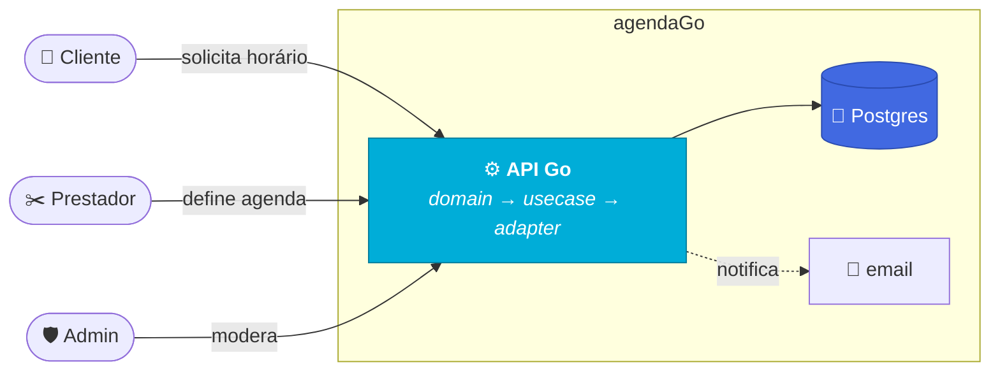

# 📅 agendaGo

> Agendamento entre clientes e prestadores de serviço — API em Go (arquitetura hexagonal) + frontend SvelteKit. **Projeto de estudo.**




---

## 🧱 Stack

| Camada | Tecnologia |
|---|---|
| 🔷 Backend | Go 1.26 · [chi](https://github.com/go-chi/chi) · [pgx](https://github.com/jackc/pgx) · [Argon2id](https://github.com/alexedwards/argon2id) |
| 🐘 Banco | PostgreSQL 16 · [Flyway](https://flywaydb.org/) (migrations) |
| 🟠 Frontend | [Svelte 5](https://svelte.dev) · SvelteKit · TypeScript · Tailwind CSS 4 |
| 🧪 Testes | Go testing · [Testcontainers](https://testcontainers.com/) · [Vitest](https://vitest.dev/) · [Playwright](https://playwright.dev/) |
| 🚀 Produção | [Caddy](https://caddyserver.com/) (HTTPS automático) · imagens no GHCR · deploy pelo CI |

> [!TIP]
> O "porquê" de cada escolha, com fontes primárias para estudo, está em
> **[docs/tecnologias.md](docs/tecnologias.md)**.

---

## ▶️ Executando o projeto

**Requisito:** [Docker](https://docs.docker.com/get-docker/) e Docker Compose.

```bash
docker compose up
```

Sobe, nesta ordem: Postgres → Flyway (migrations) → API (`:8080`, hot reload via Air) → frontend (`:5173`, hot reload via Vite). A documentação Swagger é gerada automaticamente.

| Serviço | URL |
|---|---|
| 🟠 App | [localhost:5173](http://localhost:5173) |
| ⚙️ API | [localhost:8080](http://localhost:8080) |
| 📖 Swagger | [localhost:8080/swagger/index.html](http://localhost:8080/swagger/index.html) |
| 📧 Mailpit | [localhost:8025](http://localhost:8025) — emails capturados em dev, nada é enviado de verdade |

```bash
docker compose down        # mantém os dados do banco
docker compose down -v     # apaga os dados do banco junto
```

### 🛡️ Administrador

O administrador (moderação) é **semeado no boot** a partir de `ADMIN_EMAIL` e `ADMIN_SENHA` — não há cadastro nem auto-registro. Em desenvolvimento:

| Campo | Valor |
|---|---|
| E-mail | `admin@agendago.dev` |
| Senha | `admin12345` |

Ele entra pela [mesma tela de login](http://localhost:5173/login) e cai no painel de moderação (`/admin`), onde bane e reativa prestadores e clientes.

> [!WARNING]
> **Troque essas credenciais em produção.** O `ADMIN_SENHA` é a chave do painel
> de moderação — gere com `openssl rand -base64 24`.

---

## 🛣️ Rotas disponíveis

<details>
<summary><b>🔓 Públicas</b> — cadastro, login e agendamento sem conta</summary>

<br>

| Método | Rota | Descrição |
|--------|------|-----------|
| `GET` | [`/health`](http://localhost:8080/swagger/index.html#/infra/get_health) | Status do servidor |
| `POST` | [`/providers`](http://localhost:8080/swagger/index.html#/providers/post_providers) | Cadastrar prestador |
| `POST` | [`/clients`](http://localhost:8080/swagger/index.html#/clients/post_clients) | Solicitar cadastro de cliente (envia email de confirmação) |
| `POST` | [`/clients/confirmar-cadastro`](http://localhost:8080/swagger/index.html#/clients/post_clients_confirmar_cadastro) | Confirmar cadastro pelo token do email |
| `GET` | [`/clients/pre-cadastro/{token}`](http://localhost:8080/swagger/index.html#/clients/get_clients_pre_cadastro__token_) | Consultar dados de pré-cadastro para pré-preencher o formulário |
| `POST` | [`/clients/pre-cadastro/{token}`](http://localhost:8080/swagger/index.html#/clients/post_clients_pre_cadastro__token_) | Concluir cadastro a partir do pré-cadastro, sem segunda confirmação |
| `GET` | [`/providers`](http://localhost:8080/swagger/index.html#/providers/get_providers) | Listar prestadores (vitrine) |
| `GET` | [`/providers/{id}`](http://localhost:8080/swagger/index.html#/providers/get_providers__id_) | Buscar prestador (página pública de agendamento) |
| `GET` | [`/providers/{id}/slots`](http://localhost:8080/swagger/index.html#/appointments/get_providers__id__slots) | Consultar horários livres de um prestador |
| `POST` | [`/agendamentos/convidado`](http://localhost:8080/swagger/index.html#/appointments/post_agendamentos_convidado) | Agendar sem cadastro (nome/e-mail/telefone) |
| `GET` | [`/agendamentos/cancelar/{token}`](http://localhost:8080/swagger/index.html#/appointments/get_agendamentos_cancelar__token_) | Detalhar agendamento pelo token de cancelamento |
| `POST` | [`/agendamentos/cancelar/{token}`](http://localhost:8080/swagger/index.html#/appointments/post_agendamentos_cancelar__token_) | Cancelar pelo token do email (convidado) |

</details>

<details>
<summary><b>🔑 Autenticação</b> — login por senha, login social e sessão</summary>

<br>

| Método | Rota | Descrição |
|--------|------|-----------|
| `POST` | [`/auth/provider/login`](http://localhost:8080/swagger/index.html#/auth/post_auth_provider_login) | Login do prestador |
| `POST` | [`/auth/client/login`](http://localhost:8080/swagger/index.html#/auth/post_auth_client_login) | Login do cliente |
| `POST` | [`/auth/admin/login`](http://localhost:8080/swagger/index.html#/auth/post_auth_admin_login) | Login do administrador |
| `GET` | [`/auth/client/google/start`](http://localhost:8080/swagger/index.html#/auth/get_auth_client_google_start) | Iniciar login social do cliente com Google |
| `GET` | [`/auth/provider/google/start`](http://localhost:8080/swagger/index.html#/auth/get_auth_provider_google_start) | Iniciar login social do prestador com Google |
| `GET` | [`/auth/google/callback`](http://localhost:8080/swagger/index.html#/auth/get_auth_google_callback) | Callback do login social |
| `POST` | [`/auth/logout`](http://localhost:8080/swagger/index.html#/auth/post_auth_logout) | Encerrar sessão |
| `GET` | [`/auth/me`](http://localhost:8080/swagger/index.html#/auth/get_auth_me) | Usuário autenticado atual |
| `POST` | [`/auth/recuperar-senha`](http://localhost:8080/swagger/index.html#/auth/post_auth_recuperar_senha) | Solicitar recuperação de senha por email |
| `POST` | [`/auth/redefinir-senha`](http://localhost:8080/swagger/index.html#/auth/post_auth_redefinir_senha) | Redefinir a senha com um token |

</details>

<details>
<summary><b>✂️ Prestador</b> — agenda, preferências e atendimentos</summary>

<br>

| Método | Rota | Descrição |
|--------|------|-----------|
| `PUT` | [`/providers/me/preferencias`](http://localhost:8080/swagger/index.html#/providers/put_providers_me_preferencias) | Atualizar preferências do prestador |
| `GET` | [`/providers/me/agenda`](http://localhost:8080/swagger/index.html#/availability/get_providers_me_agenda) | Consultar agenda resolvida (por período) |
| `PUT` | [`/providers/me/dias/{data}`](http://localhost:8080/swagger/index.html#/availability/put_providers_me_dias__data_) | Definir um dia (bloqueio ou horários personalizados) |
| `DELETE` | [`/providers/me/dias/{data}`](http://localhost:8080/swagger/index.html#/availability/delete_providers_me_dias__data_) | Remover a definição de um dia (volta ao padrão) |
| `GET` | [`/providers/me/agendamentos`](http://localhost:8080/swagger/index.html#/appointments/get_providers_me_agendamentos) | Listar agendamentos recebidos |
| `GET` | [`/providers/me/slots`](http://localhost:8080/swagger/index.html#/appointments/get_providers_me_slots) | Slots livres da própria agenda (inclusive fechada ao público) |
| `POST` | [`/providers/me/agendamentos`](http://localhost:8080/swagger/index.html#/appointments/post_providers_me_agendamentos) | Marcar para um cliente que ligou |
| `POST` | [`/agendamentos/{id}/confirmar`](http://localhost:8080/swagger/index.html#/appointments/post_agendamentos__id__confirmar) | Confirmar uma solicitação |
| `POST` | [`/agendamentos/{id}/recusar`](http://localhost:8080/swagger/index.html#/appointments/post_agendamentos__id__recusar) | Recusar uma solicitação |
| `POST` | [`/agendamentos/{id}/realizado`](http://localhost:8080/swagger/index.html#/appointments/post_agendamentos__id__realizado) | Marcar atendimento como realizado |
| `POST` | [`/agendamentos/{id}/nao-compareceu`](http://localhost:8080/swagger/index.html#/appointments/post_agendamentos__id__nao_compareceu) | Registrar não comparecimento |

</details>

<details>
<summary><b>👤 Cliente</b> — solicitar e acompanhar agendamentos</summary>

<br>

| Método | Rota | Descrição |
|--------|------|-----------|
| `POST` | [`/agendamentos`](http://localhost:8080/swagger/index.html#/appointments/post_agendamentos) | Solicitar um agendamento |
| `GET` | [`/clients/me/agendamentos`](http://localhost:8080/swagger/index.html#/appointments/get_clients_me_agendamentos) | Listar agendamentos do cliente |
| `POST` | [`/agendamentos/{id}/cancelar`](http://localhost:8080/swagger/index.html#/appointments/post_agendamentos__id__cancelar) | Cancelar um agendamento (cliente ou prestador) |

</details>

<details>
<summary><b>🛡️ Administrador</b> — moderação</summary>

<br>

| Método | Rota | Descrição |
|--------|------|-----------|
| `GET` | [`/admin/prestadores`](http://localhost:8080/swagger/index.html#/admin/get_admin_prestadores) | Listar prestadores para moderação |
| `GET` | [`/admin/prestadores/{id}`](http://localhost:8080/swagger/index.html#/admin/get_admin_prestadores__id_) | Detalhar prestador: cadastro + agendamentos recebidos |
| `GET` | [`/admin/clientes`](http://localhost:8080/swagger/index.html#/admin/get_admin_clientes) | Listar clientes para moderação |
| `GET` | [`/admin/clientes/{id}`](http://localhost:8080/swagger/index.html#/admin/get_admin_clientes__id_) | Detalhar cliente: cadastro + agendamentos feitos |
| `POST` | [`/admin/prestadores/{id}/banir`](http://localhost:8080/swagger/index.html#/admin/post_admin_prestadores__id__banir) | Banir um prestador |
| `POST` | [`/admin/prestadores/{id}/reativar`](http://localhost:8080/swagger/index.html#/admin/post_admin_prestadores__id__reativar) | Reativar um prestador |
| `POST` | [`/admin/clientes/{id}/banir`](http://localhost:8080/swagger/index.html#/admin/post_admin_clientes__id__banir) | Banir um cliente |
| `POST` | [`/admin/clientes/{id}/reativar`](http://localhost:8080/swagger/index.html#/admin/post_admin_clientes__id__reativar) | Reativar um cliente |

</details>

> [!NOTE]
> A documentação interativa fica em
> [`/swagger/index.html`](http://localhost:8080/swagger/index.html) — **só em
> desenvolvimento**. Em produção a rota nem chega a ser montada.

---

## 🧪 Testes

```bash
make test        # rápidos (backend + frontend), sem Docker/browser
make test-all    # tudo: + integração (Postgres) + E2E (Playwright)
```

Guia completo (build tags, Testcontainers, Playwright): **[docs/testes.md](docs/testes.md)**.

---

## 📚 Documentação

| Documento | O que você encontra |
|---|---|
| 🧰 **[tecnologias.md](docs/tecnologias.md)** | guia de estudo: o que é cada tecnologia, por que está aqui, fontes oficiais |
| 🧪 **[testes.md](docs/testes.md)** | como rodar cada camada de teste |
| 📐 **[regra-de-negocio.md](docs/regra-de-negocio.md)** | modelo de negócio: disponibilidade, slots, ciclo de vida do agendamento |
| 🚀 **[producao.md](docs/producao.md)** | deploy do zero ao ar: VPS, HTTPS, imagens no GHCR, CI → servidor |

---

## 🗂️ Estrutura do projeto

Monorepo com **arquitetura hexagonal** no backend (`domain` → `usecase` → `adapter`) e SvelteKit no frontend:

```
agendaGo/
├── 🔷 backend/    API em Go — cmd/, config/, internal/{domain,usecase,adapter}/, migrations/, test/
├── 🟠 frontend/   SvelteKit — src/{lib,routes}/, e2e/
└── 📚 docs/       tecnologias · testes · regra-de-negocio · producao
```
