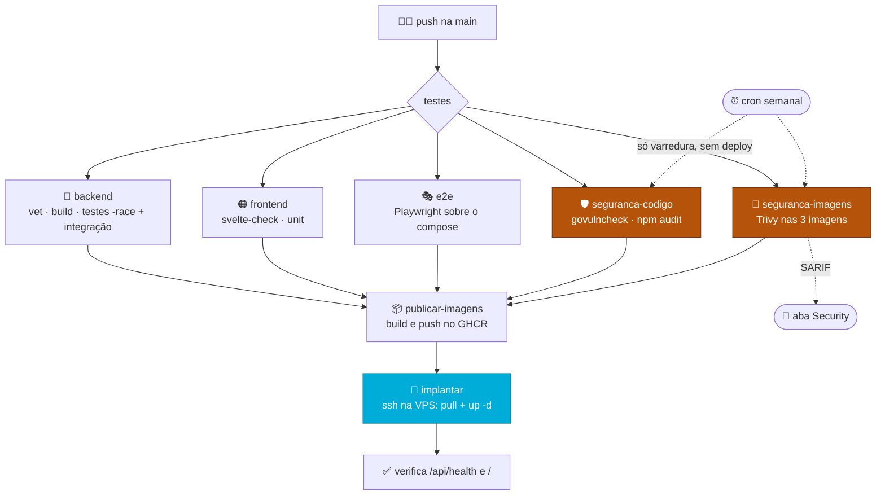
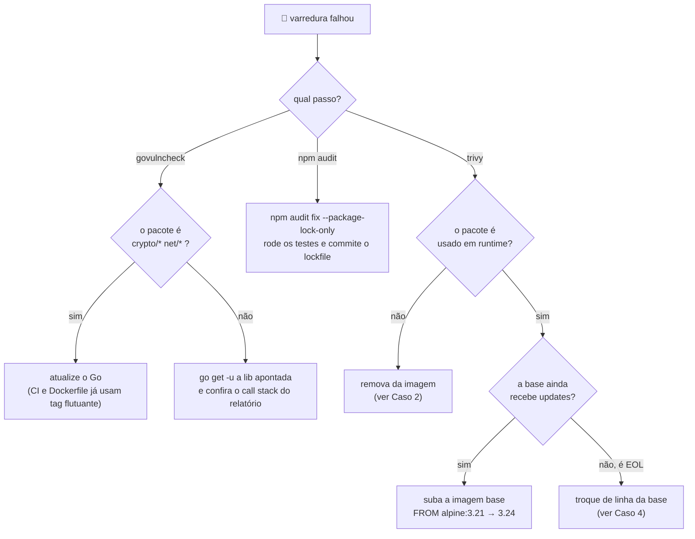

# 🔄 Entrega contínua e varredura de vulnerabilidades

> Como um commit vira produção neste projeto, e o que impede uma dependência
> vulnerável de ir junto. Documento de estudo: cada decisão vem com o porquê e
> com o caso real que a motivou.

O deploy fica em **[producao.md](producao.md)** (o passo a passo do servidor).
Aqui é o **automático**: o que o GitHub Actions faz sozinho, por quê, e como
ler o resultado quando fica vermelho.

---

## 1️⃣ O caminho de um commit até o ar



**A regra que segura tudo:** `publicar-imagens` declara
`needs: [backend, frontend, e2e, seguranca-codigo, seguranca-imagens]`. Se
qualquer um dos cinco falhar, nenhuma imagem é publicada e o servidor nunca é
tocado. **Produção só recebe código que passou por completo** — não existe
"deploy mesmo com o teste vermelho".

> [!NOTE]
> A varredura era um job só, `seguranca`. Virou dois porque o Trivy passou a
> rodar numa matriz — uma perna por imagem, inclusive a de **migrations**, que
> antes ia para produção sem ser varrida apesar de rodar na VPS com acesso ao
> banco. As dependências do código (`govulncheck`, `npm audit`) não têm o que
> fazer numa matriz por imagem, então ficaram no job irmão.

### Por que o cancelamento automático não vale para a main

```yaml
concurrency:
  group: ${{ github.workflow }}-${{ github.ref }}
  cancel-in-progress: ${{ github.event_name == 'pull_request' }}
```

Cancelar a execução anterior quando chega um push novo economiza tempo e é o
que se quer **em pull request**: ninguém espera o CI de um commit que já foi
substituído.

Na `main` era perigoso. `cancel-in-progress` é de nível de workflow e alcança
*todos* os jobs do run anterior — inclusive o `implantar`. Dois pushes seguidos
podiam matar o deploy no meio:

- entre o `docker compose pull` e o `up -d`, deixando a stack com containers em
  versões diferentes;
- durante a reescrita do crontab, que é um `crontab -l | grep -v … | crontab -`
  — cancelar ali **trunca o agendamento do backup**, em silêncio. O backup só
  faria falta no dia em que fosse necessário.

Definir `concurrency` no próprio job não resolve: a regra do workflow vence.
A saída é a expressão acima — o comportamento rápido continua onde é seguro.

### Por que a VPS só faz `pull`, nunca `build`

O CI compila as três imagens (`agendago-api`, `agendago-web`,
`agendago-migrations`) e publica no GHCR. O servidor recebe apenas
`docker-compose.prod.yml`, o `Caddyfile` e a ordem de puxar.

Uma VPS de 1 vCPU levaria minutos compilando Go e npm — e ficaria fora do ar
durante isso. Compilando no CI, o deploy vira download de imagem pronta:
segundos. O `.env` **nunca** é enviado; ele mora só no host, com os segredos.

### Por que a tag é o SHA do commit

```yaml
IMAGE_TAG=${{ github.sha }} docker compose -f docker-compose.prod.yml pull --quiet
```

> [!NOTE]
> O `--quiet` é só sobre o log. Sem terminal para reescrever a linha de
> progresso, o Docker imprime **uma linha nova por atualização de cada
> camada** — o deploy de uma imagem só já produziu milhares de linhas de
> `Downloading 10.49MB`, e um erro no meio disso não é encontrável. Erros
> continuam saindo em stderr; quem protege contra um pull travado é o
> `timeout-minutes` do job, não a barra de progresso.
>
> No deploy **manual** ([producao.md](producao.md)) a barra continua, porque
> ali existe terminal e ela se reescreve no lugar.

O servidor sobe exatamente o artefato que passou nos testes. Se fosse `latest`,
haveria uma janela em que outro push republicaria a tag entre o teste e o
deploy — e o que subiria não seria o que foi testado. Como bônus, dá rollback:
`IMAGE_TAG=<sha antigo> docker compose up -d`.

### Por que o cron não faz deploy

```yaml
if: (github.event_name == 'push' || github.event_name == 'workflow_dispatch') && github.ref == 'refs/heads/main'
```

O `schedule:` vale para o workflow inteiro, não só para o job de varredura. Sem
essa guarda, a execução de toda segunda republicaria imagens e reimplantaria
produção sozinha, sem ninguém ter commitado nada. A guarda deixa passar só
`push` (commit de verdade) e `workflow_dispatch` (o botão manual de redeploy).

---

## 2️⃣ Varredura de vulnerabilidades

### O problema que ela resolve

Num projeto pequeno, a via mais provável de comprometimento **não é uma falha
que você escreveu**. É uma CVE publicada numa biblioteca que você usa e que
ninguém percebeu que envelheceu.

A diferença é o tempo de descoberta. Um bug seu você encontra testando. Uma CVE
numa dependência é anunciada publicamente para o mundo inteiro — inclusive para
quem vai explorá-la — e o seu projeto continua exatamente igual, sem nenhum
sinal de que algo mudou. Ninguém te avisa. É esse silêncio que a varredura quebra.

### O modelo mental: sua aplicação tem três camadas

Este é o ponto que costuma confundir. "Dependência" não é uma coisa só — são
três, empilhadas, e **cada ferramenta enxerga uma**:

```
┌─────────────────────────────────────────────┐
│ 1. suas dependências                        │  chi, pgx, svelte, tailwind
│    (go.mod, package.json)                   │  → govulncheck / npm audit
├─────────────────────────────────────────────┤
│ 2. a biblioteca padrão da linguagem         │  crypto/tls, net/http
│    (a versão do Go que compilou o binário)  │  → govulncheck
├─────────────────────────────────────────────┤
│ 3. o sistema operacional da imagem          │  alpine, openssl, o npm que
│    (FROM golang:1.26-alpine, node:22-alpine)│    vem no node → Trivy
└─────────────────────────────────────────────┘
```

Rodar só `npm audit` deixa as camadas 2 e 3 no escuro. Rodar só o Trivy não
enxerga se o seu código realmente *chama* a função vulnerável. **Nenhuma das
três ferramentas substitui as outras** — é por isso que o job `seguranca` roda
as três.

| Ferramenta | Camada | Job | O que trava o CI |
|---|---|---|---|
| `govulncheck` | Go: suas libs + stdlib | `seguranca-codigo` | qualquer vulnerabilidade **alcançável** |
| `npm audit` | JS: dependências | `seguranca-codigo` | `high`+ **em produção** (`--omit=dev`) |
| `trivy` | imagem: SO e libs de sistema | `seguranca-imagens` | `CRITICAL` |

---

### 🔷 govulncheck — o diferencial é a *alcançabilidade*

A maioria dos scanners funciona assim: lê a lista de dependências, cruza com um
banco de CVEs, imprime tudo que bater. O resultado é uma lista enorme, quase
toda irrelevante — porque ter uma biblioteca instalada não significa usar a
parte vulnerável dela.

O `govulncheck` faz diferente: ele analisa o **grafo de chamadas** a partir do
seu `main`. Só reporta se existir um caminho real de execução do seu código até
a função vulnerável. E mostra o caminho:

```
#3: cmd/api/main.go:319:31: api.main calls http.Server.ListenAndServe,
    which calls net.Listen
```

Leia como uma acusação com prova: *"seu `main`, na linha 319, chama
`ListenAndServe`, que chama `net.Listen`, que é onde está a falha."* Não é
"você tem a lib X instalada" — é "este caminho no seu código chega lá".

Por isso o resultado dele **trava o deploy**: se apontou, é porque o seu
binário executa aquilo.

> [!NOTE]
> **O passo do swag antes.** O `main.go` importa `agendago/docs`, gerado pelo
> swag e fora do versionamento. Sem gerar antes, o `govulncheck` nem carrega os
> pacotes — ele precisa *compilar* para montar o grafo de chamadas. É o mesmo
> motivo pelo qual o job `backend` também gera as docs antes.

---

### 🟠 npm audit — por que roda duas vezes

```yaml
- name: npm audit — dependências de produção (trava o CI)
  run: npm audit --omit=dev --audit-level=high

- name: npm audit — relatório completo (não trava)
  if: always()
  run: npm audit || true
```

Parece redundante; não é. A diferença é **o que vai para dentro da imagem**.

O `package.json` mistura duas populações. As `dependencies` são embarcadas no
build e rodam em produção. As `devDependencies` — Vite, Playwright, svelte-check
— rodam na sua máquina e no CI, e **nunca** chegam ao servidor.

Uma CVE no Playwright é real, mas não é explorável por um visitante do site:
o Playwright não está lá. Se ela travasse o CI, você ficaria impedido de fazer
deploy de uma correção urgente por causa de uma ferramenta de teste. Por isso:

- **`--omit=dev`** → só o que roda em produção, e **trava**.
- **Relatório completo** → você continua vendo o resto, sem que ele bloqueie.

> [!TIP]
> `--audit-level=high` significa "ignore `low` e `moderate`". Não é desleixo: é
> reconhecer que um scanner com ruído demais vira um alarme que todo mundo
> aprende a ignorar. O relatório completo continua registrando as menores.

---

### 🐳 Trivy — o que os outros dois não veem

`govulncheck` e `npm audit` olham código-fonte e manifesto. Nenhum dos dois
enxerga o que a *imagem* carrega: o Alpine, o OpenSSL do sistema, e todo
binário que a imagem base já traz.

O Trivy varre a imagem **pronta**, como ela vai para o servidor.

```yaml
severity: 'CRITICAL,HIGH'
exit-code: '0'      # só relata
---
severity: 'CRITICAL'
exit-code: '1'      # trava
```

Duas passadas pelo mesmo motivo do `npm audit`: `CRITICAL` interrompe a
publicação, `HIGH` fica visível sem bloquear. O portão vem **por último** de
propósito — assim o relatório e o SARIF sobem mesmo na execução que reprova,
que é justamente aquela em que se quer ler o resultado.

#### As três imagens, não duas

A matriz cobre `agendago-api`, `agendago-web` e `agendago-migrations`. A de
migrations entrou depois: ela roda na VPS com credencial de banco e passava
direto, sem varredura, só porque não era uma das duas imagens "principais".
Imagem que chega ao servidor é imagem varrida — não há categoria de exceção.

#### Por que a varredura constrói com buildx

A build daqui usa `docker/build-push-action` com o mesmo `scope` de cache do
job que publica:

```yaml
cache-from: type=gha,scope=${{ matrix.imagem }}
cache-to: type=gha,mode=max,scope=${{ matrix.imagem }}
```

Antes era `docker build` puro, sem cache: a mesma imagem era compilada aqui e
**de novo** em `publicar-imagens`, minutos depois, do zero. Compartilhando o
cache, a segunda build reaproveita as camadas da primeira — Go e npm não
recompilam à toa.

#### O SARIF e a aba Security

```yaml
- name: Trivy — SARIF
  format: sarif
  output: trivy-${{ matrix.imagem }}.sarif
- uses: github/codeql-action/upload-sarif@v3
  with:
    category: trivy-${{ matrix.imagem }}
```

No log, o achado se perde no scroll e desaparece na execução seguinte. Em
SARIF, ele vai para a aba **Security** do repositório com histórico,
deduplicação e a data em que apareceu pela primeira vez — dá para responder
"desde quando essa CVE está aqui?", que o log não responde.

> [!NOTE]
> `category` distinta por imagem é obrigatório numa matriz: sem isso, a última
> perna a terminar sobrescreve o resultado das anteriores e só uma das três
> imagens fica registrada.

---

## 3️⃣ Casos reais deste projeto

A teoria acima só assenta com exemplo. Estes quatro aconteceram aqui, e cada um
ensina uma coisa diferente sobre **como agir** quando o job fica vermelho.

### Caso 1 — `postcss`: a correção é atualizar

`npm audit` acusou *path traversal* no `postcss` (severidade **high**), em
produção. Diagnóstico direto: a versão instalada era antiga e existia versão
corrigida.

```bash
npm audit fix --package-lock-only
# postcss 8.5.16 → 8.5.23
```

**A lição:** este é o caso simples, e o mais comum. Existe correção publicada,
você sobe a versão, acabou. Se todo achado fosse assim, o Dependabot faria
sentido.

### Caso 2 — `tar` dentro do npm: a correção é *remover*, não atualizar

O Trivy acusou uma vulnerabilidade em `usr/local/lib/node_modules/npm/node_modules/tar`
na imagem do frontend. Repare no caminho: não é uma dependência do projeto — é
o `tar` que o **npm** usa internamente, e o npm estava ali só porque vem
embutido no `node:22-alpine`.

O servidor do adapter-node roda com `node build`. Ele **nunca usa npm em
runtime**. A correção não foi atualizar nada:

```dockerfile
RUN rm -rf /usr/local/lib/node_modules/npm /usr/local/bin/npx /opt/yarn-* ...
```

Resultado: de 1 vulnerabilidade e 200+ alvos varridos para **zero**, imagem
menor, e um container de produção sem gerenciador de pacotes disponível para
quem eventualmente entrar nele.

**A lição:** antes de perguntar *"como atualizo isso?"*, pergunte **"eu preciso
disso aí?"**. A dependência mais segura é a que não está na imagem. Boa parte do
que o Trivy acusa em imagem base é ferramenta que ninguém usa em runtime.

### Caso 3 — a stdlib do Go: nem todo vermelho é culpa do seu código

Rodando o `govulncheck` localmente, apareceram **9 vulnerabilidades** em
`crypto/tls`, `crypto/x509` e `net/http` — coisa séria. Mas veja de onde vinham:

| Onde | Versão do Go | Situação |
|---|---|---|
| Máquina de desenvolvimento | 1.26.2 | as 9 falhas |
| CI (`go-version: '1.26'`) | 1.26.5 | corrigidas |
| Imagem de produção (`golang:1.26-alpine`) | 1.26.5 | corrigidas |

As correções saíram entre 1.26.3 e 1.26.5. Nenhuma linha do projeto precisava
mudar: **o conserto era atualizar o compilador**, e CI e produção já usavam tag
flutuante, que pega a versão mais nova sozinha.

**A lição:** quando o `govulncheck` reclamar de `crypto/*`, `net/*` ou
`html/template`, a causa quase sempre é a versão do Go, não o seu código.
E o corolário incômodo: **esse job vai ficar vermelho um dia sem você ter
mexido em nada** — basta sair uma CVE nova de stdlib. Isso não é o CI quebrado;
é o CI funcionando.

### Caso 4 — Flyway em base EOL: a correção existe, mas não chega até você

Este apareceu na **primeira execução** depois que a imagem de migrations entrou
na varredura — até então ela ia para produção sem ser olhada. Cinco CVEs
**CRITICAL** de uma vez, e o aviso que explicava tudo:

```
WARN  This OS version is no longer supported by the distribution  family="alpine" version="3.20.3"
WARN  The vulnerability detection may be insufficient because security updates are not provided
```

| CVE | Pacote | Correção |
|---|---|---|
| CVE-2026-33845, CVE-2026-42010 | `gnutls` | 3.8.13-r0 |
| CVE-2026-31789 | `openssl`, `libcrypto3`, `libssl3` | 3.3.7-r0 |

Repare no detalhe cruel: **a coluna "correção" está preenchida**. Os patches
existem há tempo. Só que `flyway/flyway:10-alpine` está preso no Alpine 3.20,
que saiu de suporte — e distribuição EOL não recebe backport de segurança. Um
`apk upgrade` ali não traz nada, porque não há nada publicado para buscar.

Foi o primeiro reflexo, e estava errado: subir para `11-alpine` (Alpine 3.22)
**não resolveu** — as mesmas 5 CVEs continuaram, porque essa imagem foi
construída em janeiro e as correções são posteriores. A imagem base estar numa
linha suportada não significa que ela esteja atualizada.

A saída foi `flyway/flyway:13-alpine` (Alpine 3.23, reconstruída com
frequência), verificada nos dois caminhos que importam:

| Verificação | Resultado |
|---|---|
| CRITICAL na imagem | 5 → **0** |
| HIGH na imagem | 98 → **20** |
| 13 migrations em banco novo | aplicam, `v13` |
| Flyway 13 sobre schema history criado pela 10 | valida e reporta *up to date*, sem reexecutar |

**A lição:** *"tem correção disponível?"* e *"a correção chega na minha
imagem?"* são perguntas diferentes. Numa base EOL a resposta da segunda é
sempre não, e nenhum `apk upgrade` muda isso — o conserto é **sair da linha
EOL**. E, ao sair, confira a data de build da imagem nova: linha suportada e
imagem atualizada também são coisas diferentes.

> [!TIP]
> Isto é o argumento prático do Dependabot para `package-ecosystem: docker`
> (seção 5): ele acompanha a tag da base e avisa quando a linha avança, em vez
> de a descoberta vir de uma varredura vermelha meses depois.

### Caso 5 — onde os alertas abertos realmente estavam

A aba Security acumulando alertas levou à hipótese óbvia: as bases das imagens
de API e web estavam velhas (`alpine:3.21`, de dezembro de 2024, e
`node:22-alpine`), e um bump limparia boa parte. **A medição desmentiu isso.**

| Imagem | Base | HIGH+CRITICAL |
|---|---|---|
| `agendago-api` | `alpine:3.21` → `3.24` | 0 → **0** |
| `agendago-web` | `node:22-alpine` → `24-alpine` | 0 → **0** |
| `agendago-migrations` | `flyway/flyway:13-alpine` | **20** |

O Alpine já estava limpo nas duas versões. E a imagem web fica em zero **apesar
de** `node:24-alpine` sozinho acusar 5 HIGH: eles moram no npm, que o
`Dockerfile.prod` remove do runtime (Caso 2). A mitigação de lá continua
pagando dividendos aqui.

Ou seja: **todo o volume estava numa imagem só** — justamente a que o Caso 4
havia declarado resolvida. E "resolvida" ali significava *zero CRITICAL*, não
zero alerta.

Dos 20, cinco eram pacotes de sistema (`libexpat`, `p11-kit`) que a base do
Flyway ainda não tinha incorporado. Um `apk upgrade --no-cache` por cima da
imagem oficial resolve esses — o oposto do Caso 4, onde o mesmo comando não
trazia nada porque a distribuição estava EOL:

| | |
|---|---|
| HIGH antes | 20 |
| HIGH depois do `apk upgrade` | **15** |
| Flyway continua funcional | `Flyway OSS Edition 13.0.0` |

Sobraram 15 HIGH e 24 MEDIUM, todos em bibliotecas Java. E foi só olhar **onde**
elas moravam para a resposta aparecer:

```
flyway/drivers/couchbase/core-io-3.12.0.jar        → netty, jackson
flyway/drivers/databricks-jdbc-3.4.1.jar           → jackson, lz4
flyway/drivers/mssql-jdbc-12.10.2.jre11.jar        → mssql-jdbc
flyway/lib/netty/netty-codec-http-4.2.15.Final.jar → netty
```

**Couchbase. Databricks. SQL Server.** O agendaGo fala com PostgreSQL e nada
mais. A imagem oficial do Flyway embarca **290 MB de drivers** para vinte e
tantos bancos, e cada um deles traz a própria árvore de dependências Java junto.

Ou seja: não havia correção por *atualização* porque as bibliotecas estavam
certas onde estavam — o errado era elas estarem ali. Isto é o **Caso 2 de novo**,
com outro figurino: a correção é remover, não atualizar. Não existe versão
corrigida de uma dependência que não deveria fazer parte da imagem.

| | HIGH | MEDIUM |
|---|:---:|:---:|
| Imagem oficial | 20 | — |
| Após `apk upgrade` | 15 | 24 |
| Após remover os drivers não usados | **0** | **0** |

> [!CAUTION]
> **Não dá para remover tudo que não se usa.** O primeiro corte tirou os 290 MB
> inteiros, deixando só o `postgresql-*.jar` — e o Flyway não subiu:
>
> ```
> Caused by: java.lang.ClassNotFoundException:
>   com.datastax.oss.driver.api.core.cql.Statement
> ```
>
> Ele resolve os plugins de banco por `ServiceLoader` e os carrega **avidamente**:
> sem o driver do Cassandra no classpath, o boot morre — mesmo sem nenhum uso de
> Cassandra. O corte que funciona é cirúrgico, e o único teste que vale é rodar
> `flyway migrate` contra um Postgres de verdade: 13 migrations, 15 tabelas.

**Três lições:**

1. **Meça antes de consertar.** A hipótese de que bases velhas explicavam os
   alertas era plausível, coerente com o histórico do projeto — e errada. Trinta
   segundos de `trivy image` teriam poupado a conclusão apressada.
2. **Leia o caminho do achado, não só o nome do pacote.** "netty tem CVE" leva a
   procurar netty atualizado. `flyway/drivers/couchbase/...` leva à pergunta
   certa: *por que existe um driver de Couchbase nesta imagem?*
3. **"Zero CRITICAL" não é "zero alerta".** O portão do CI trava em CRITICAL, e
   é fácil ler o verde dele como imagem limpa. Os HIGH seguem acumulando na aba
   Security, exatamente como projetado — mas quem lê o portão precisa saber que
   essa é a intenção, não um descuido.

E o bump de `alpine:3.24`/`node:24-alpine` ficou, mesmo sem ganho imediato: o
Alpine 3.21 perde suporte em novembro de 2026 e o Node 22 sai do LTS ativo.
Trocar antes do vencimento é manutenção; trocar depois é o Caso 4 de novo.

### Caso 6 — `x/crypto/openpgp` no binário da API: alcançabilidade de novo

Sobra um alerta fora do Flyway, em severidade **Note**: *"the golang.org/x/crypto/openpgp
package is unmaintained, unsafe by design"*, apontado no próprio binário da API.

Só que o pacote não é usado:

```console
$ go mod why golang.org/x/crypto/openpgp
(main module does not need package golang.org/x/crypto/openpgp)

$ go tool nm bin/api | grep -c openpgp
0
```

Zero símbolos linkados. O `x/crypto` entra por `argon2id`, `go-mail` e
`validator`, e o Go só linka os **pacotes** efetivamente alcançados — mas o Trivy
lê o *buildinfo* embutido no binário, que lista **módulos**, e casa o aviso no
nível do módulo inteiro.

É o [Caso 3](#caso-3--a-stdlib-do-go-nem-todo-vermelho-é-culpa-do-seu-código)
pelo avesso: lá o govulncheck evitou o alarme falso justamente por fazer análise
de alcançabilidade. Ferramentas diferentes, granularidades diferentes — e o
`govulncheck` do pipeline segue verde neste caso, o que é a segunda opinião que
importa. Nada a corrigir.

---

## 4️⃣ Ficou vermelho. E agora?



**Regra geral:** leia *onde* está a vulnerabilidade antes de tentar corrigi-la.
Os quatro casos acima têm quatro consertos completamente diferentes — atualizar
dependência, remover software inútil, atualizar o compilador, trocar a linha da
imagem base — e o que decide qual é o caminho no relatório, não a severidade.

---

## 5️⃣ Dependabot: removido, e depois readmitido com coleira

Esta seção já se chamou *"Por que não usamos Dependabot"*. A decisão mudou, e
vale registrar as duas metades — porque o motivo original **continua válido**.

### Por que tinha sido removido

O Dependabot vigia versões e **abre um PR** quando sai uma nova. Neste projeto
se commita direto na `main` e não se usa pull request. Ele só sabe se comunicar
por PR: na primeira execução abriu **12 PRs** de uma vez, um por dependência.
Agrupados por ecossistema, ainda eram 4 por semana. Volume que ninguém revisa
vira ruído, e ruído recorrente ensina a ignorar o aviso — o contrário do
objetivo.

### O que faltava sem ele

O `schedule` semanal do CI **detecta**: toda segunda a varredura roda e o build
fica vermelho se apareceu CVE nova.

```yaml
schedule:
  - cron: '0 9 * * 1'   # segunda, 9h UTC (6h em Brasília)
```

O que ele não faz é **fechar o ciclo**. Descoberto o problema, achar a versão
corrigida, subir o bump e conferir se quebrou alguma coisa continuava sendo
trabalho manual, numa segunda de manhã, com o CI vermelho pressionando. O
Caso 1 (`postcss`) é exatamente isso: um `npm audit fix` que a máquina podia
ter proposto sozinha.

### A configuração que voltou

O problema nunca foi o Dependabot — era o **volume**. Então o volume virou o
parâmetro a ajustar:

| | Como era | Como está |
|---|---|---|
| Cadência | `weekly` | **`monthly`** |
| Agrupamento | um PR por dependência | **um PR por ecossistema** (patch/minor) |
| Teto | sem limite | `open-pull-requests-limit` 2–3 |
| Volume resultante | ~12, depois ~4/semana | **~4/mês** |

Major continua vindo separado, porque é o que costuma quebrar e merece ser lido
sozinho.

> [!IMPORTANT]
> **Alertas de segurança não passam por essa cadência.** Eles são ligados em
> *Settings → Code security*, não no `dependabot.yml`, e chegam assim que a CVE
> é publicada. É esse canal que fecha o ciclo com a varredura; o ciclo mensal é
> só higiene de versão.

E o `schedule` semanal continua: as duas coisas resolvem problemas diferentes.
O Dependabot avisa que **saiu versão nova**; a varredura avisa que **a versão
que você tem virou um problema** — o que também acontece sem ninguém publicar
nada, como no Caso 3 (stdlib do Go).

### Auto-merge: o que fecha o PR sozinho

CI verde **não mescla nem fecha PR nenhum** — ele só pinta os checks. Sem
automação, cada PR do Dependabot fica aberto esperando alguém apertar o botão,
e é assim que se acumulam seis PRs parados.

O `.github/workflows/dependabot-auto-merge.yml` fecha esse laço, com um limite
rígido: **major nunca é mesclado sozinho**.

| Tipo | O que acontece |
|---|---|
| patch/minor, CI verde | mesclado com squash, branch apagado |
| grupo (`npm-menores`, `go-menores`) | mesclado — os grupos só admitem minor/patch |
| **major** | comentário no PR explicando, e fica para você |
| CI vermelho | nada acontece |

A regra do major não é excesso de zelo: o PR do **TypeScript 6 → 7** derrubou o
`svelte-check` e o E2E de uma vez. Mesclado sozinho, teria quebrado a `main`.

#### Por que o gatilho é o fim do CI, e não a abertura do PR

O padrão mais divulgado é reagir ao `pull_request` e chamar
`gh pr merge --auto`, deixando o GitHub mesclar quando os checks passarem.
**Desde 25/03/2026 isso não funciona mais**: o GitHub passou a recusar a
*ativação* do auto-merge enquanto os requisitos não estiverem cumpridos — e no
instante em que o PR abre, o CI nem começou.

Por isso o gatilho aqui é `workflow_run` no término do CI, quando o resultado
já existe e a mesclagem é direta:

```yaml
on:
  workflow_run:
    workflows: [CI]
    types: [completed]
    branches: ['dependabot/**']
```

Efeito colateral bem-vindo: **não exige branch protection** com checks
obrigatórios. Como neste projeto se commita direto na `main`, exigir PR para
tudo atrapalharia o fluxo normal em troca de nada.

#### Por que o filtro de branch fica no gatilho, e não no `if`

As condições do job (`conclusion`, `event`, `actor`) já barravam tudo que não
fosse PR do Dependabot, mas barravam **tarde demais**: o GitHub cria a execução
antes de avaliar o `if`, então cada push na `main` deixava um run *skipped* do
auto-merge na aba Actions. Nada errado acontecia — só que a aba passava a ter
duas linhas por commit, e a que nunca faz nada se confunde com falha de verdade
na hora de procurar um deploy quebrado.

O `branches` no `workflow_run` filtra pelo branch do CI que terminou. Como o
Dependabot sempre nomeia o branch com o prefixo `dependabot/`, um push na `main`
deixa de casar com o gatilho e **nenhuma execução chega a ser criada**. As
condições do job continuam lá como rede de segurança: o filtro de branch não
diz nada sobre o CI ter passado, nem impede um humano de abrir um PR de um
branch com esse prefixo.

> [!NOTE]
> A decisão de mesclar sai do **título** do PR, que o Dependabot escreve em
> formato estável (`bump X from 1.2.3 to 7.0.2`, ou `bump the <grupo> group`).
> O formato da versão varia mais do que parece — `6.0.3`, `5` e `22-alpine` são
> todos títulos reais deste repositório —, então a comparação usa só o inteiro
> inicial de cada lado. Título que não casa com nenhum dos dois formatos é
> tratado como major: na dúvida, não mescla.

---

## 6️⃣ As proteções chatas do workflow

Nenhuma delas aparece quando tudo dá certo. Todas existem por causa de um jeito
específico de dar errado.

### `timeout-minutes` em todos os jobs

O padrão do GitHub é **360 minutos**. Os jobs daqui levam de 0,3 a 3,7 min: um
`waitFor` travado no Playwright ou um `ssh` pendurado numa VPS que não responde
seguraria o grupo de concorrência por seis horas antes de alguém perceber. Cada
job declara um teto com folga (10 a 20 min) — se estourar, é bug, não lentidão.

### `permissions: contents: read` no topo

O `GITHUB_TOKEN` chega a cada job com as permissões padrão do repositório.
Declarar o mínimo no topo e elevar só onde é necessário deixa explícito quem
precisa de quê:

| Job | Permissão extra | Para quê |
|---|---|---|
| `publicar-imagens` | `packages: write` | publicar no GHCR |
| `seguranca-imagens` | `security-events: write` | enviar o SARIF |

Todos os outros só leem o repositório. Num CI que guarda a chave SSH de
produção, isso é a diferença entre um passo comprometido conseguir ler código e
conseguir publicar imagem.

### `VPS_KNOWN_HOSTS` deixou de ser opcional

Havia um fallback: sem o segredo, o job rodava `ssh-keyscan` e aceitava a
identidade de quem respondesse — **a cada deploy**, não só na primeira vez —
e em seguida entregava a chave de deploy. Como a VPS já está de pé, fixar a
identidade custa um comando, e o caso ausente virou falha com a instrução no
próprio erro:

```
::error::VPS_KNOWN_HOSTS não configurado. Gere com: ssh-keyscan -p 22 -H SEU_IP
```

### As actions locais em `.github/actions/`

Dois blocos viviam copiados em quatro jobs: o login condicional no Docker Hub e
o `docker pull` com retentativa. Viraram *composite actions* locais:

```yaml
- uses: ./.github/actions/docker-hub-login
  with:
    usuario: ${{ secrets.DOCKERHUB_USERNAME }}
    token: ${{ secrets.DOCKERHUB_TOKEN }}

- uses: ./.github/actions/docker-pull
  with:
    imagem: postgres:16-alpine
```

O ganho não é tamanho de arquivo: é a explicação da cota do Docker Hub passar a
morar num lugar só, em vez de quatro cópias que se desatualizam em ritmos
diferentes.

---

## ⚠️ O que esta varredura **não** cobre

Saber o limite da ferramenta é parte de confiar nela:

- **Falhas de lógica no seu código.** Um `if` de autorização invertido não é
  CVE de ninguém. Isso é papel dos testes e da revisão.
- **CVE recém-publicada.** O scanner só sabe o que já está no banco de
  vulnerabilidades. Entre a exploração existir e ela ser catalogada, existe uma
  janela.
- **Segredo vazado no repositório.** É outra categoria de problema (e o motivo
  de o `.env` nunca sair do host).
- **A configuração do servidor.** Firewall, SSH, permissões — nada disso está
  numa imagem para ser varrido. Veja o checklist em
  [producao.md](producao.md#-checklist-de-go-live).

---

## 📚 Para estudar

**Varredura e dependências**
- [Go — Vulnerability Management](https://go.dev/doc/security/vuln/) — como o banco de vulnerabilidades e a análise de alcançabilidade funcionam
- [govulncheck: o anúncio](https://go.dev/blog/govulncheck) — a motivação por trás da análise de call graph
- [OWASP Top 10 — A06: Vulnerable and Outdated Components](https://owasp.org/Top10/A06_2021-Vulnerable_and_Outdated_Components/) — o item que essas ferramentas atacam
- [npm audit](https://docs.npmjs.com/cli/commands/npm-audit) — o que significa cada nível de severidade
- [Trivy — documentação](https://trivy.dev/latest/docs/) — os scanners disponíveis além de `vuln`

**Entrega contínua**
- [GitHub Actions — workflows](https://docs.github.com/en/actions/using-workflows) — `on:`, `needs:`, `if:` e as expressões de contexto
- [Docker — build multi-stage](https://docs.docker.com/build/building/multi-stage/) — por que a imagem final não carrega o compilador
- [OWASP — Docker Security Cheat Sheet](https://cheatsheetseries.owasp.org/cheatsheets/Docker_Security_Cheat_Sheet.html) — o que mais endurecer numa imagem
