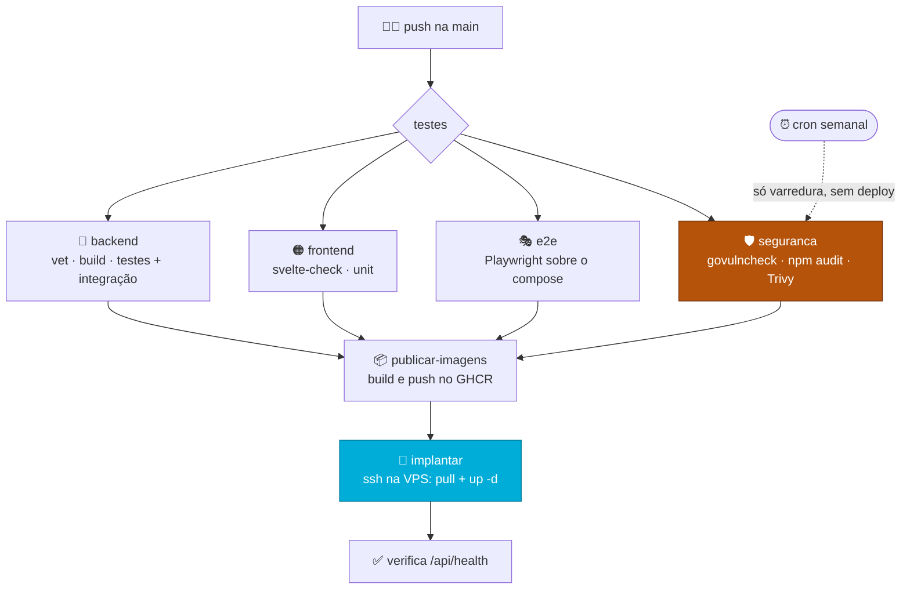
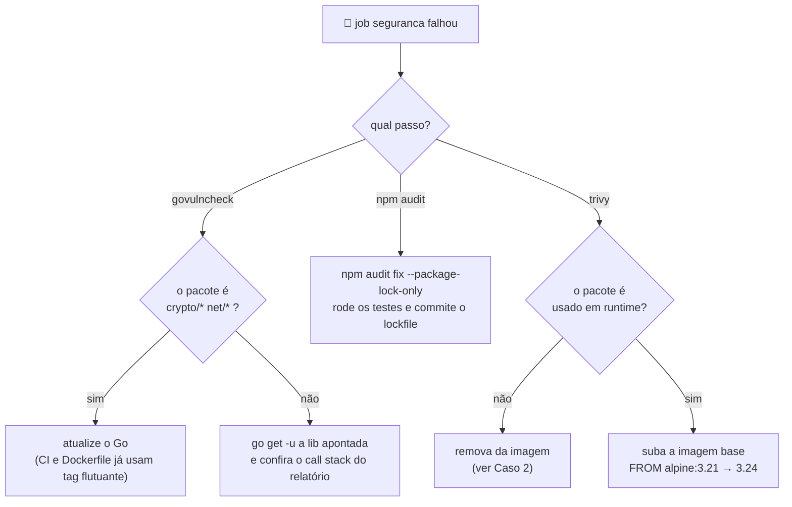

# 🔄 Entrega contínua e varredura de vulnerabilidades

> Como um commit vira produção neste projeto, e o que impede uma dependência
> vulnerável de ir junto. Documento de estudo: cada decisão vem com o porquê e
> com o caso real que a motivou.

O deploy fica em **[producao.md](producao.md)** (o passo a passo do servidor).
Aqui é o **automático**: o que o GitHub Actions faz sozinho, por quê, e como
ler o resultado quando fica vermelho.

---

## 1️⃣ O caminho de um commit até o ar



**A regra que segura tudo:** `publicar-imagens` declara
`needs: [backend, frontend, e2e, seguranca]`. Se qualquer um dos quatro falhar,
nenhuma imagem é publicada e o servidor nunca é tocado. **Produção só recebe
código que passou por completo** — não existe "deploy mesmo com o teste
vermelho".

### Por que a VPS só faz `pull`, nunca `build`

O CI compila as três imagens (`agendago-api`, `agendago-web`,
`agendago-migrations`) e publica no GHCR. O servidor recebe apenas
`docker-compose.prod.yml`, o `Caddyfile` e a ordem de puxar.

Uma VPS de 1 vCPU levaria minutos compilando Go e npm — e ficaria fora do ar
durante isso. Compilando no CI, o deploy vira download de imagem pronta:
segundos. O `.env` **nunca** é enviado; ele mora só no host, com os segredos.

### Por que a tag é o SHA do commit

```yaml
IMAGE_TAG=${{ github.sha }} docker compose -f docker-compose.prod.yml pull
```

O servidor sobe exatamente o artefato que passou nos testes. Se fosse `latest`,
haveria uma janela em que outro push republicaria a tag entre o teste e o
deploy — e o que subiria não seria o que foi testado. Como bônus, dá rollback:
`IMAGE_TAG=<sha antigo> docker compose up -d`.

### Por que o cron não faz deploy

```yaml
if: (github.event_name == 'push' || github.event_name == 'workflow_dispatch') && github.ref == 'refs/heads/main'
```

O `schedule:` vale para o workflow inteiro, não só para o job de varredura. Sem
essa guarda, a execução de toda segunda republicaria imagens e reimplantaria
produção sozinha, sem ninguém ter commitado nada. A guarda deixa passar só
`push` (commit de verdade) e `workflow_dispatch` (o botão manual de redeploy).

---

## 2️⃣ Varredura de vulnerabilidades

### O problema que ela resolve

Num projeto pequeno, a via mais provável de comprometimento **não é uma falha
que você escreveu**. É uma CVE publicada numa biblioteca que você usa e que
ninguém percebeu que envelheceu.

A diferença é o tempo de descoberta. Um bug seu você encontra testando. Uma CVE
numa dependência é anunciada publicamente para o mundo inteiro — inclusive para
quem vai explorá-la — e o seu projeto continua exatamente igual, sem nenhum
sinal de que algo mudou. Ninguém te avisa. É esse silêncio que a varredura quebra.

### O modelo mental: sua aplicação tem três camadas

Este é o ponto que costuma confundir. "Dependência" não é uma coisa só — são
três, empilhadas, e **cada ferramenta enxerga uma**:

```
┌─────────────────────────────────────────────┐
│ 1. suas dependências                        │  chi, pgx, svelte, tailwind
│    (go.mod, package.json)                   │  → govulncheck / npm audit
├─────────────────────────────────────────────┤
│ 2. a biblioteca padrão da linguagem         │  crypto/tls, net/http
│    (a versão do Go que compilou o binário)  │  → govulncheck
├─────────────────────────────────────────────┤
│ 3. o sistema operacional da imagem          │  alpine, openssl, o npm que
│    (FROM golang:1.26-alpine, node:22-alpine)│    vem no node → Trivy
└─────────────────────────────────────────────┘
```

Rodar só `npm audit` deixa as camadas 2 e 3 no escuro. Rodar só o Trivy não
enxerga se o seu código realmente *chama* a função vulnerável. **Nenhuma das
três ferramentas substitui as outras** — é por isso que o job `seguranca` roda
as três.

| Ferramenta | Camada | O que trava o CI |
|---|---|---|
| `govulncheck` | Go: suas libs + stdlib | qualquer vulnerabilidade **alcançável** |
| `npm audit` | JS: dependências | `high`+ **em produção** (`--omit=dev`) |
| `trivy` | imagem: SO e libs de sistema | `CRITICAL` |

---

### 🔷 govulncheck — o diferencial é a *alcançabilidade*

A maioria dos scanners funciona assim: lê a lista de dependências, cruza com um
banco de CVEs, imprime tudo que bater. O resultado é uma lista enorme, quase
toda irrelevante — porque ter uma biblioteca instalada não significa usar a
parte vulnerável dela.

O `govulncheck` faz diferente: ele analisa o **grafo de chamadas** a partir do
seu `main`. Só reporta se existir um caminho real de execução do seu código até
a função vulnerável. E mostra o caminho:

```
#3: cmd/api/main.go:319:31: api.main calls http.Server.ListenAndServe,
    which calls net.Listen
```

Leia como uma acusação com prova: *"seu `main`, na linha 319, chama
`ListenAndServe`, que chama `net.Listen`, que é onde está a falha."* Não é
"você tem a lib X instalada" — é "este caminho no seu código chega lá".

Por isso o resultado dele **trava o deploy**: se apontou, é porque o seu
binário executa aquilo.

> [!NOTE]
> **O passo do swag antes.** O `main.go` importa `agendago/docs`, gerado pelo
> swag e fora do versionamento. Sem gerar antes, o `govulncheck` nem carrega os
> pacotes — ele precisa *compilar* para montar o grafo de chamadas. É o mesmo
> motivo pelo qual o job `backend` também gera as docs antes.

---

### 🟠 npm audit — por que roda duas vezes

```yaml
- name: npm audit — dependências de produção (trava o CI)
  run: npm audit --omit=dev --audit-level=high

- name: npm audit — relatório completo (não trava)
  if: always()
  run: npm audit || true
```

Parece redundante; não é. A diferença é **o que vai para dentro da imagem**.

O `package.json` mistura duas populações. As `dependencies` são embarcadas no
build e rodam em produção. As `devDependencies` — Vite, Playwright, svelte-check
— rodam na sua máquina e no CI, e **nunca** chegam ao servidor.

Uma CVE no Playwright é real, mas não é explorável por um visitante do site:
o Playwright não está lá. Se ela travasse o CI, você ficaria impedido de fazer
deploy de uma correção urgente por causa de uma ferramenta de teste. Por isso:

- **`--omit=dev`** → só o que roda em produção, e **trava**.
- **Relatório completo** → você continua vendo o resto, sem que ele bloqueie.

> [!TIP]
> `--audit-level=high` significa "ignore `low` e `moderate`". Não é desleixo: é
> reconhecer que um scanner com ruído demais vira um alarme que todo mundo
> aprende a ignorar. O relatório completo continua registrando as menores.

---

### 🐳 Trivy — o que os outros dois não veem

`govulncheck` e `npm audit` olham código-fonte e manifesto. Nenhum dos dois
enxerga o que a *imagem* carrega: o Alpine, o OpenSSL do sistema, e todo
binário que a imagem base já traz.

O Trivy varre a imagem **pronta**, como ela vai para o servidor.

```yaml
severity: 'CRITICAL'
exit-code: '1'      # trava
---
severity: 'CRITICAL,HIGH'
exit-code: '0'      # só relata
```

Duas passadas pelo mesmo motivo do `npm audit`: `CRITICAL` interrompe a
publicação, `HIGH` fica visível sem bloquear.

---

## 3️⃣ Casos reais deste projeto

A teoria acima só assenta com exemplo. Estes três aconteceram aqui, e cada um
ensina uma coisa diferente sobre **como agir** quando o job fica vermelho.

### Caso 1 — `postcss`: a correção é atualizar

`npm audit` acusou *path traversal* no `postcss` (severidade **high**), em
produção. Diagnóstico direto: a versão instalada era antiga e existia versão
corrigida.

```bash
npm audit fix --package-lock-only
# postcss 8.5.16 → 8.5.23
```

**A lição:** este é o caso simples, e o mais comum. Existe correção publicada,
você sobe a versão, acabou. Se todo achado fosse assim, o Dependabot faria
sentido.

### Caso 2 — `tar` dentro do npm: a correção é *remover*, não atualizar

O Trivy acusou uma vulnerabilidade em `usr/local/lib/node_modules/npm/node_modules/tar`
na imagem do frontend. Repare no caminho: não é uma dependência do projeto — é
o `tar` que o **npm** usa internamente, e o npm estava ali só porque vem
embutido no `node:22-alpine`.

O servidor do adapter-node roda com `node build`. Ele **nunca usa npm em
runtime**. A correção não foi atualizar nada:

```dockerfile
RUN rm -rf /usr/local/lib/node_modules/npm /usr/local/bin/npx /opt/yarn-* ...
```

Resultado: de 1 vulnerabilidade e 200+ alvos varridos para **zero**, imagem
menor, e um container de produção sem gerenciador de pacotes disponível para
quem eventualmente entrar nele.

**A lição:** antes de perguntar *"como atualizo isso?"*, pergunte **"eu preciso
disso aí?"**. A dependência mais segura é a que não está na imagem. Boa parte do
que o Trivy acusa em imagem base é ferramenta que ninguém usa em runtime.

### Caso 3 — a stdlib do Go: nem todo vermelho é culpa do seu código

Rodando o `govulncheck` localmente, apareceram **9 vulnerabilidades** em
`crypto/tls`, `crypto/x509` e `net/http` — coisa séria. Mas veja de onde vinham:

| Onde | Versão do Go | Situação |
|---|---|---|
| Máquina de desenvolvimento | 1.26.2 | as 9 falhas |
| CI (`go-version: '1.26'`) | 1.26.5 | corrigidas |
| Imagem de produção (`golang:1.26-alpine`) | 1.26.5 | corrigidas |

As correções saíram entre 1.26.3 e 1.26.5. Nenhuma linha do projeto precisava
mudar: **o conserto era atualizar o compilador**, e CI e produção já usavam tag
flutuante, que pega a versão mais nova sozinha.

**A lição:** quando o `govulncheck` reclamar de `crypto/*`, `net/*` ou
`html/template`, a causa quase sempre é a versão do Go, não o seu código.
E o corolário incômodo: **esse job vai ficar vermelho um dia sem você ter
mexido em nada** — basta sair uma CVE nova de stdlib. Isso não é o CI quebrado;
é o CI funcionando.

---

## 4️⃣ Ficou vermelho. E agora?



**Regra geral:** leia *onde* está a vulnerabilidade antes de tentar corrigi-la.
Os três casos acima têm três consertos completamente diferentes — atualizar
dependência, remover software inútil, atualizar o compilador — e o que decide
qual é o caminho no relatório, não a severidade.

---

## 5️⃣ Por que não usamos Dependabot

O Dependabot vigia versões e **abre um PR** quando sai uma nova. Chegou a ficar
configurado aqui; foi removido.

O motivo é de fluxo, não técnico: neste projeto se commita direto na `main` e
não se usa pull request. O Dependabot só sabe se comunicar por PR — na primeira
execução abriu **12 PRs** de uma vez, um por dependência. Agrupados por
ecossistema ainda eram 4 por semana. Volume que ninguém revisa vira ruído, e
ruído recorrente ensina a ignorar o aviso — exatamente o contrário do objetivo.

**O que ficou no lugar:** um `schedule` semanal no próprio CI.

```yaml
schedule:
  - cron: '0 9 * * 1'   # segunda, 9h UTC (6h em Brasília)
```

Sem ele, o job `seguranca` só rodaria quando alguém commitasse — e uma CVE
publicada numa semana sem push passaria despercebida até o próximo commit.
Com ele, o ciclo fica:

> roda sozinho toda segunda → achou CVE, build vermelho → você corrige e
> commita normal

Zero PRs, e o aviso não se perde. A diferença para o Dependabot é que ninguém
te entrega a correção pronta: você lê o relatório e decide, que é justamente o
que os três casos da seção anterior mostram ser necessário.

---

## ⚠️ O que esta varredura **não** cobre

Saber o limite da ferramenta é parte de confiar nela:

- **Falhas de lógica no seu código.** Um `if` de autorização invertido não é
  CVE de ninguém. Isso é papel dos testes e da revisão.
- **CVE recém-publicada.** O scanner só sabe o que já está no banco de
  vulnerabilidades. Entre a exploração existir e ela ser catalogada, existe uma
  janela.
- **Segredo vazado no repositório.** É outra categoria de problema (e o motivo
  de o `.env` nunca sair do host).
- **A configuração do servidor.** Firewall, SSH, permissões — nada disso está
  numa imagem para ser varrido. Veja o checklist em
  [producao.md](producao.md#-checklist-de-go-live).

---

## 📚 Para estudar

**Varredura e dependências**
- [Go — Vulnerability Management](https://go.dev/doc/security/vuln/) — como o banco de vulnerabilidades e a análise de alcançabilidade funcionam
- [govulncheck: o anúncio](https://go.dev/blog/govulncheck) — a motivação por trás da análise de call graph
- [OWASP Top 10 — A06: Vulnerable and Outdated Components](https://owasp.org/Top10/A06_2021-Vulnerable_and_Outdated_Components/) — o item que essas ferramentas atacam
- [npm audit](https://docs.npmjs.com/cli/commands/npm-audit) — o que significa cada nível de severidade
- [Trivy — documentação](https://trivy.dev/latest/docs/) — os scanners disponíveis além de `vuln`

**Entrega contínua**
- [GitHub Actions — workflows](https://docs.github.com/en/actions/using-workflows) — `on:`, `needs:`, `if:` e as expressões de contexto
- [Docker — build multi-stage](https://docs.docker.com/build/building/multi-stage/) — por que a imagem final não carrega o compilador
- [OWASP — Docker Security Cheat Sheet](https://cheatsheetseries.owasp.org/cheatsheets/Docker_Security_Cheat_Sheet.html) — o que mais endurecer numa imagem
