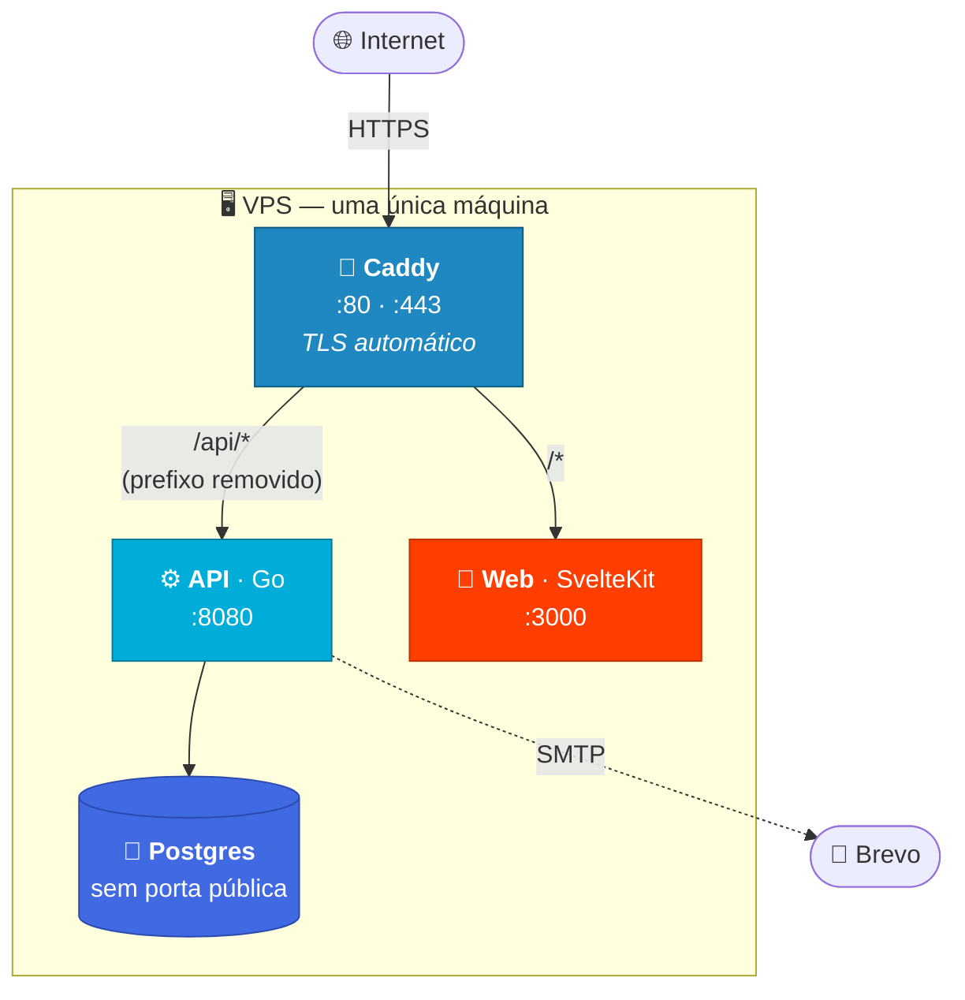
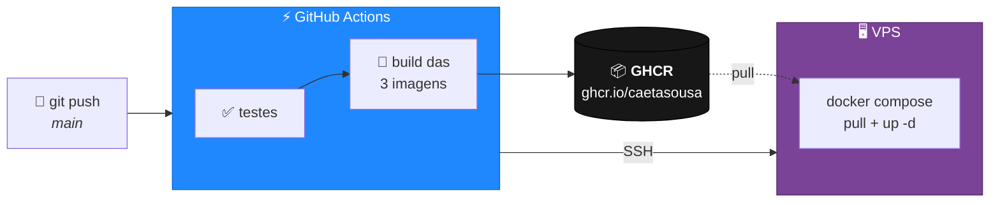
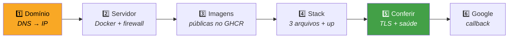
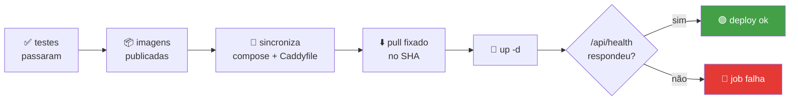

# 🚀 Produção

> Como o agendaGo vai para o ar, **na ordem em que as coisas precisam acontecer**.
> Este é o roteiro que foi realmente percorrido no primeiro deploy — com os erros
> que apareceram no caminho e o que os causou.


| | |
|---|---|
| **Onde roda** | uma VPS pequena (1 vCPU / 4 GB dá folga) |
| **O que fica no servidor** | 3 arquivos — nunca o código-fonte |
| **Como atualiza** | `git push` na `main` |
| **Quanto demora um deploy** | segundos (é só download de imagem) |

> [!NOTE]
> O `docker-compose.yml` da raiz é **só para desenvolvimento** (hot reload,
> portas expostas, Mailpit). Produção usa o **`docker-compose.prod.yml`**.

---

## 🏗️ Arquitetura no ar



O Caddy serve **frontend e API na mesma origem**: `/api/*` vai para a API (o
prefixo é removido antes de repassar) e todo o resto vai para o frontend.

> [!IMPORTANT]
> **Origem única não é estética.** O cookie de sessão é `SameSite=Lax`, e é a
> origem única que faz o navegador enviá-lo de volta nas chamadas do front para
> a API — sem mudar código e sem CORS. Se front e API ficassem em domínios
> diferentes, **o login quebraria silenciosamente**. Essa decisão também é o que
> permite o frontend usar `/api` relativo, e a imagem publicada não ficar
> amarrada a um domínio.

---

## 📦 O host não recebe o código-fonte



As imagens são buildadas pelo **CI** e publicadas no **GHCR**. O
`docker-compose.prod.yml` só as consome — ele não tem nenhuma diretiva `build`.
Na VPS ficam **três arquivos**, e nada além disso:

```
~/agendago/
├── 📄 docker-compose.prod.yml   ← sincronizado pelo CI
├── 📄 Caddyfile                 ← sincronizado pelo CI
└── 🔒 .env                      ← só você. Nunca sai daqui
```

> [!TIP]
> **Por que isso importa:** buildar no servidor exigiria repositório, toolchain
> Go e Node, e RAM/CPU para compilar — num plano de 1 vCPU, cada deploy
> competiria com o site no ar por vários minutos. Puxando imagem pronta, o
> deploy é um download de segundos, e o que roda em produção é **exatamente o
> artefato que passou no CI**, não uma recompilação que pode divergir.

---

# 🧭 Roteiro do primeiro deploy



---

## 1️⃣ Um nome de domínio

> [!CAUTION]
> **Não dá para usar o IP puro.** Nenhuma autoridade pública emite certificado
> para endereço IP. O Caddy cai na CA interna dele — e o handshake TLS falha na
> prática, porque clientes **não enviam SNI** quando o destino é um IP, e sem SNI
> o servidor não sabe qual certificado apresentar. O resultado é um redirect para
> HTTPS que morre em `tlsv1 alert internal error`.
>
> **E HTTP puro também não resolve:** com `APP_ENV=production` o cookie de sessão
> vai com o atributo `Secure`, e o navegador se recusa a guardar cookie `Secure`
> recebido por HTTP. O site abriria e **ninguém conseguiria logar** — sem
> mensagem de erro.

Sem domínio próprio, a saída gratuita é o **[DuckDNS](https://www.duckdns.org)**:
entre com GitHub, crie um subdomínio e coloque o IP da VPS no campo *current ip*.

**Confirme antes de seguir:**

```bash
curl -s https://api.ipify.org; echo          # o IP público da VPS
getent hosts SEU_SUBDOMINIO.duckdns.org      # tem que devolver o mesmo IP
```

<table><tr><td>

💡 **Por que `getent` e não `dig`?** O `dig` não vem instalado no Ubuntu mínimo;
o `getent` sempre existe.

</td></tr></table>

> [!WARNING]
> **Não pule esta verificação.** Se o Caddy tentar emitir com o DNS errado, o
> Let's Encrypt bloqueia novas tentativas **por uma hora** depois de cinco falhas.

---

## 2️⃣ Preparar o servidor

**Instale o Docker** (como root):

```bash
curl -fsSL https://get.docker.com | sh
```

**Crie um usuário sem privilégios** para a aplicação e o deploy:

```bash
adduser --disabled-password --gecos '' deploy
usermod -aG docker deploy
```

| Flag | O que faz |
|---|---|
| `--disabled-password` | ninguém entra nesse usuário por senha, só por chave SSH |
| `--gecos ''` | pula o formulário interativo (nome, telefone, sala) |
| `-aG docker` | **a**crescenta ao grupo (sem o `a`, os grupos atuais seriam substituídos) |

> [!WARNING]
> **`sudo` não funciona para o `deploy`** — ele não tem senha e não está no grupo
> `sudo`. Qualquer tentativa falha com *"3 incorrect password attempts"*. É
> intencional: **root** para comandos de sistema, **deploy** para Docker e
> aplicação.

**Firewall com o mínimo aberto:**

```bash
ufw allow 22/tcp && ufw allow 80/tcp && ufw allow 443/tcp && ufw --force enable
```

| Porta | Para quê |
|---|---|
| **22** | SSH — seu acesso. Esquecer essa **tranca você para fora** |
| **80** | desafio do Let's Encrypt + redirect. **Não é opcional** |
| **443** | o site |

Postgres (5432) e API (8080) **não** são expostos — os containers conversam por
uma rede interna do Docker.

**Confira:**

```bash
docker --version && ufw status && id deploy
```

✅ O `id deploy` precisa mostrar `docker` entre os grupos.

---

## 3️⃣ Liberar as imagens no GHCR

> [!IMPORTANT]
> Pacotes publicados no GHCR nascem **privados**, mesmo em repositório público.
> Sem este passo o `docker compose up` falha com **`denied`**.

**GitHub → seu perfil → Packages →** cada `agendago-*` **→ Package settings →
Danger Zone → Change visibility → Public**

<details>
<summary><b>🔐 Isso é uma falha de segurança?</b></summary>

<br>

**Com repositório público, não.** A imagem é o código-fonte compilado, e o fonte
já está aberto. O que vai dentro delas:

| Imagem | Conteúdo |
|---|---|
| `agendago-api` | só o binário, em alpine, usuário não-root |
| `agendago-web` | só o `build/` — o mesmo bundle que qualquer visitante baixa |
| `agendago-migrations` | os `.sql`, que já estão no repositório |

**Nenhum segredo entra nas imagens:** os Dockerfiles buildam a partir de
`./backend` e `./frontend`, onde não existe arquivo `.env`.

A alternativa (pacotes privados) exige `docker login` na VPS com um PAT, que fica
gravado **em texto quase claro** em `~/.docker/config.json` e expira sem avisar —
você trocaria "meu código já público pode ser baixado" por "existe uma credencial
do meu GitHub guardada no servidor".

⚠️ **Se um dia o repositório virar privado, torne os pacotes privados junto.**

</details>

---

## 4️⃣ Instalar a stack

**Como `deploy`:**

```bash
su - deploy
mkdir -p ~/agendago && cd ~/agendago

BASE=https://raw.githubusercontent.com/caetasousa/agendaGo/main
curl -O $BASE/docker-compose.prod.yml
curl -O $BASE/Caddyfile
curl -o .env $BASE/.env.prod.example
```

<table><tr><td>

💡 O `-` em `su - deploy` carrega o ambiente de login **do zero**, o que inclui a
participação nova no grupo `docker`. `-O` salva com o nome original; `-o .env`
renomeia o exemplo para o arquivo real.

</td></tr></table>

**Gere as senhas e preencha:**

```bash
openssl rand -base64 24    # POSTGRES_PASSWORD
openssl rand -base64 24    # ADMIN_SENHA
nano .env
chmod 600 .env
```

No mínimo: `DOMINIO`, `POSTGRES_PASSWORD`, `ADMIN_EMAIL`, `ADMIN_SENHA` e
`GOOGLE_REDIRECT_URL`.

🔒 O `chmod 600` restringe a leitura ao dono — o arquivo tem a senha do banco, a
do admin e as credenciais de SMTP e OAuth.

**Suba — de dentro da pasta:**

```bash
cd ~/agendago
docker compose -f docker-compose.prod.yml up -d
```

> [!CAUTION]
> **O Compose lê o `.env` do diretório atual**, não do diretório onde está o
> arquivo de compose. Rodando de outro lugar, **todas** as variáveis chegam
> vazias: o Caddy pede certificado para um domínio em branco e o Postgres sobe
> sem senha — e nada disso diz *"faltou o .env"*.

Para ver a configuração já resolvida, **sem subir nada**:

```bash
docker compose -f docker-compose.prod.yml config | grep -E "DOMINIO|image:"
```

### 🔐 Usuário de banco sem poder de DDL

Por padrão a API se conecta com o **dono** do banco, que pode criar, alterar e
derrubar qualquer tabela — uma falha de execução remota na API herdaria esse
poder. O script abaixo cria um usuário só com `SELECT/INSERT/UPDATE/DELETE`.
Rode **uma vez**, com a stack no ar (é idempotente: rodar de novo só atualiza a
senha e reaplica os GRANTs):

```bash
cd ~/agendago
curl -o scripts/criar-usuario-app.sh $BASE/scripts/criar-usuario-app.sh
chmod +x scripts/criar-usuario-app.sh

DB_PASSWORD=$(openssl rand -base64 24) ./scripts/criar-usuario-app.sh
```

O script imprime o que falta: acrescente ao `.env` e recrie a API.

```bash
# no .env
DB_USER=agendago_app
DB_PASSWORD=<a senha gerada acima>

docker compose -f docker-compose.prod.yml up -d api
```

> [!NOTE]
> Sem `DB_USER` no `.env`, a API continua usando o dono do banco — o
> comportamento antigo. Nada quebra por esquecer; só não se ganha a contenção.

Quem aplica migration continua sendo o dono, pelo Flyway. Para conferir que a
restrição pegou:

```bash
docker compose -f docker-compose.prod.yml exec -T postgres \
  psql -U agendago_app -d agendago -c "DROP TABLE providers;"
# ERROR: must be owner of table providers  ✅
```

---

## 5️⃣ Conferir

```bash
docker compose -f docker-compose.prod.yml ps -a
```

| Serviço | Estado esperado |
|---|---|
| `postgres` | 🟢 Up (healthy) |
| `api` | 🟢 Up (healthy) |
| `web` | 🟢 Up |
| `caddy` | 🟢 Up |
| `flyway` | ⚪ **Exited (0)** |

> [!NOTE]
> **`flyway` como *Exited* não é falha.** Ele é um job pontual que aplica as
> migrations e sai — **sair é o comportamento correto**. O `-a` no `ps` existe
> justamente para você conseguir enxergá-lo.

**O certificado saiu?**

```bash
docker compose -f docker-compose.prod.yml logs caddy | grep -i certificate
```

| O que aparece | Significa |
|---|---|
| `certificate obtained successfully` + `issuer` com **letsencrypt** | ✅ certificado público, tudo certo |
| `"issuer":"local"` | ❌ emissão falhou, caiu na CA interna |

Se falhou: DNS errado ou porta 80 bloqueada. Na Hostinger, confira também o
**firewall do painel**, que é separado do `ufw`.

**A aplicação responde?**

```bash
curl -s https://SEU_DOMINIO/api/health         # {"status":"ok"}
curl -sI http://SEU_DOMINIO/ | head -1         # 308 Permanent Redirect
curl -sI https://SEU_DOMINIO/ | grep -i strict-transport
curl -so /dev/null -w '%{http_code}\n' https://SEU_DOMINIO/api/swagger/index.html   # 404
```

> [!WARNING]
> **Use GET, não HEAD.** `curl -I` manda HEAD, e `/health` é registrada como
> `GET` — a resposta é **405**, que parece defeito e não é.

> [!TIP]
> **Repare na ausência do `-k`.** No ensaio local ele é necessário (certificado
> interno). Aqui, a ausência dele **é o próprio teste**: se responder, o
> certificado é publicamente confiável e nenhum visitante verá aviso.

No navegador, confirme no DevTools que o cookie **`__Host-agendago_session`**
veio com **Secure**, **HttpOnly**, **SameSite=Lax**, `Path=/` e **sem Domain** —
o prefixo `__Host-` é justamente o contrato que exige esses atributos, e o
navegador ignora o cookie se algum faltar. Em desenvolvimento o nome é
`agendago_session`, sem prefixo: não há HTTPS, logo não há `Secure`.

Confirme também que as chamadas XHR vão para `https://SEU_DOMINIO/api/...` —
nunca para `localhost:8080` — e que o **Console não acusa violação de CSP** em
nenhuma tela.

---

## 6️⃣ Login social com Google

Cadastre a URL de callback em *Authorized redirect URIs*, no cliente OAuth do
[Google Cloud Console](https://console.cloud.google.com/apis/credentials):

```
https://SEU_DOMINIO/api/auth/google/callback
```

> [!CAUTION]
> **O `/api` é obrigatório.** O callback é rota da **API**, e atrás do Caddy a
> API vive sob esse prefixo. Sem ele, o Google devolve o usuário no frontend, que
> não tem essa rota: o consentimento funciona e **o login morre num 404** —
> depois de a conta já ter sido vinculada do lado do Google.

O Google compara a URL **caractere a caractere**; divergiu, recusa com
`redirect_uri_mismatch`. O mesmo cliente aceita várias URIs, então os três
ambientes convivem:

| Ambiente | URI |
|---|---|
| Dev (API direta) | `http://localhost:8080/auth/google/callback` |
| Ensaio local | `https://localhost/api/auth/google/callback` |
| Produção | `https://SEU_DOMINIO/api/auth/google/callback` |

**Conferir sem abrir o navegador:**

```bash
curl -sD - -o /dev/null https://SEU_DOMINIO/api/auth/client/google/start | grep -i location
```

---

## 7️⃣ Email

> [!CAUTION]
> **O remetente não pode ser `@gmail`/`@outlook`/`@yahoo`.** Quem envia é a
> Brevo, o DMARC desses provedores não a autoriza, e a mensagem cai em spam ou é
> rejeitada. É preciso um endereço de **domínio próprio** autenticado na Brevo
> (SPF + DKIM).
>
> **Um subdomínio DuckDNS não resolve** — você não controla o DNS de
> `duckdns.org` e não consegue publicar os registros. Sem domínio próprio,
> confirmação de cadastro, recuperação de senha e cancelamento por link **não
> chegam de forma confiável**.

Credenciais SMTP ficam em **Brevo → SMTP & API → SMTP** (não é a senha da conta).

<details>
<summary><b>🧪 Testar email sem depender da entrega</b></summary>

<br>

**Validar as credenciais** sem disparar mensagem (`235` = aceitas):

```bash
U=$(printf '%s' "$SMTP_USER" | base64 -w0); P=$(printf '%s' "$SMTP_PASSWORD" | base64 -w0)
printf 'EHLO teste\r\nAUTH LOGIN\r\n%s\r\n%s\r\nQUIT\r\n' "$U" "$P" \
  | openssl s_client -quiet -starttls smtp -connect smtp-relay.brevo.com:587 2>/dev/null | grep '^235'
```

**Ver os emails que o app gera**, com um Mailpit local:

```bash
docker run -d --name mailpit --network agendago_default -p 8025:8025 axllent/mailpit
SMTP_HOST=mailpit SMTP_PORT=1025 SMTP_STARTTLS=false SMTP_USER= SMTP_PASSWORD= \
  docker compose -f docker-compose.prod.yml up -d api
# caixa de entrada em http://localhost:8025
```

⚠️ **Zere `SMTP_USER` e `SMTP_PASSWORD` junto.** O Mailpit não faz AUTH, e a API
falha com `server does not support SMTP AUTH` se as credenciais continuarem lá.

</details>

---

# 🤖 Deploy automático (CI → VPS)

O job `implantar` do `.github/workflows/ci.yml` fecha o ciclo:



**Três coisas que ele não faz, de propósito:**

| Não faz | Por quê |
|---|---|
| Enviar código-fonte | as imagens vêm do GHCR |
| Tocar no `.env` do servidor | é lá que vivem os segredos |
| Rodar sem os segredos | passa com aviso, para o repo funcionar antes de a VPS existir |

> [!TIP]
> A tag puxada é o **SHA do commit**, não `latest`. O servidor sobe exatamente o
> artefato que passou nos testes — sem a janela em que outro push republica a
> tag entre a publicação e o `pull`.

### Configuração

**1. Chave SSH exclusiva do CI**, na sua máquina:

```bash
ssh-keygen -t ed25519 -f ~/.ssh/agendago_deploy -N '' -C 'github-actions'
```

**2. Autorizar a chave pública**, na VPS como root:

```bash
mkdir -p /home/deploy/.ssh
echo 'CONTEUDO_DE_agendago_deploy.pub' >> /home/deploy/.ssh/authorized_keys
chown -R deploy:deploy /home/deploy/.ssh
chmod 700 /home/deploy/.ssh && chmod 600 /home/deploy/.ssh/authorized_keys
```

> [!WARNING]
> **As permissões não são detalhe.** O SSH **recusa a chave silenciosamente** se
> a pasta ou o arquivo estiverem legíveis por outros usuários. É a causa mais
> comum de "a chave não funciona e não diz por quê".

**Teste antes de seguir:**

```bash
ssh -i ~/.ssh/agendago_deploy deploy@SEU_IP 'docker ps --format "{{.Names}}"'
```

✅ Listar os containers prova três coisas de uma vez: a chave funciona, o usuário
entra sem senha, e tem acesso ao Docker.

**3. Cadastrar no GitHub** (*Settings → Secrets and variables → Actions*):

| Nome | Aba | Conteúdo |
|---|---|---|
| `VPS_HOST` | 🔒 Secrets | IP ou hostname da VPS |
| `VPS_USER` | 🔒 Secrets | `deploy` |
| `VPS_SSH_KEY` | 🔒 Secrets | a chave **privada**, com as linhas `BEGIN`/`END` |
| `VPS_PORT` | 🔒 Secrets | opcional, padrão `22` |
| `VPS_KNOWN_HOSTS` | 🔒 Secrets | saída de `ssh-keyscan SEU_IP` |
| `DOMINIO` | 📢 Variables | seu domínio, para a verificação pós-deploy |
| `BACKUP_CRON` | 📢 Variables | opcional; horário do backup diário (padrão `0 3 * * *`) |

> [!TIP]
> `VPS_KNOWN_HOSTS` é opcional mas recomendado: sem ele o CI aceita a identidade
> que o servidor apresentar na hora, o que abre janela para **man-in-the-middle**
> no primeiro contato.

**4. Testar sem commit:** *Actions → CI → **Run workflow***, habilitado pelo
`workflow_dispatch`.

---

# 🧪 Ensaiar na sua máquina antes

> [!TIP]
> A stack inteira roda local com `DOMINIO=localhost`. Foi assim que **quatro
> defeitos que só se manifestariam em produção** apareceram antes do deploy.

Reproduza o host: uma pasta **fora do repositório**, com os mesmos três arquivos.
O comando fica idêntico ao do servidor e o `.env` de desenvolvimento fica
intocado.

```bash
mkdir -p ~/agendago-vps && cd ~/agendago-vps
cp ~/agendaGo/docker-compose.prod.yml ~/agendaGo/Caddyfile .
cp ~/agendaGo/.env.prod.example .env
# no .env: DOMINIO=localhost e senhas descartáveis
docker compose -f docker-compose.prod.yml up -d
```

<details>
<summary><b>🔨 Buildar as imagens localmente</b> (enquanto o CI não publicou)</summary>

<br>

É o único passo que **não** existe na VPS de verdade — lá o `up` puxa do GHCR
sozinho.

```bash
cd ~/agendaGo
docker build -t ghcr.io/caetasousa/agendago-api:latest        -f backend/Dockerfile.prod       backend/
docker build -t ghcr.io/caetasousa/agendago-web:latest        -f frontend/Dockerfile.prod      frontend/
docker build -t ghcr.io/caetasousa/agendago-migrations:latest -f backend/Dockerfile.migrations backend/
```

</details>

<details>
<summary><b>🔓 Fazer o navegador aceitar o certificado local</b></summary>

<br>

Com `DOMINIO=localhost` o Caddy emite um certificado da **CA interna** dele — daí
o `curl -k` nos testes locais.

No navegador o certificado gera aviso, e o cabeçalho **HSTS faz o Chrome remover
o botão de prosseguir**. Duas saídas:

**Rápida:** digitar `thisisunsafe` na tela de erro (não existe campo — é só
digitar).

**Definitiva:** instalar a CA do Caddy:

```bash
docker cp agendago-vps-caddy-1:/data/caddy/pki/authorities/local/root.crt .
# Windows (repositório do usuário, não exige admin):
certutil.exe -user -addstore Root root.crt
```

⚠️ A confiança **quebra se você apagar o volume** — `down -v` recria a CA. Nada
disso existe em produção, onde o certificado é público.

</details>

---

# 🛠️ Operação

<details>
<summary><b>🔄 Atualizar</b></summary>

<br>

Com o deploy automático, um push na `main` que passe nos testes já sobe a versão
nova. Manualmente:

```bash
docker compose -f docker-compose.prod.yml pull
docker compose -f docker-compose.prod.yml up -d
```

O Flyway aplica só as migrations novas; a API sobe depois. O desligamento é
gracioso (até 10s para as requisições em andamento terminarem), então o redeploy
**não derruba requests no meio**.

</details>

<details>
<summary><b>⏪ Rollback</b></summary>

<br>

O CI tagueia cada imagem com o SHA do commit:

```bash
echo 'IMAGE_TAG=<sha-do-commit-bom>' >> .env
docker compose -f docker-compose.prod.yml up -d
```

⚠️ **Migrations não voltam sozinhas.** Se o commit ruim adicionou uma, o rollback
do schema é manual.

</details>

<details>
<summary><b>📋 Logs</b></summary>

<br>

Em produção a API emite **JSON estruturado** em stdout, com rotação já
configurada (3 arquivos de 10 MB por serviço).

```bash
docker compose -f docker-compose.prod.yml logs -f api                          # acompanhar
docker compose -f docker-compose.prod.yml logs api | jq 'select(.level=="ERROR")'   # só erros
docker compose -f docker-compose.prod.yml logs api | jq 'select(.level=="WARN")'    # segurança
```

Cada requisição gera uma linha com `request_id`, `rota` (o **padrão**, não o
caminho — tokens não vão para o log), `status`, `duracao` e `ip` do cliente real
(resolvido do `X-Real-IP` que o Caddy define). O mesmo `request_id` liga a linha
de acesso ao erro correspondente.

</details>

<details>
<summary><b>💾 Backup</b></summary>

<br>

O script `scripts/backup.sh` é **versionado e sincronizado pelo CI** — chega em
`~/agendago/scripts/backup.sh` a cada deploy. Ele faz um dump lógico completo,
comprime, **verifica a integridade**, **pula backups idênticos** e aplica rotação.

```bash
~/agendago/scripts/backup.sh
```

> [!TIP]
> **O agendamento é instalado pelo próprio deploy.** O job `implantar` registra
> a entrada no crontab do usuário `deploy` de forma idempotente — reescreve só a
> linha do agendaGo e preserva qualquer outra tarefa. Não há passo manual: um
> cron esquecido não avisa, e a descoberta viria no dia em que o backup fosse
> necessário.

Para mudar o horário, crie a variável de repositório **`BACKUP_CRON`**
(*Settings → Secrets and variables → Actions → Variables*) com uma expressão
cron, por exemplo `30 4 * * *`. O padrão é `0 3 * * *`.

> [!CAUTION]
> **A expressão é interpretada no fuso do servidor**, e uma VPS costuma vir em
> `Etc/UTC`. O cron do Debian/Ubuntu (`3.0pl1`) **não suporta `CRON_TZ`** —
> verificado no binário —, então não há como declarar o fuso dentro do crontab.
> Num host em UTC, `0 1 * * *` dispara às **22h de Brasília**.
>
> Acerte o fuso do host uma vez, como root:
>
> ```bash
> timedatectl set-timezone America/Sao_Paulo
> ```
>
> Além do cron, isso alinha todos os horários que você lê no servidor com o seu
> relógio — e com o fuso fixo que a aplicação já assume nas regras de negócio.
> O Postgres e os containers continuam em UTC internamente, como deve ser.
>
> O deploy imprime o fuso do servidor ao lado da linha instalada, justamente
> para esse desencontro nunca passar despercebido:
>
> ```
> fuso do servidor: America/Sao_Paulo (agora: 2026-07-26 00:33:38 -03)
> crontab: 0 1 * * * $HOME/agendago/scripts/backup.sh >> ...
> ```

> [!WARNING]
> Como o crontab passa a ser gerenciado pelo CI, **editar a linha do agendaGo à
> mão na VPS não adianta** — o próximo deploy a reescreve. Mude pela variável.

Variáveis opcionais do script: `PASTA_BACKUP` (padrão `~/backups`) e
`RETENCAO_DIAS` (padrão `7`).

### Por que full, e não incremental

| Estratégia | No Postgres | Veredito |
|---|---|---|
| **Full** (`pg_dump`) | dump lógico completo | ✅ **usado aqui** |
| **Incremental** | `pg_basebackup` + arquivamento de WAL (PITR) | complexidade sem ganho nesta escala |
| **Diferencial** | não existe nativamente; só via restic/borg sobre o data dir | exige snapshot consistente |

O banco é pequeno — um dump completo leva segundos e ocupa dezenas de KB. Mais
importante: **a restauração é um comando só**, e é isso que importa no dia em que
ela for necessária. Dump lógico ainda sobrevive a upgrade de versão maior do
Postgres e restaura em outra máquina, o que backup físico não faz.

O preço é um RPO de 24h: na pior hipótese, perde-se um dia de agendamentos.
Quando isso deixar de ser aceitável — ou o banco passar de alguns GB —, o caminho
é WAL archiving com [pgBackRest](https://pgbackrest.org/) ou
[barman](https://pgbarman.org/).

### Dia sem alteração não gera backup novo

O script calcula o **SHA-256 do conteúdo** do dump e o guarda num arquivo
`.sha256` ao lado. Se o hash bater com o do backup anterior, nenhum arquivo novo
é criado — só uma linha no log:

```
2026-07-26 03:00:02  sem alteração desde agendago-2026-07-25-030001.sql.gz; nenhum backup novo criado
```

Dois detalhes fazem isso funcionar:

> [!WARNING]
> **O `pg_dump` não é reprodutível byte a byte.** Ele envolve o dump em
> `\restrict`/`\unrestrict` com um **token aleatório** a cada execução — proteção
> contra injeção de meta-comandos do `psql`. Dois dumps do mesmo banco intocado
> têm hashes diferentes se você não descartar essas linhas antes de calcular.

> [!CAUTION]
> **Quando pula, o script dá `touch` no backup anterior.** Sem isso, um banco
> parado por mais tempo que a retenção teria seu último backup apagado pela
> rotação — e você terminaria com **zero backups**. Como consequência, a data no
> nome do arquivo deixa de indicar quando o backup rodou; essa informação passa a
> viver no log.

Uma ressalva sobre o sentido do erro: a ordem das linhas do `COPY` acompanha a
ordem física das tuplas, que muda com `UPDATE` e `VACUUM`. O hash pode então
diferir sem mudança lógica — gerando um backup a mais, o que é inofensivo. O
inverso (dados diferentes com o mesmo hash) não acontece.

O `.sha256` tem um segundo uso, mais valioso que a deduplicação: **verificar
corrupção silenciosa** do arquivo com o tempo, e conferir se a cópia enviada para
fora da VPS chegou íntegra.

> [!CAUTION]
> **Backup que mora só na VPS morre com a VPS.** Se o disco corromper ou a conta
> for suspensa, os sete dumps vão junto. Puxe uma cópia para fora, da sua
> máquina:
>
> ```bash
> rsync -avz -e "ssh -i ~/.ssh/agendago_deploy" \
>   deploy@SEU_IP:~/backups/ ~/agendago-backups/
> ```
>
> E lembre que o dump tem **email e telefone de pessoas reais** — o script já
> aplica `chmod 600`, mas fora da VPS a proteção é sua.

### Testar a restauração

> [!IMPORTANT]
> **Backup nunca restaurado é só um arquivo com esperança dentro.** Rode isto ao
> menos uma vez, e sempre que mudar algo no processo:

```bash
docker run -d --name pg-teste \
  -e POSTGRES_PASSWORD=teste -e POSTGRES_USER=agendago -e POSTGRES_DB=agendago \
  postgres:16-alpine

gzip -dc ~/backups/agendago-AAAA-MM-DD-HHMM.sql.gz \
  | docker exec -i pg-teste psql -U agendago -d agendago

docker exec pg-teste psql -U agendago -d agendago -c "\dt"
docker exec pg-teste psql -U agendago -d agendago -c "select count(*) from providers;"

docker rm -f pg-teste
```

Restaura num Postgres descartável, sem tocar na produção. Você deve ver as
**15 tabelas** e as contagens compatíveis com o que existe no ar.

⚠️ **Backup de VM do provedor não substitui isto.** Ele restaura a máquina
inteira — serve para desastre, não para "recuperar o banco de ontem" nem para
levar os dados para outro lugar.

</details>

<details>
<summary><b>🔐 Certificado</b></summary>

<br>

O Caddy renova sozinho; os certificados persistem no volume `caddy_data`.

</details>

---

# 📊 Dimensionamento

> Medições reais da stack de produção, com os containers **limitados a 2 vCPUs**
> e o banco vazio.

| Rota | Req/s | p50 | p99 |
|---|---:|---:|---:|
| `/api/health` | **12.235** | 3,5 ms | 15,6 ms |
| `/api/providers` (Postgres) | **4.665** | 8,7 ms | 1,55 s |
| `/` (página do frontend) | **2.749** | 15,5 ms | 233 ms |
| `/auth/provider/login` (Argon2id) | **85** | 226 ms | 544 ms |

**Memória em repouso — 99 MiB nos quatro containers:**

| Container | RAM |
|---|---:|
| 🐘 Postgres | 41 MiB |
| 🎨 Web | 26 MiB |
| ⚙️ API | 18 MiB |
| 🔐 Caddy | 13 MiB |

> [!IMPORTANT]
> **O gargalo é o login.** Cada verificação Argon2id custa ~24 ms de CPU e
> **19 MB de RAM**, de propósito — é o que torna quebra de senha por força bruta
> cara. Sob 20 logins simultâneos, a API sozinha chegou a **365 MiB**. Num host
> de 1 GB isso pede swap; com 4 GB não é preocupação. O rate limit por IP existe
> exatamente para conter esse pico.

Uma VPS de **1 vCPU e 4 GB atende com folga**: o recurso escasso passa a ser CPU,
e ainda sobram ordens de grandeza para o perfil de uso de um app de agendamento.
Como o host não compila nada, o requisito de RAM caiu — era o build que exigia
2 GB.

---

# ✅ Checklist de go-live

- [ ] **`APP_ENV=production`** — já fixado no compose; liga `Secure` e o prefixo `__Host-` no cookie
- [ ] **Certificado da Let's Encrypt** — `curl` **sem** `-k` responde
- [ ] **Rate limit > 0** — nenhum `RATE_LIMIT_*` pode ser `0` (são cinco: IP, conta e sessão)
- [ ] **`ADMIN_SENHA` e `POSTGRES_PASSWORD` fortes** — `openssl rand -base64 24`
- [ ] **`DB_USER` sem DDL** — `scripts/criar-usuario-app.sh` rodado e `DB_USER`/`DB_PASSWORD` no `.env`
- [ ] **`.env` com `chmod 600`**
- [ ] **SMTP com remetente de domínio autenticado** — se já usou a chave em outro lugar, **rotacione**
- [ ] **SMTP funcionando de verdade** — sem email, ninguém mais cria conta: prestador **e** cliente dependem do link de confirmação
- [ ] **Postgres sem porta pública** — o compose não expõe; confirme o firewall
- [ ] **Swagger fora do ar** — duas camadas: a API não monta a rota em produção **e** o Caddy responde 404
- [ ] **CSP e cabeçalhos de segurança** — `curl -I https://SEU_DOMINIO` mostra `content-security-policy`, `strict-transport-security`, `permissions-policy` e `cross-origin-opener-policy`
- [ ] **Sem violação de CSP no Console** — abra painel, admin e a página pública de agendamento
- [ ] **Backup do banco agendado**

---

# 🚨 Armadilhas conhecidas

> Compilado do que quebrou **de verdade**, para consulta rápida.

| Sintoma | Causa |
|---|---|
| `405` no `/api/health` | `curl -I` manda HEAD; a rota é `GET` |
| `flyway` como *Exited* | ✅ é o esperado: job pontual que roda e sai |
| Variáveis vazias no compose | rodou de fora da pasta que contém o `.env` |
| `denied` ao puxar imagens | pacotes do GHCR ainda privados |
| `"issuer":"local"` no log do Caddy | DNS errado ou porta 80 fechada |
| Login social em 404 após consentimento | `GOOGLE_REDIRECT_URL` sem o prefixo `/api` |
| `redirect_uri_mismatch` | URL não cadastrada, ou diferente, no Google Console |
| Chave SSH ignorada sem erro claro | permissões frouxas em `~/.ssh` ou `authorized_keys` |
| `sudo` falha para o `deploy` | 🔒 intencional: sem senha e fora do grupo `sudo` |
| API não sobe, erro de parse de URL | senha do banco com caractere reservado — *corrigido: DSN montada com `net/url`* |
| Frontend chamando `localhost:8080` | `PUBLIC_API_URL` não exposta no build — *corrigido: `envPrefix` no `vite.config.ts`* |

---

<details>
<summary><b>📖 Referência: variáveis de ambiente</b></summary>

<br>

| Variável | Obrigatória | Padrão | Para quê |
|---|---|---|---|
| `DOMINIO` | ✅ | — | hostname público; usado pelo Caddy (TLS) e como `FRONTEND_ORIGIN` |
| `IMAGE_REPO` | — | `ghcr.io/caetasousa` | de onde vêm as imagens |
| `IMAGE_TAG` | — | `latest` | versão das imagens (use o SHA para fixar/rollback) |
| `POSTGRES_DB/USER/PASSWORD` | ✅ | — | banco (a API recebe como `DB_*`) |
| `APP_ENV` | ✅ | `production` (fixo) | liga `Secure` no cookie, log em JSON e **remove a rota do Swagger** |
| `FRONTEND_ORIGIN` | ✅ | `https://${DOMINIO}` (fixo) | origem no CORS e base dos links dos emails |
| `ADMIN_EMAIL/SENHA` | recomendado | — | semeiam o admin no boot (vazias = sem admin) |
| `DB_USER` | recomendado | dono do banco | usuário da API; use o criado por `scripts/criar-usuario-app.sh` (só DML) |
| `DB_PASSWORD` | se usar `DB_USER` | senha do dono | senha desse usuário |
| `RATE_LIMIT_LOGIN_POR_MINUTO` | — | `10` | teto de logins por IP/min (⚠️ **não use 0**) |
| `RATE_LIMIT_CONVIDADO_POR_MINUTO` | — | `10` | teto de agendamentos de convidado por IP/min |
| `RATE_LIMIT_PUBLICO_POR_MINUTO` | — | `60` | teto das leituras públicas (vitrine, slots) por IP/min |
| `RATE_LIMIT_LOGIN_POR_CONTA` | — | `5` | falhas de login/pedidos de recuperação por **conta** a cada 5 min |
| `RATE_LIMIT_AUTENTICADO_POR_MINUTO` | — | `60` | teto de escritas por **sessão**/min |
| `SMTP_HOST` | — | — | servidor SMTP. **Vazio desliga o envio** |
| `SMTP_PORT` | — | `587` | porta SMTP |
| `SMTP_USER/PASSWORD` | — | — | credenciais SMTP |
| `SMTP_STARTTLS` | — | `true` | exige STARTTLS |
| `EMAIL_REMETENTE/_NOME` | — | — | remetente (precisa ser de domínio autenticado) |
| `EMAIL_REPLY_TO` | — | — | endereço de resposta |
| `GOOGLE_CLIENT_ID/SECRET` | — | — | login social; **vazio desliga** o recurso |
| `GOOGLE_REDIRECT_URL` | se usar Google | — | callback **com o prefixo `/api`** |

</details>
