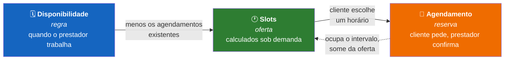
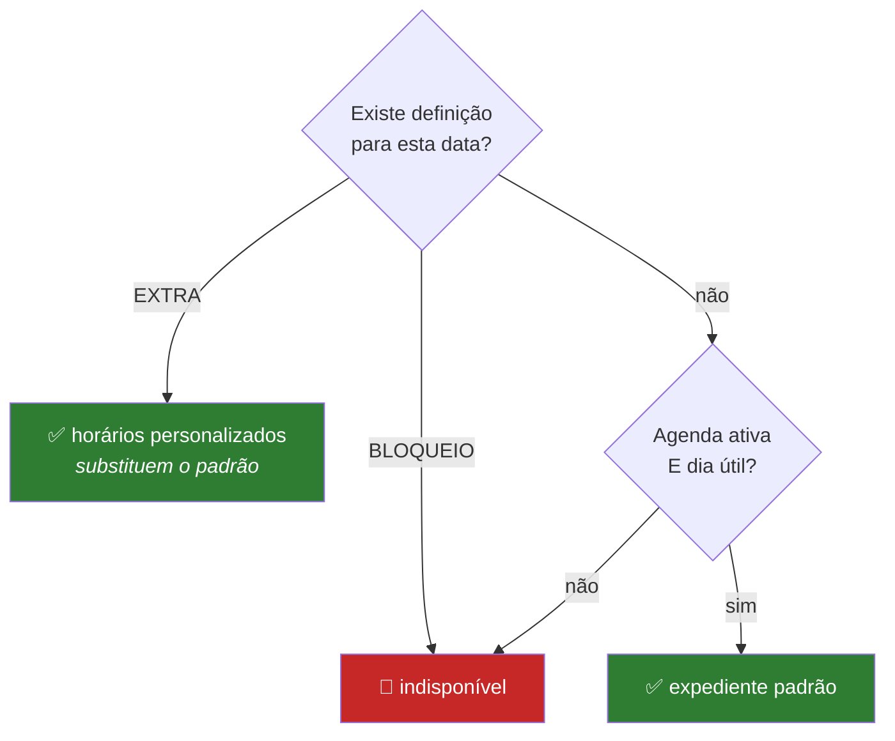
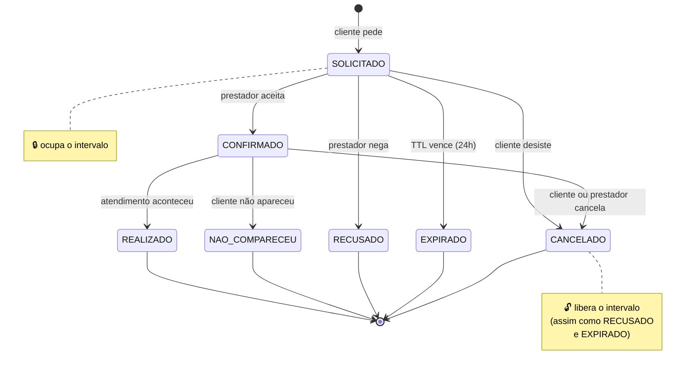

# 📐 Regras de Negócio — agendaGo

> Referência de **como a agenda funciona**: como o prestador configura sua
> disponibilidade, como os horários chegam ao cliente e como o agendamento evolui
> até a conclusão.

## 🧭 Visão geral do fluxo



Três camadas, refletidas no domínio (`internal/domain/{user,availability,slot,appointment}`):

| Camada | O que é | Quem controla |
|---|---|---|
| 🗓️ **Disponibilidade** | a regra: quando o prestador trabalha | prestador |
| 🕐 **Slots** | a oferta: horários livres, **calculados**, nunca pré-gravados | o sistema |
| 📌 **Agendamento** | a reserva: um slot vira compromisso | cliente pede, prestador confirma |

> [!IMPORTANT]
> **A separação disponibilidade → slots → agendamento é o eixo do sistema.** O
> cliente só consegue marcar em dias e horários efetivamente disponíveis — não há
> como agendar "por fora" da regra.

---

## 1️⃣ 🗓️ Disponibilidade do prestador

### Expediente padrão
Não há grade recorrente por dia da semana: o prestador configura, em Configurações, um
único conjunto de **blocos de horário** (`horarios_padrao`) que vale igual de segunda a
sexta — quantos períodos quiser, inclusive blocos curtos, com os intervalos que fizer
sentido entre eles. Um prestador recém-cadastrado começa com uma sugestão de dia
comercial (08:00–12:00 e 14:00–18:00), livre para editar ou zerar. Sábados e domingos são
indisponíveis por padrão, independente do expediente configurado.

O expediente padrão só vale para o prestador com a agenda **ativa**
(`aceita_agendamentos = true`). Um prestador que não deseja atender mantém a flag
desativada e **nunca** oferta slots, mesmo com blocos configurados.

### Definições por data
O que o prestador persiste são apenas os **desvios** do padrão, data a data
(`date_exceptions`):
- **BLOQUEIO** — a data fica indisponível o dia inteiro (folga, feriado).
- **EXTRA** — a data ganha **horários personalizados**, que substituem o expediente
  padrão (serve tanto para atender num sábado quanto para mudar as horas de um dia útil).

A definição da data tem **precedência** sobre o expediente padrão, e é **uma por data**:
salvar de novo substitui a anterior (upsert).

### Validação dos blocos (estrita)
Ao salvar os horários de uma data, o sistema valida:
- Sem blocos **sobrepostos** no mesmo dia.
- `fim > início` (proíbe bloco invertido ou de duração zero).
- **Proíbe cruzar a meia-noite** — um expediente noturno deve ser partido em dois dias.
- Horários em **minutos cheios** (granularidade mínima a definir na implementação).
- Blocos **adjacentes** são mesclados (ex.: 08:00–12:00 + 12:00–14:00 → 08:00–14:00).

### Resolução da disponibilidade de um dia



A definição da data **sempre vence** o expediente padrão.

### Antecedência para alterar o dia de hoje

> [!WARNING]
> Qualquer alteração no dia **de hoje** — bloquear, definir ou editar horários
> personalizados — exige **24h de antecedência**. Não se cancela nem se cria
> oferta "em cima da hora".

A única exceção é **restaurar o padrão a partir de um bloqueio**: isso só reduz a
oferta (nunca a amplia), então nunca surpreende um cliente. Hoje a regra é aplicada na interface;
quando existirem agendamentos, a validação passa a valer também no backend (um dia com
agendamento não poderá ser bloqueado).

---

## 2️⃣ 🕐 Slots (horários ofertados)

Os slots são **calculados sob demanda**, nunca pré-gravados:

```
slots livres  =  blocos do dia  −  agendamentos (SOLICITADO / CONFIRMADO)
```

> [!TIP]
> **Link público de agendamento** — cada prestador tem um link (`/agendar/{id}`,
> exibido no painel para compartilhar no Instagram/WhatsApp). Qualquer pessoa vê o
> calendário de horários livres **sem cadastro**; criar conta ou entrar só é
> exigido na hora de solicitar.

### Fatiamento por duração + buffer
Cada bloco é fatiado em slots conforme a **duração do atendimento** somada ao **buffer**
do prestador. Enquanto não existe um domínio de serviços, a duração é única por
prestador (`duracao_atendimento_minutos`, configurável em Configurações, sugestão inicial
de 60 min):

- **Buffer configurável por prestador** (`descanso_minutos`: 0, 10, 15…) — intervalo de
  preparação/limpeza entre atendimentos. O próximo slot só abre após
  `duração + buffer`.
- **Sobra descartada** — só vira slot o intervalo que cabe o **atendimento inteiro
  (+ buffer)** dentro do bloco. O tempo que sobra no fim do bloco é ignorado; um
  atendimento nunca "vaza" para fora do bloco.
- **Nunca no passado** — dias anteriores a hoje não ofertam slots, e hoje só oferta
  horários que ainda não começaram.

---

## 3️⃣ 📌 Agendamento (reserva)

### Reserva ao solicitar + expiração (anti-overbooking)
Quando o cliente solicita um horário, o agendamento já **ocupa o intervalo** (reserva
pessimista) com um prazo de expiração (`expira_em = agora + TTL`). Outros clientes não
conseguem solicitar o mesmo intervalo.

- Se o prestador não confirmar dentro do TTL, a pendência vira **EXPIRADO** e o intervalo
  volta a ficar livre. A expiração é **lazy**: uma solicitação vencida deixa de ocupar o
  intervalo imediatamente e o status é efetivado na próxima leitura.
- O conflito é barrado na persistência **dentro de transação**: um lock na linha do
  prestador serializa as reservas concorrentes dele, e a checagem de conflito + INSERT
  acontecem sob esse lock. (Optamos pelo lock transacional em vez de uma constraint de
  exclusão para o schema não carregar regra de negócio — decisão registrada no CLAUDE.md.)

> [!IMPORTANT]
> **Isso elimina a janela de overbooking** entre "solicitar" e "confirmar". Sem a
> reserva pessimista, dois clientes poderiam pedir o mesmo horário enquanto o
> prestador não respondesse ao primeiro.

### Agendamento sem cadastro (convidado)
Um visitante **sem conta** pode agendar pelo link público informando **nome, e-mail e
telefone** de contato. O sistema cria (ou reusa) um **cliente convidado** — um cliente
sem senha (`TemConta() == false`) — e reserva o slot como qualquer outra solicitação.

- O **telefone** passa por uma **validação leve**: exige ao menos 8 dígitos (formatação
  livre, sem verificação real). É guardado no cadastro do cliente para o prestador ter
  como retornar o contato.
- Se já existe um **convidado** com o mesmo e-mail, a reserva **reusa** esse convidado em
  vez de duplicar. Um cliente **banido** não agenda como convidado (bloqueado como
  qualquer inativo).
- E-mail de **conta registrada é rejeitado** (a resposta orienta a entrar): como o fluxo
  de convidado não verifica a posse do e-mail, aceitar permitiria criar agendamentos
  dentro da conta de um terceiro só conhecendo o e-mail dele.
- A rota pública tem **teto de solicitações por IP** (configurável; padrão 10/min) —
  sem ele, uma rajada encheria a agenda de um prestador com reservas falsas.
- Na listagem de agendamentos, o **prestador** enxerga o **nome, e-mail e telefone** do
  cliente — informação de contato que **não** é exposta na visão do próprio cliente.

### Cadastro de cliente e verificação por email
O cadastro de cliente (`POST /clients`) **não cria a conta na hora**: coleta nome, email,
**telefone** (obrigatório) e senha, guarda o cadastro pendente (com a senha já hasheada) e
envia um **email de confirmação**. A conta só nasce quando a pessoa clica no link
(`/confirmar-cadastro?token=...`) — prova de posse do email. O prestador, por outro lado,
cadastra e entra logado direto (sem essa etapa).

- **Herança do histórico de convidado**: se o email já pertence a um **convidado**, a
  confirmação **converte o mesmo registro** em conta (preservando o `client_id`), então
  todos os agendamentos que a pessoa fez como convidado passam a aparecer na conta dela.
  Essa é a razão de exigir verificação por email: sem prova de posse, qualquer um poderia
  reivindicar o histórico de um convidado só sabendo o email.
- **Email que já é conta**: a resposta na tela é **sempre a mesma** (anti-enumeração — não
  revela se o email existe), mas o email enviado é um aviso "você já tem conta, entre ou
  recupere a senha", em vez do link de confirmação.
- **Convidado banido** não vira conta ativa pelo cadastro.
- O **token de confirmação** é opaco (só o hash no banco), de **uso único**, com TTL de
  24h; um novo cadastro do mesmo email invalida os pendentes anteriores. As rotas têm teto
  por IP (mitiga spam de emails e força bruta de token).
- **Email é único no sistema**: um endereço só pode existir como cliente/convidado **ou**
  como prestador, nunca nos dois. O cadastro de prestador rejeita (409) um email já usado
  por cliente/convidado; o de cliente responde com o aviso "você já tem conta" quando o
  email pertence a um prestador (sem revelar isso na resposta HTTP).

### Login social (Google)
Cliente e prestador podem entrar sem senha, autenticando com Google. Diferente do cadastro
normal, a conta social **nasce ativa na hora** — não há confirmação por email, porque o
próprio Google já provou a posse do endereço.

- **Email verificado é exigido sempre**, antes de qualquer outra decisão — tanto para
  vincular a uma conta existente quanto para criar uma conta nova. Sem essa checagem,
  alguém poderia registrar um provedor OIDC com um email alheio ainda não confirmado e
  sequestrar a conta de outra pessoa, ou pré-criar uma conta num email que ainda não é seu.
- **Email inédito cria conta nova**, sem senha de verdade: o sistema gera uma senha
  aleatória, hasheia e descarta o valor em texto puro — ela nunca é comunicada e nunca serve
  para logar. É só para satisfazer a mesma invariante de domínio do cadastro por senha.
- **Email é único por tipo, mesma regra do cadastro normal**: um email que já é prestador
  não pode logar socialmente como cliente (nem o contrário) — o login social rejeita com o
  mesmo espírito de `ErrEmailJaCadastrado` do cadastro por senha, em vez de criar uma
  segunda conta paralela sob o mesmo email.
- **Prestador novo nasce com telefone pendente e fica travado até completar**: o Google
  não fornece telefone, mas o domínio de prestador exige um (é como o cliente entra em
  contato). Um prestador que nunca teve conta é criado na hora, no callback do Google, com
  um telefone-placeholder técnico (`TelefonePendente`, ver `usecase/auth/login_social.go`) e
  a agenda desativada (`AceitaAgendamentos=false`, o padrão de qualquer prestador novo). O
  frontend detecta esse placeholder (`MeResponse.telefonePendente`) e trava a navegação do
  painel em `/painel/configuracoes` até um telefone de verdade ser salvo — nenhuma outra
  página do painel carrega enquanto isso. Cliente não passa por essa trava — o cadastro de
  cliente não exige telefone.
- **Convidados (sem conta) ficam de fora**: login social só se aplica a quem tem ou vai
  ganhar uma conta; o fluxo de agendamento sem cadastro não muda.
- **Banimento vale igual**: um cliente ou prestador banido pelo admin não consegue entrar
  por login social, mesma regra do login por senha.

### Confirmação
O agendamento só é **concluído após a confirmação do prestador**. Enquanto isso, fica
pendente (`SOLICITADO`) e ocupando o intervalo.

### Ciclo de vida (máquina de estados)



| Estado | Significa | Ocupa o horário? |
|---|---|:---:|
| 🟡 **SOLICITADO** | cliente pediu, aguardando o prestador | 🔒 sim |
| 🟢 **CONFIRMADO** | prestador aceitou | 🔒 sim |
| ✅ **REALIZADO** | atendimento aconteceu | — |
| 🔴 **RECUSADO** | prestador negou enquanto SOLICITADO | 🔓 não |
| ⏰ **EXPIRADO** | pendência venceu o TTL sem confirmação | 🔓 não |
| ⚪ **CANCELADO** | cancelado por cliente ou prestador | 🔓 não |
| 👻 **NÃO_COMPARECEU** | confirmado, mas o cliente não apareceu | — |

> [!NOTE]
> Toda transição que encerra a reserva (**RECUSADO**, **EXPIRADO**, **CANCELADO**)
> **libera o intervalo** — o horário volta imediatamente para a oferta.

### Cancelamento
**Cliente e prestador** podem cancelar um agendamento `CONFIRMADO`, respeitando a
**antecedência mínima** (config: 24h antes do início). Cancelamentos dentro da janela
mínima são bloqueados (tratamento de penalidade fica fora de escopo por enquanto).
Ao cancelar, o intervalo volta a ficar livre.

O **cliente** também pode cancelar a própria solicitação ainda `SOLICITADO`, sem
exigência de antecedência — desistir de um pedido não confirmado não surpreende ninguém.
O **prestador** não cancela solicitações pendentes: para isso existe a recusa.

#### Cancelamento pelo convidado (por token no email)
O **convidado não tem conta**, então não conseguiria cancelar por rotas autenticadas.
Para isso, ao **confirmar** um agendamento de convidado, o sistema gera um **token de
cancelamento** de uso pessoal (opaco, só o hash vai ao banco — mesmo padrão do token de
recuperação de senha) e o envia no **email de confirmação** como um link
`/cancelar-agendamento/{token}`. O convidado abre o link, vê os detalhes e confirma o
cancelamento, **sem login**.

- O token substitui apenas a autenticação; a **regra de antecedência de 24h continua
  valendo** — o cancelamento por token passa pelo mesmo método de domínio, então cancelar
  um confirmado em cima da hora é bloqueado do mesmo jeito. A página avisa quando o prazo
  já passou.
- O token **não expira** por conta própria: vale enquanto o agendamento for cancelável.
- Ao cancelar, o **prestador é notificado** por email (cancelado pelo cliente).
- Cliente **com conta** não recebe esse link — ele cancela pelo painel.

---

## 4️⃣ 🛡️ Moderação (admin)

Um **administrador** modera prestadores e clientes. Ele é semeado no boot a partir de
`ADMIN_EMAIL`/`ADMIN_SENHA` (sem cadastro nem auto-registro), entra pela mesma tela de
login e cai no painel de moderação.

- **Banir** desativa o usuário (`ativo = false`): ele deixa de logar e as **sessões
  ativas dele são revogadas na hora** — sem isso, um banido com cookie válido manteria
  acesso até a sessão expirar. Um prestador banido também **some da vitrine** e **para de
  ofertar horários** — o link público dele passa a não mostrar slots, sem vazar o motivo.
  Um cliente banido também não agenda, nem logado nem como convidado. **Reversível** por
  reativar.
- **Histórico preservado** — banir não apaga nada; agendamentos existentes continuam.
- `ativo` (moderação, decisão do admin) é distinto de `aceita_agendamentos` (decisão do
  próprio prestador): um prestador ativo pode escolher não atender, mas um banido nunca
  oferta, independente da flag.

### Detalhe em leitura
O admin pode **abrir o detalhe** de um prestador ou de um cliente e ver **tudo o que
aquele usuário vê**, sem se passar por ele (nada de impersonation):

- **Prestador** — dados cadastrais (e-mail, duração do atendimento, intervalo de
  preparação, se aceita agendamentos) e a lista de **agendamentos recebidos**, com o
  **contato do cliente** (nome, e-mail, telefone) — a mesma visão do painel do prestador.
- **Cliente** — dados cadastrais (e-mail, telefone, se tem conta ou é convidado) e a lista
  de **agendamentos feitos**, com o nome do prestador.

É uma visão **somente leitura**: o admin não confirma, recusa nem cancela pelo detalhe —
para intervir no acesso do usuário existem banir/reativar. O detalhe reaproveita a mesma
listagem de agendamentos das pontas (com expiração lazy e nomes/contato já resolvidos).

---

## 5️⃣ 🌎 Fuso horário

> [!NOTE]
> Todo o sistema assume um **fuso único fixo**: `America/Sao_Paulo`. Os horários são
interpretados e exibidos nesse fuso. O fuso deve ser centralizado em uma
constante/configuração única (não espalhar `time.Local` pelo código), para facilitar uma
eventual evolução para múltiplos fusos no futuro.

---

## 6️⃣ 📧 Notificações por email

O sistema envia email em cinco situações, sempre em português e em
**melhor-esforço**: uma falha de envio nunca impede a operação que a disparou —
só é registrada em log.

| Evento | Destinatário | Conteúdo |
|---|---|---|
| Novo pedido de horário | Prestador | Nome do cliente, data/hora, prazo para confirmar |
| Confirmação | Cliente | Nome do prestador, data/hora confirmada (+ link de cancelamento, se convidado) |
| Recusa | Cliente | Nome do prestador, data/hora recusada |
| Cancelamento | A outra parte (quem não cancelou) | Quem cancelou, data/hora |
| Lembrete (24h antes) | Cliente | Nome do prestador, data/hora do atendimento |

O envio é assíncrono (goroutine), para não atrasar a resposta HTTP da ação que o disparou.

### Recuperação de senha

Prestadores e clientes **com conta** (`TemConta() == true`) podem redefinir a senha por
email. Convidados (sem senha) não têm o que redefinir.

- O pedido gera um **token opaco de 256 bits**, do mesmo jeito que o token de sessão
  (`internal/pkg/token`): só o **hash SHA-256** é persistido, o token puro só existe no
  link do email.
- **TTL de 1h** a partir da emissão.
- **Uso único** — o token é apagado no momento em que é consumido (`DELETE ... RETURNING`
  atômico), então reusar o mesmo link uma segunda vez falha.
- Um novo pedido **invalida qualquer token anterior** do mesmo usuário — só o link mais
  recente funciona.
- **Resposta idêntica para email existente e inexistente** (sempre 204, mesmo corpo): o
  mesmo cuidado anti-enumeração já aplicado ao login (`internal/usecase/auth/auth.go`)
  vale aqui — a rota nunca revela quais emails estão cadastrados.
- Redefinir a senha **revoga todas as sessões ativas** do usuário (mesmo mecanismo do
  banimento pelo admin) — uma redefinição de senha é motivo razoável para exigir login de
  novo em todo dispositivo.
- A rota de solicitação tem o mesmo **teto de requisições por IP** dos logins, para
  mitigar tanto o esgotamento da cota diária do provedor de email quanto tentativas de
  adivinhar tokens por força bruta.

### Lembrete de agendamento

Um worker de fundo (`internal/adapter/worker/reminder.go`) checa periodicamente
(config: a cada 10 min) os agendamentos **CONFIRMADOs** cujo início está a **até 24h** de
distância e ainda não foram lembrados, e dispara o email de lembrete.

- **Nunca duplica**: marcar o lembrete como enviado é um `UPDATE` condicional
  (`WHERE lembrete_enviado_em IS NULL`) — funciona como uma reivindicação atômica, então
  mesmo sob concorrência só uma execução consegue enviar.
- Um agendamento confirmado a **menos de 24h** do início já recebe o lembrete no primeiro
  tick após a confirmação — redundante com o email de confirmação, mas inofensivo.

---

## ⚙️ Parâmetros fixados

Valores centralizados em `config/agendamento.go` e no domínio:

| Parâmetro | Descrição | Valor |
|---|---|---|
| TTL da pendência | Prazo até uma solicitação não confirmada expirar | 24h |
| Antecedência mínima de cancelamento | Prazo antes do início em que ainda se pode cancelar | 24h |
| Granularidade de minutos | Múltiplo mínimo dos horários dos blocos | 15 min |
| Duração do atendimento | Tamanho de cada slot ofertado (por prestador, editável) | sugestão inicial de 60 min |
| TTL do token de recuperação de senha | Prazo até o link de redefinição expirar | 1h |
| TTL do token de confirmação de cadastro | Prazo até o link de confirmação de cadastro expirar | 24h |
| Antecedência do lembrete de agendamento | Quanto antes do início o lembrete é disparado | 24h |
| Intervalo de checagem do worker de lembrete | Frequência do ticker que busca agendamentos a lembrar | 10 min |

---

## 6️⃣ 👥 Conta e agenda são coisas diferentes

Um prestador não é uma linha só. São três:

| Peça | O que é | Onde |
|---|---|---|
| **Conta** | quem loga: email, senha, telefone, e se está banido | `usuarios` |
| **Agenda** | o que se opera: expediente, duração, buffer, se oferta horários | `providers` |
| **Vínculo** | liga as duas, com um papel (`dono` ou `operador`) | `provider_membros` |

O motivo é simples: **uma segunda pessoa precisa poder operar a agenda sem
compartilhar a senha do dono**. Recepcionista, secretária, sócia. Enquanto
login e agenda fossem a mesma linha, a única forma de dar acesso era entregar a
credencial.

Consequências que valem saber:

- **O banimento é da conta, não da agenda.** Um prestador banido some da
  vitrine e para de ofertar horários — mas quem responde por isso é `usuarios`,
  e a agenda sozinha não sabe dizer se está banida. Por isso vitrine, slots e
  disponibilidade consultam o dono antes de ofertar qualquer coisa.
- **Os agendamentos pertencem à agenda, não a quem operou.** `appointments`
  aponta para o `provider_id`. Quem marcou é irrelevante para o histórico.
- **Hoje todo mundo tem exatamente um vínculo, como `dono`.** A migração V14
  converteu cada prestador existente em conta + agenda + vínculo, reusando o
  mesmo id — por isso nenhuma sessão caiu no deploy.
- **Convidar alguém já é possível** pela tela de Equipe no painel, depois de
  ligar o recurso em Configurações — ver abaixo.

### Exclusão de conta: por que é anonimização

Quando um cliente pede para remover a conta, o cadastro é **anonimizado**, não
apagado: nome vira "Cliente removido", email vira um placeholder único,
telefone e senha são apagados e a conta fica inativa.

⚠️ **Não é possível simplesmente apagar a linha.** `appointments.client_id` tem
`ON DELETE CASCADE` (V5), então um `DELETE` levaria junto o histórico do
**prestador** — que é dado de outra pessoa, e que ela tem obrigação profissional
e fiscal de manter.

A separação é essa: o direito do cliente alcança **a identificação dele**, não o
registro de que o atendimento aconteceu. O prestador continua vendo data,
horário e status na agenda; deixa de ver de quem era.

Junto com o cadastro caem sessões, tokens de recuperação e identidades sociais —
tudo que daria acesso à conta.

### Auditoria

Ações sensíveis deixam rastro em `auditoria`: banir e reativar (admin), e os
pedidos de exportação e exclusão (o próprio titular).

Duas escolhas que valem registro:

- **A trilha não tem foreign key para o ator nem para o alvo.** Ela precisa
  sobreviver ao desaparecimento dos dois — com `CASCADE`, apagar uma conta
  apagaria justamente o registro de que ela foi apagada.
- **Nenhum dado pessoal entra no detalhe.** O alvo é identificado por id.
  Guardar nome ou email ali recriaria, na trilha, o que a anonimização acabou de
  apagar do cadastro.

A trilha é append-only por não existir caminho de escrita destrutiva na
aplicação: o repositório expõe inserção e leitura, e nada mais.

### Endereço público (slug)

O link de agendamento é `/agendar/joao-barbeiro` em vez de `/agendar/{uuid}`. O
slug nasce derivado do nome do prestador e pode ser trocado em Configurações.

⚠️ **O caminho por UUID continua valendo, para sempre.** Todo link compartilhado
antes do slug existir usa o id, e removê-lo daria 404 em endereço que já está na
mão de cliente. A busca tenta slug primeiro e cai para id.

Trocar o slug **quebra os links antigos** — não há redirecionamento do endereço
anterior. A tela avisa isso antes de salvar; o sistema não tem como saber quem
já recebeu o link.

Há uma lista de palavras reservadas (`admin`, `painel`, `api`, `login`,
`agendar`, entre outras) que não podem virar slug, para não colidir com
caminhos do próprio site.

### Compromisso pessoal

O prestador reserva um intervalo do dia para si — médico, almoço, deslocamento —
e aquele horário some da oferta **sem redefinir o expediente**. É diferente de
bloquear o dia (que derruba o dia inteiro) e de marcar horários personalizados
(que substitui o expediente todo).

Três regras que valem registro:

- **Não pode ser criado por cima de cliente já marcado.** A resposta é 409 e o
  prestador cancela o agendamento primeiro. O sistema não desmarca ninguém por
  conta própria.
- **Não tem regra de antecedência**, diferente do agendamento. Criar compromisso
  só reduz a oferta e não desmarca nada, então exigir 24h atrapalharia sem
  proteger ninguém.
- **O buffer do prestador vale dos dois lados.** Um compromisso das 14h às 15h
  com descanso de 15 minutos também tira as 13h45 e as 15h15 da oferta. É o
  comportamento desejado — preparação e deslocamento —, mas surpreende quem
  espera que só o intervalo exato saia.

⚠️ Já a **recusa de reserva** usa sobreposição real, sem buffer: recusar um
horário que só encosta no buffer seria mais restritivo do que a própria oferta,
e confundiria quem acabou de ver o horário disponível.

Internamente o compromisso carrega uma **origem**, hoje sempre `manual`. Ela
existe porque este é o canal genérico de "intervalo ocupado que não é
agendamento": uma integração com calendário externo entraria como outra origem,
escrevendo na mesma tabela, sem tocar no cálculo de horários.

### Papéis: o que cada um pode

| | `dono` | `operador` |
|---|:---:|:---:|
| Operar a agenda — expediente, duração, buffer, agendamentos | ✅ | ✅ |
| Administrar a conta — encerrar, convidar e remover membros | ✅ | ❌ |

As duas perguntas vivem no domínio, em `internal/domain/membro/`, como
`PodeGerenciarAgenda()` e `PodeAdministrarConta()` — não espalhadas em `if`s
pelos handlers. Quem responde "este papel pode fazer isto?" é um arquivo só.

A checagem acontece na borda HTTP: o grupo de `/providers/me/*` passa por
`ExigirGestaoDaAgenda`, e o que for exclusivo do dono passará por
`ExigirAdministracaoDaConta`. **Hoje os dois papéis passam no primeiro**, então
o middleware não muda comportamento nenhum — ele existe pela ordem em que as
coisas dão errado. Sem ele, um papel novo e mais restrito nasceria com acesso a
todas as rotas e só o perderia onde alguém lembrasse de checar; com ele, o
padrão é negar.

### A equipe é opcional, e nasce desligada

Equipe é um recurso que o prestador liga em **Configurações**
(`permite_equipe`). Ele nasce **desativado**: a maioria trabalha sozinha, e uma
agenda de uma pessoa só não precisa carregar a ideia de convidar ninguém — a
tela some do painel inteiro.

Desligado, não é só a tela que some: `POST /providers/me/membros` e
`GET /providers/me/membros` respondem **403**. Esconder o menu e deixar a API
aberta faria de uma chamada direta um contorno da escolha de quem opera a
agenda.

⚠️ **Não se desliga a equipe com gente dentro.** Com um vínculo além do dono ou
um convite pendente, salvar as configurações devolve **409** — a agenda ficaria
com alguém operando e ninguém para ver ou remover esse acesso. Primeiro remove,
depois desliga.

### Convidar alguém para a equipe

O dono convida por email; a pessoa recebe um link, escolhe a própria senha e
passa a operar a agenda. **O convite CRIA a conta** — quem entra por ele nunca
se cadastra sozinha, e por isso nasce com exatamente um vínculo. É o que mantém
a resolução da agenda determinística: ela loga e cai na agenda que a convidou,
não numa agenda própria.

| Etapa | O que acontece |
|---|---|
| Dono convida | token de uso único, válido por 7 dias, e um email com o link |
| Reconvidar o mesmo email | substitui o convite anterior — dois links válidos só confundiriam |
| Pessoa abre o link | vê de quem é a agenda; consultar **não** gasta o convite |
| Pessoa aceita | cria conta + vínculo de operadora. **Nenhuma agenda nova** |
| Dono remove o acesso | apaga o vínculo e derruba as sessões dela na hora |

**Email que já tem conta é recusado**, seja de prestador ou de cliente, com uma
mensagem que não diz qual dos dois — quem convida precisa saber que o endereço
não serve, não descobrir que tipo de conta a pessoa tem. Os motivos são
concretos:

- **Já é prestador:** a pessoa já é dona da própria agenda. Um segundo vínculo
  *pareceria* funcionar e não funcionaria — a resolução devolve o vínculo mais
  antigo, e ela continuaria caindo na agenda dela. O que destrava esse caso é a
  escolha de agenda ativa, que ainda não existe.
- **Já é cliente:** o email é único entre clientes e prestadores, e é essa
  invariante que faz o login unificado funcionar. Duplicar tiraria dela o acesso
  à própria conta de cliente.

> [!NOTE]
> **Não se convida alguém como dono.** Uma agenda tem um dono só, definido no
> cadastro; transferir a propriedade é outra operação, com outras consequências,
> e o domínio recusa explicitamente essa tentativa.

> [!NOTE]
> **`clients` ficou de fora, de propósito.** Cliente não tem agenda nem segunda
> pessoa operando, e o modelo de convidado (`TemConta() == false`) não cabe numa
> tabela de identidade de login. Unificar seria uma refatoração grande sem
> demanda que a justifique.

---

## 🗺️ Mapa para o código

<details>
<summary><b>Onde cada regra vive no repositório</b></summary>

<br>

| Conceito | Local | Conteúdo |
|---|---|---|
| Conta (quem loga) | `internal/domain/usuario/` | `email`, `senha_hash`, `telefone`, `ativo` (moderação) |
| Convite para a equipe | `internal/domain/convite/` | token de uso único, email, agenda e papel oferecido; recusa convidar como dono |
| Vínculo conta↔agenda | `internal/domain/membro/` | `Papel` (`dono` \| `operador`), `PodeGerenciarAgenda`, `PodeAdministrarConta` |
| Agenda do prestador | `internal/domain/provider/` | `nome`, `aceita_agendamentos`, `descanso_minutos`, `duracao_atendimento_minutos`, `HorariosPadrao` |
| Cliente | `internal/domain/client/` | conta ou convidado, `telefone` (contato), `ativo` (moderação) |
| Admin | `internal/domain/admin/` | moderador; semeado por env, sem cadastro |
| Disponibilidade | `internal/domain/availability/` | `TimeBlock`, `DateException` (bloqueio/extra), validação estrita |
| Slot | `internal/domain/slot/` | `Slot`, `Livres` (cálculo puro: duração + buffer, sobra descartada) |
| Agendamento | `internal/domain/appointment/` | `Appointment` + máquina de estados + expiração lazy |
| Token de recuperação de senha | `internal/domain/passwordreset/` | `Token`, uso único, TTL curto |
| Token de cancelamento (convidado) | `internal/domain/cancellation/` | `Token` por agendamento, gerado na confirmação, sem TTL |
| Cadastro pendente (verificação de email) | `internal/domain/signup/` | `Pendente` com nome/telefone/senha-hash, uso único, TTL 24h; converte convidado em conta preservando o ID |
| Login social (Google) | `internal/domain/socialidentity/`, `internal/domain/oauthstate/`, `internal/usecase/auth/login_social.go`, `internal/adapter/oauth/google.go` | vínculo `(provedor, sub)` → usuário; state/nonce de uso único (CSRF/replay); vincula por email verificado ou cria conta sem senha real; prestador novo nasce com `TelefonePendente` |
| Orquestração | `internal/usecase/{provider,availability,appointment,admin,auth}/` | preferências, slots, solicitar, confirmar, recusar, cancelar (por sessão ou por token), concluir, moderar, recuperar/redefinir senha, lembrar, login social |
| Notificações | `internal/adapter/email/`, `internal/adapter/worker/` | templates, transporte SMTP, worker de lembrete |
| Configuração | `config/agendamento.go`, `config/server.go`, `config/email.go`, `config/oauth.go` | fuso fixo, TTL, antecedência mínima, credenciais do admin, SMTP, credenciais Google OAuth |
| Persistência | `migrations/` | `providers`, `horarios_padrao`, `clients`, `admins`, `date_exceptions`, `appointments` (anti-overbooking por lock transacional no repositório), `sessions`, `password_reset_tokens`, `cancelamento_tokens`, `cadastros_pendentes`, `providers.telefone`, `social_identities`, `oauth_states` |

</details>
