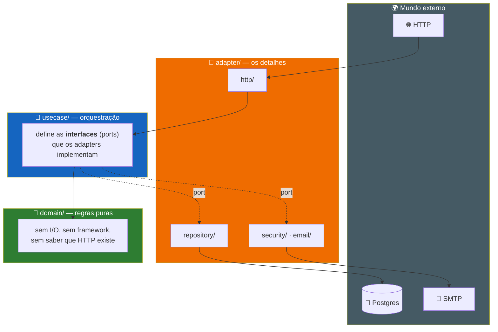

# 🧰 Tecnologias do agendaGo — guia de estudo

> Este documento existe para quem quer entender **por que** cada peça do stack foi
> escolhida e **onde estudá-la a fundo**.

Não é uma lista de dependências — é um **roteiro de aprendizado** organizado por
camada, com ponteiros para o código real do projeto e **fontes primárias**
(documentação oficial, RFCs, artigos de referência) em vez de tutoriais de
terceiros.

| Seção | O que cobre |
|---|---|
| [1. Linguagem e arquitetura](#1-linguagem-e-arquitetura-do-backend) | Go, hexagonal |
| [2. Backend HTTP](#2-backend-http) | chi, validator, Swaggo |
| [3. Segurança](#3-segurança-e-autenticação) | Argon2id, sessões, OIDC, rate limiting |
| [4. Banco e infra](#4-banco-de-dados-e-infraestrutura) | Postgres, pgx, Flyway, Docker, Caddy, GHCR, slog |
| [5. Frontend](#5-frontend) | Svelte 5, TypeScript, Vite, Tailwind, adapter-node |
| [6. Testes](#6-testes) | Go testing, Testcontainers, Vitest, Playwright |
| [7. Email](#7-notificações-por-email) | go-mail, Mailpit, Brevo, worker |

---

<details>
<summary><h2>📋 Visão geral do stack</h2></summary>

| Camada | Tecnologia | Papel no projeto | Versão |
|---|---|---|---|
| Linguagem (backend) | [Go](https://go.dev) | API HTTP, domínio, persistência | 1.26 |
| Arquitetura | Hexagonal (Ports & Adapters) | Organização do backend em `domain/usecase/adapter` | — |
| Roteamento HTTP | [chi](https://github.com/go-chi/chi) | Router e middlewares da API | v5.3 |
| CORS | [go-chi/cors](https://github.com/go-chi/cors) | Controle de origens permitidas nas respostas da API | v1.2 |
| Rate limiting | [go-chi/httprate](https://github.com/go-chi/httprate) | Teto de requisições por IP (login, convidado, tokens) | v0.16 |
| Logging | [log/slog](https://pkg.go.dev/log/slog) | Logs estruturados (JSON em produção) com correlação por requisição | stdlib |
| Banco de dados | [PostgreSQL](https://www.postgresql.org/) | Persistência relacional | 16 (alpine) |
| Driver Postgres | [pgx](https://github.com/jackc/pgx) | Acesso ao banco a partir do Go | v5.10 |
| Migrations | [Flyway](https://flywaydb.org/) | Versionamento de schema | 10 |
| Hash de senha | [Argon2id](https://github.com/alexedwards/argon2id) | Armazenamento seguro de credenciais | v1.0 |
| Validação | [go-playground/validator](https://github.com/go-playground/validator) | Validação de DTOs de entrada | v10.30 |
| Documentação de API | [Swaggo](https://github.com/swaggo/swag) | OpenAPI/Swagger gerado a partir de comentários | v1.16 |
| Testes de integração | [Testcontainers](https://testcontainers.com/) | Postgres real e efêmero em cada teste | v0.43 |
| Envio de email | [go-mail](https://github.com/wneessen/go-mail) | Cliente SMTP para recuperação de senha e notificações | v0.8 |
| SMTP em desenvolvimento | [Mailpit](https://mailpit.axllent.org/) | Captura os emails localmente, sem enviar de verdade | — |
| Provedor SMTP (produção) | [Brevo](https://www.brevo.com/) | Envio real de email, plano gratuito (300/dia) | — |
| Framework (frontend) | [Svelte 5](https://svelte.dev) + [SvelteKit](https://kit.svelte.dev) | UI reativa com runes, roteamento file-based | 5.56 / 2.63 |
| Linguagem (frontend) | [TypeScript](https://www.typescriptlang.org/) | Tipagem estática no cliente | 6.0 |
| Build tool | [Vite](https://vitejs.dev/) | Dev server e bundler | 8.0 |
| Estilos | [Tailwind CSS](https://tailwindcss.com/) | Utility-first CSS | 4.3 |
| Testes unitários (frontend) | [Vitest](https://vitest.dev/) | Testes do cliente HTTP e da store de sessão | 4.1 |
| Testes E2E | [Playwright](https://playwright.dev/) | Fluxos de cadastro/login/sessão no browser real | 1.61 |
| Orquestração local | [Docker Compose](https://docs.docker.com/compose/) | Sobe banco + migrations + API + web juntos | — |
| Proxy reverso (produção) | [Caddy](https://caddyserver.com/) | HTTPS automático e origem única para frontend e API | 2 (alpine) |

</details>

---

## 1. Linguagem e arquitetura do backend

### Go

Go é a linguagem escolhida pela simplicidade da sintaxe, tooling embutido (`go test`, `go fmt`, `go vet`) e concorrência nativa via goroutines — mesmo que o agendaGo ainda não explore concorrência pesada, é o tipo de decisão que compensa à medida que o projeto cresce (ex.: processar múltiplos agendamentos, notificações assíncronas).

**Para estudar:**
- [A Tour of Go](https://go.dev/tour/) — interativo, cobre a sintaxe do zero
- [Effective Go](https://go.dev/doc/effective_go) — como escrever Go idiomático (nomenclatura, erros, interfaces)
- [Go by Example](https://gobyexample.com/) — referência rápida por tópico
- [How to Write Go Code](https://go.dev/doc/code) — módulos, pacotes e a estrutura de um projeto Go
- [Go Proverbs](https://go-proverbs.github.io/) — os princípios de design da linguagem, por Rob Pike

### Arquitetura Hexagonal (Ports & Adapters)

O backend é organizado em três camadas que só se enxergam por interfaces:



| Camada | Pasta | Regra |
|---|---|---|
| 🧠 **Domínio** | `internal/domain/` | regras de negócio puras, **sem I/O** |
| 🔀 **Usecase** | `internal/usecase/` | orquestração; **declara** as interfaces que precisa |
| 🔌 **Adapter** | `internal/adapter/` | HTTP, Postgres, Argon2id, SMTP — os detalhes |

> [!IMPORTANT]
> **A interface pertence a quem precisa dela, não a quem a implementa.** Repare
> que `internal/usecase/provider/repositorio.go` declara `repositorioCadastrar`
> do lado de quem **consome** — não do lado do Postgres. Essa inversão é a marca
> registrada de Ports & Adapters.

O ganho prático: o domínio (`internal/domain/provider/provider.go`) não sabe que existe HTTP ou Postgres. Trocar o banco por outro, ou adicionar uma segunda forma de expor a API, não exige tocar em uma linha de regra de negócio.

**Para estudar:**
- [Hexagonal Architecture — Alistair Cockburn](https://alistair.cockburn.us/hexagonal-architecture/) (artigo original, quem cunhou o termo)
- [Ports & Adapters Pattern — Netflix TechBlog](https://netflixtechblog.com/ready-for-changes-with-hexagonal-architecture-b315ec967749) (aplicação prática em produção)

---

## 2. Backend HTTP

### chi

Router HTTP minimalista, compatível com a stdlib (`net/http`) — não reinventa `http.Handler`, só adiciona roteamento por padrão de URL, middlewares encadeáveis e grupos de rotas. Usado em `config/server.go` e no wiring de `cmd/api/main.go`, onde rotas autenticadas ficam agrupadas sob o middleware `Autenticar`.

**Para estudar:**
- [chi — README oficial](https://github.com/go-chi/chi#chi) (exemplos de roteamento e middleware)
- [net/http — pacote padrão do Go](https://pkg.go.dev/net/http) (a base sobre a qual o chi é construído)

### go-playground/validator

Validação declarativa via struct tags — em vez de escrever `if` para cada campo, o DTO descreve suas próprias regras (`validate:"required,email"`). Ver `internal/adapter/http/dto/provider.go` e `dto/client.go`.

**Para estudar:**
- [validator — documentação oficial](https://pkg.go.dev/github.com/go-playground/validator/v10) (lista completa de tags)

### Swaggo

Gera a especificação OpenAPI a partir de comentários no código (`@Summary`, `@Router` etc., visíveis em `internal/adapter/http/handler/provider.go`). A documentação nunca fica desatualizada em relação ao handler, porque é gerada dele.

É **ferramenta de desenvolvimento**, e fica atrás de uma **build tag**: só entra no binário compilado com `-tags=swagger`. Ver `config/swagger_ligado.go` e `config/swagger_desligado.go` — o segundo é o padrão, e o que vai para produção.

Antes a rota era montada condicionalmente em tempo de execução (`if !EhProducao()`). Aquilo resolvia a exposição, mas não o resto: a UI publica a superfície inteira da API para quem alcançar a porta, e o binário de produção **carregava a ferramenta inteira mesmo sem poder servi-la** — 26,63 MB com, 16,61 MB sem, ou seja **10 MB e 37% do binário** em assets da UI que o `swaggo/files` embute e na spec (`docs.go` tem 114 KB de JSON como string).

Virar decisão de compilação resolve as duas coisas de uma vez: o código não existe no binário, e não há variável de ambiente que possa ligá-lo por engano. O efeito se propaga — o `Dockerfile.prod` deixou de instalar e rodar o `swag`, e a esteira deixou de gerar a doc em dois jobs. Quem exercita esse caminho é o job de E2E, que sobe o compose de desenvolvimento (onde o `.air.toml` compila com a tag).

Os dois testes que travam o comportamento são um par, um por variante: `test/config/swagger_desligado_test.go` exige 404 em qualquer `APP_ENV` no build padrão, e `swagger_ligado_test.go` exige que a doc responda com a tag. O 404 do Caddy continua sendo segunda linha de defesa, não a única.

**Para estudar:**
- [Swaggo — README oficial](https://github.com/swaggo/swag) (sintaxe das anotações)
- [OpenAPI Specification](https://swagger.io/specification/) (o formato por trás do Swagger)

---

## 3. Segurança e autenticação

Esta é a parte mais rica para estudo — o agendaGo implementa autenticação seguindo recomendações da OWASP, não um tutorial genérico.

### Hash de senha: Argon2id

Senhas nunca são armazenadas em texto puro: a coluna `senha_hash` guarda só o hash (ver `internal/adapter/security/argon2id.go` e as migrations `V1__cria_tabela_providers.sql`/`V2__cria_tabela_clients.sql`, que já nascem com essa coluna). Argon2id é o algoritmo **recomendado atualmente** pela OWASP para hash de senha — venceu a Password Hashing Competition (2015) justamente por ser resistente a ataques com hardware especializado (GPU/ASIC), já que seu custo é dominado por acesso à memória, não só processamento.

Os parâmetros usados (19 MiB, 2 iterações, salt de 16 bytes) seguem exatamente a recomendação mínima da OWASP para 2024+.

**Para estudar:**
- [OWASP Password Storage Cheat Sheet](https://cheatsheetseries.owasp.org/cheatsheets/Password_Storage_Cheat_Sheet.html) (a referência prática nº 1)
- [RFC 9106 — Argon2 Memory-Hard Function](https://www.rfc-editor.org/rfc/rfc9106.html) (a especificação formal do algoritmo)
- [Password Hashing Competition](https://www.password-hashing.net/) (o concurso que elegeu o Argon2, com os finalistas e critérios)

### Sessões server-side + cookie HttpOnly

O login (`internal/usecase/auth/login_provider.go`) gera um token opaco de 256 bits (`internal/pkg/token/token.go`), guarda apenas o **hash SHA-256** dele no banco (tabela `sessions`), e entrega o token puro só no cookie. Essa escolha — sessão em vez de JWT — foi deliberada: revogar uma sessão é `DELETE` de uma linha; revogar um JWT exige infraestrutura extra (blacklist, TTL curto + refresh token). Para uma aplicação web first-party como o agendaGo, sessão é mais simples **e** mais segura.

O atributo `HttpOnly` do cookie impede que JavaScript no browser leia o token — é a defesa de primeira linha contra roubo de sessão via XSS.

Em produção o cookie ganha ainda o prefixo **`__Host-`** (`internal/adapter/http/handler/cookie.go`): é um contrato com o navegador, que só aceita um cookie com esse nome se ele vier com `Secure`, `Path=/` e **sem** atributo `Domain`. O efeito prático é amarrar a sessão a esta origem exata — um subdomínio comprometido não consegue escrever um cookie que o domínio principal aceite. Em desenvolvimento o prefixo não existe, porque sem HTTPS não há `Secure` e o navegador recusaria o cookie inteiro.

As respostas das rotas autenticadas saem com **`Cache-Control: no-store`** (`internal/adapter/http/middleware/cache.go`): sem esse cabeçalho, o navegador pode guardar em disco, por heurística própria, JSONs com dados pessoais — o histórico de agendamentos com nome, email e telefone de clientes, por exemplo.

**Para estudar:**
- [OWASP Session Management Cheat Sheet](https://cheatsheetseries.owasp.org/cheatsheets/Session_Management_Cheat_Sheet.html)
- [MDN — Using HTTP cookies](https://developer.mozilla.org/en-US/docs/Web/HTTP/Cookies) (atributos `HttpOnly`, `Secure`, `SameSite`)
- [Auth0 — Sessions vs. Tokens](https://auth0.com/blog/is-jwt-better-than-session-authentication/) (comparação prática dos dois modelos)

### Login social: OpenID Connect (OIDC)

O login com Google (`internal/adapter/oauth/google.go`, `internal/usecase/auth/login_social.go`) usa **OpenID Connect**, o protocolo padrão de identidade construído sobre o OAuth 2.0 — o OAuth por si só autoriza acesso a um recurso (ex.: "ler minha agenda"), mas não prova identidade; o OIDC adiciona o `id_token`, um JWT assinado pelo provedor que atesta quem é o usuário. O fluxo aqui é o **Authorization Code Flow**: o backend redireciona ao Google (`/auth/client|provider/google/start`), recebe um código de uso único no callback, e o troca (server-to-server) por um `id_token`, que é então **verificado** contra as chaves públicas (JWKS) do Google via `github.com/coreos/go-oidc` — nunca confiamos no token sem essa verificação criptográfica.

Duas proteções do fluxo valem o estudo: o parâmetro **`state`** (gerado com o mesmo `token.Gerar/Hash` das sessões, guardado num cookie curto e numa tabela de uso único `oauth_states`) evita CSRF — sem ele, um atacante poderia induzir a vítima a completar o login de uma sessão iniciada por ele; o **`nonce`** embutido no `id_token` evita replay do mesmo token em outra sessão. Como o Google não fornece telefone e o domínio exige um valor para prestadores, a criação via login social usa um telefone placeholder (`internal/usecase/auth/login_social.go`) que o prestador completa depois em Configurações — e como o domínio de `Client`/`Provider` exige uma senha, uma senha aleatória de 256 bits é gerada e hasheada (nunca comunicada) só para satisfazer essa invariante.

**Para estudar:**
- [OpenID Connect — site oficial](https://openid.net/developers/how-connect-works/) (visão geral do protocolo sobre OAuth 2.0)
- [Google Identity — OpenID Connect](https://developers.google.com/identity/openid-connect/openid-connect) (a implementação específica que o projeto consome)
- [RFC 6749 — The OAuth 2.0 Authorization Framework](https://www.rfc-editor.org/rfc/rfc6749) (a base sobre a qual o OIDC é construído)
- [OWASP — Unvalidated Redirects and Forwards Cheat Sheet](https://cheatsheetseries.owasp.org/cheatsheets/Unvalidated_Redirects_and_Forwards_Cheat_Sheet.html) (por que o `?voltar=` do callback só aceita caminhos internos)

### Tokens de uso único (recuperação de senha, confirmação de cadastro, cancelamento)

O mesmo padrão da sessão — token opaco de 256 bits, guardado só como hash SHA-256 — reaparece em quatro fluxos por email, cada um numa tabela própria (`password_reset_tokens`, `cadastros_pendentes`, `pre_cadastro_tokens`, `cancelamento_tokens`). Três decisões de ciclo de vida se repetem em todos e valem o estudo:

- **Expiração**: todo token tem prazo (`expira_em`) — 1h para recuperação de senha, 24h para confirmação/pré-cadastro. Um segredo que cria conta ou troca senha não pode valer para sempre.
- **Uso único de verdade**: o consumo é atômico via `DELETE ... RETURNING` (ver `internal/adapter/repository/*_postgres.go`), então o token some no mesmo instante em que é usado, mesmo sob concorrência — não dá para reusar o link.
- **Limpeza**: um worker em background (`internal/adapter/worker/cleanup.go`) remove periodicamente os tokens vencidos, para PII de contato não se acumular indefinidamente no banco.

Repare também na postura **anti-enumeração**: o cadastro e a recuperação de senha respondem sempre igual, exista ou não o email (o aviso "você já tem conta" vai por email, não na resposta HTTP), para não revelar quais endereços estão cadastrados.

**Para estudar:**
- [OWASP Forgot Password Cheat Sheet](https://cheatsheetseries.owasp.org/cheatsheets/Forgot_Password_Cheat_Sheet.html) (token de uso único, expiração, resposta genérica)
- [OWASP Cryptographic Storage Cheat Sheet](https://cheatsheetseries.owasp.org/cheatsheets/Cryptographic_Storage_Cheat_Sheet.html) (por que guardar o hash, não o token)

### Timing attacks e enumeração de usuários

Repare em `internal/usecase/auth/auth.go`: quando o email não existe, o código ainda executa um `Verificar` contra um hash dummy antes de retornar erro. Sem isso, um invasor poderia medir o tempo de resposta e descobrir quais emails estão cadastrados (busca no banco + hash é mais lento que só retornar erro).

A mesma disciplina vale para os **dois** cadastros (`internal/usecase/client/solicitar_cadastro.go` e `internal/usecase/provider/cadastrar.go`): a resposta é sempre a mesma, exista ou não o email, e o que muda é só a mensagem que sai por email — link de confirmação para quem é dono de um endereço livre, aviso de "esse email já está em uso" para o resto. A senha é hasheada em todos os caminhos, inclusive nos que não criam nada, para o tempo de resposta não denunciar o desfecho.

O cadastro de prestador seguiu por um tempo o caminho oposto (criava a conta na hora e respondia `409 email já cadastrado`), e isso custava duas coisas: qualquer um podia sondar quem tem conta, e dava para publicar na vitrine um prestador com o email de outra pessoa, já que ninguém provava posse do endereço.

**Para estudar:**
- [OWASP Authentication Cheat Sheet](https://cheatsheetseries.owasp.org/cheatsheets/Authentication_Cheat_Sheet.html) (seção sobre respostas genéricas de erro)
- [OWASP WSTG — Testing for Account Enumeration](https://owasp.org/www-project-web-security-testing-guide/latest/4-Web_Application_Security_Testing/03-Identity_Management_Testing/04-Testing_for_Account_Enumeration_and_Guessable_User_Account) (como se testa isso de fora)

### Rate limiting em três chaves: go-chi/httprate

Middleware de limitação de requisições da própria família do chi. O ponto que vale estudar aqui não é a biblioteca — é **por qual chave** contar, já que cada uma tapa um buraco que as outras deixam aberto:

| Chave | Onde | O que pega |
|---|---|---|
| **IP** | login, cadastro, convidado e leituras públicas | brute-force simples, rajadas de Argon2id (caro de CPU por design), raspagem da vitrine |
| **Conta** (email) | dentro dos handlers de login e recuperação de senha | o atacante com endereços de sobra — uma botnet ou uma faixa IPv6 inteira nunca encosta no teto por IP, porque cada tentativa chega de um endereço novo |
| **Sessão** (usuário autenticado) | rotas de escrita depois do login | abuso por quem já entrou, quando o IP deixa de identificar alguém |

Duas decisões de projeto no teto por conta (`internal/adapter/http/handler/ratelimit.go`): só **tentativa fracassada** é contabilizada, para o uso normal nunca aproximar a conta do teto; e a resposta 429 é idêntica para email existente e inexistente, senão o próprio bloqueio viraria um jeito de descobrir quem tem conta.

Estourado o teto, a janela barra **também a senha certa** — barrar só a senha errada não pararia o atacante que acerta na enésima tentativa. Isso admite um abuso conhecido: quem sabe o email de alguém consegue mantê-lo trancado enquanto insistir. A escolha é deliberada — a janela é curta e se renova sozinha, então o pior caso é um atraso de minutos, contra o risco de uma conta tomada.

O IP vem do `X-Real-IP` que o Caddy escreve (`internal/adapter/http/middleware/real_ip.go`) — o cliente não consegue forjá-lo, porque o proxy sobrescreve o cabeçalho. A chave é canonizada com `httprate.CanonicalizeIP`, que agrupa a faixa /64 de um cliente IPv6: sem isso, trocar de endereço dentro da própria faixa zeraria o contador.

Os limites vêm de env vars (`RATE_LIMIT_*`, 0 desliga cada um — ver `config/server.go`); os testes e2e desligam todos, porque a suíte dispara centenas de requisições do mesmo IP em poucos minutos.

Complementa o limite de **tamanho de corpo** (`internal/adapter/http/middleware/body.go`, via `http.MaxBytesReader`): a API só troca JSONs pequenos, então qualquer corpo acima de 1 MiB é rejeitado antes de ocupar memória.

**Para estudar:**
- [go-chi/httprate](https://github.com/go-chi/httprate)
- [OWASP — Denial of Service Cheat Sheet](https://cheatsheetseries.owasp.org/cheatsheets/Denial_of_Service_Cheat_Sheet.html)
- [OWASP Authentication Cheat Sheet — bloqueio de conta](https://cheatsheetseries.owasp.org/cheatsheets/Authentication_Cheat_Sheet.html#account-lockout) (o trade-off entre travar a conta e deixar o brute-force correr)

### Content-Security-Policy

A CSP é a rede que segura um XSS que escape de tudo o mais — uma dependência comprometida, um `@html` distraído. Ela é declarada em `frontend/vite.config.ts` (`kit.csp`, com `mode: 'hash'`) e não no Caddy: o SvelteKit gera um `<script>` inline por build, calcula o hash dele e o publica na política, o que permite `script-src 'self'` sem `unsafe-inline`. Uma CSP estática no proxy teria de liberar todo inline para não quebrar a cada build — e duas CSPs na mesma resposta valem pela interseção, então a mais frouxa não ajudaria e a mais rígida quebraria o app.

Detalhe que só aparece na prática: o SvelteKit **só** hasheia os scripts que ele mesmo gera. O script de tema, que precisa rodar antes da primeira pintura, teve de sair do `app.html` para um arquivo estático (`frontend/static/tema.js`) — inline, seria bloqueado.

No Caddy ficam os cabeçalhos que não dependem do build: HSTS, `X-Content-Type-Options`, `X-Frame-Options`, `Referrer-Policy`, `Permissions-Policy` e `Cross-Origin-Opener-Policy`.

**Para estudar:**
- [MDN — Content Security Policy](https://developer.mozilla.org/en-US/docs/Web/HTTP/CSP)
- [SvelteKit — Content Security Policy](https://svelte.dev/docs/kit/configuration#csp) (o modo `hash` e o que ele cobre)
- [OWASP Secure Headers Project](https://owasp.org/www-project-secure-headers/) (o conjunto completo, com o que cada cabeçalho resolve)

### Varredura de dependências: govulncheck, npm audit e Trivy

Num projeto pequeno em produção, a via mais provável de comprometimento não é uma falha escrita aqui — é uma CVE numa biblioteca que ninguém percebeu que envelheceu. O CI (`.github/workflows/ci.yml`, jobs `seguranca-codigo` e `seguranca-imagens`) cobre as três camadas onde isso mora, porque nenhuma ferramenta enxerga a camada da outra:

- **[govulncheck](https://go.dev/blog/govulncheck)** — suas libs Go e a stdlib. O diferencial é a análise de alcançabilidade: só acusa vulnerabilidade em código **realmente chamado** a partir do binário, em vez de listar tudo que existe na árvore de dependências. Por isso o que ele aponta trava o deploy.
- **`npm audit`** — dependências JS. Roda duas vezes: `--omit=dev` (só o que vai para a imagem) travando o CI, e completo em modo relatório, porque uma CVE no Vite ou no Playwright não roda em produção e não pode barrar um deploy de correção.
- **[Trivy](https://trivy.dev/)** — a imagem pronta: sistema base (alpine, node) e bibliotecas de sistema, que os dois anteriores não enxergam. Roda numa matriz sobre as **três** imagens que vão para produção, inclusive a de migrations. `CRITICAL` trava a publicação; `HIGH` sai como relatório.

Os jobs rodam a cada push e também num `schedule` semanal — sem isso, uma CVE publicada numa semana sem commit passaria despercebida até o próximo push.

> [!TIP]
> Este é o resumo. O documento **[entrega-continua.md](entrega-continua.md)** destrincha cada ferramenta, explica o que fazer quando o job fica vermelho e traz quatro casos reais deste projeto (uma correção por atualização, uma por remoção, uma no compilador e uma por troca de imagem base EOL).

**Para estudar:**
- [Go — Vulnerability Management](https://go.dev/doc/security/vuln/) (como o banco de vulnerabilidades e a análise de chamadas funcionam)
- [OWASP — Vulnerable and Outdated Components](https://owasp.org/Top10/A06_2021-Vulnerable_and_Outdated_Components/) (o item do Top 10 que essas ferramentas atacam)

### Code scanning: os achados do Trivy em SARIF

Varredura cujo resultado só existe no log de um job tem um problema prático: o achado se perde no scroll e desaparece na execução seguinte. Não dá para responder *"essa CVE apareceu quando?"* nem *"já não tínhamos resolvido isso?"*.

O Trivy exporta em **SARIF** (*Static Analysis Results Interchange Format*), o formato padrão para resultado de análise estática, e o `github/codeql-action/upload-sarif` publica na aba **Security** do repositório — com histórico, deduplicação e a data do primeiro aparecimento. É gratuito em repositório público, e exige `permissions: security-events: write` no job (ver `seguranca-imagens` em `.github/workflows/ci.yml`).

**Para estudar:**
- [GitHub — Code scanning com SARIF](https://docs.github.com/en/code-security/code-scanning/integrating-with-code-scanning/sarif-support-for-code-scanning) (como um relatório vira alerta rastreável)
- [SARIF — a especificação](https://docs.oasis-open.org/sarif/sarif/v2.1.0/sarif-v2.1.0.html) (por que existe um formato comum entre ferramentas)

### Dependabot: atualização de dependências com o volume sob controle

O Dependabot abre PR quando sai versão nova de uma dependência. Já esteve configurado aqui, foi **removido** por volume (12 PRs de uma vez, ~4/semana depois de agrupar) e voltou em `.github/dependabot.yml` com a cadência tratada como o parâmetro que era: `monthly`, agrupando patch/minor num PR por ecossistema, com teto de PRs abertos.

A divisão de trabalho com a varredura é o ponto: o Dependabot avisa que **saiu versão nova**; a varredura avisa que **a versão que você tem virou um problema** — o que também acontece sem ninguém publicar nada, como quando sai uma CVE de stdlib do Go. Os alertas de *segurança* do Dependabot não seguem o ciclo mensal: chegam assim que a CVE é publicada.

Abrir o PR é metade do trabalho: **CI verde não mescla nada sozinho**. O `.github/workflows/dependabot-auto-merge.yml` mescla os PRs de patch/minor que passarem no CI e deixa **major sempre para revisão manual** — o PR do TypeScript 6 → 7 quebrou o `svelte-check` e o E2E, e teria ido para a `main` se a regra não existisse.

> [!TIP]
> O histórico completo da remoção e da volta está em **[entrega-continua.md](entrega-continua.md)**, seção *Dependabot: removido, e depois readmitido com coleira*.

**Para estudar:**
- [Dependabot — opções de configuração](https://docs.github.com/en/code-security/dependabot/working-with-dependabot/dependabot-options-reference) (`groups`, `open-pull-requests-limit`, `commit-message`)

---

## 4. Banco de dados e infraestrutura

### PostgreSQL

Banco relacional open-source, escolhido pela maturidade, suporte a `UUID` nativo e o ecossistema de ferramentas (Testcontainers, Flyway) que o projeto usa nos testes.

**Para estudar:**
- [PostgreSQL — Tutorial oficial](https://www.postgresql.org/docs/current/tutorial.html)
- [Use The Index, Luke!](https://use-the-index-luke.com/) — como índices funcionam (relevante para os índices em `expira_em`, `email` etc. das migrations)

### pgx

Driver Postgres para Go — usado via `pgxpool` (pool de conexões) em vez de `database/sql` puro, porque expõe recursos específicos do protocolo Postgres com melhor performance. Ver `internal/adapter/repository/provider_postgres.go`.

**Para estudar:**
- [pgx — documentação oficial](https://pkg.go.dev/github.com/jackc/pgx/v5)

### Paginação: LIMIT/OFFSET e o `total`

Vitrine, painel de moderação e histórico de agendamentos são listas que só crescem. Enquanto a base é pequena, uma consulta sem teto parece inofensiva — e é justamente por isso que ela sobrevive até o dia em que buscar "todos os agendamentos" significa carregar anos de histórico na memória a cada abertura de tela. Pior: numa rota pública, isso é o jeito mais barato de derrubar a API.

Toda listagem passa por `internal/pkg/paging`: limite padrão de 100, teto de 200, e um `Valida()` que os repositórios chamam antes de montar o SQL — uma `Pagina{}` zerada que escapasse de um caller viraria `LIMIT 0` e devolveria lista vazia calada, o tipo de defeito que só aparece em produção com o usuário achando que perdeu os dados. A resposta devolve `total` junto dos itens: é comparando o acumulado com o total que a tela sabe se ainda há o que carregar, sem adivinhar pelo tamanho da página.

Dois detalhes que a paginação obriga a acertar:

- **Ordem estável.** Todo `ORDER BY` termina em `id`. Sem desempate, duas linhas de mesmo nome (ou mesma data) podem trocar de posição entre uma página e a seguinte, e o item que estava na fronteira aparece duas vezes ou some.
- **Filtro no SQL, não em memória.** A vitrine mostra só prestadores ativos. Enquanto a consulta trazia tudo, dava para descartar os banidos no Go; com `LIMIT`, esse filtro devolveria páginas mais curtas que o pedido e esconderia prestadores válidos das páginas seguintes (ver `ListarAtivos` em `internal/adapter/repository/provider_postgres.go`).

**Para estudar:**
- [Use The Index, Luke! — Paginação](https://use-the-index-luke.com/sql/partial-results/fetch-next-page) (por que OFFSET fica caro e o que é paginação por keyset)

### Números do painel: agregar no servidor, nunca contar na tela

Toda métrica é um `count` sobre o conjunto **inteiro**, e o navegador nunca tem
o conjunto inteiro — tem uma página. É a armadilha que nasce da seção anterior:
a home do prestador contava "realizados no mês" filtrando a lista já carregada,
o que dá o número certo enquanto o histórico cabe em 100 itens e passa a dar o
número errado, calado, no dia em que não cabe mais. Um teste não pega isso: o
código está correto, os dados é que chegam pela metade.

O resumo do período virou rota própria — `GET /providers/me/metricas`, servida
por `internal/usecase/analytics/`. Três decisões sustentam o desenho:

- **O recorte é a data do atendimento, não a da criação.** "Julho" quer dizer
  os horários de julho, inclusive os marcados em junho. É como o prestador lê a
  própria agenda.
- **A conta é em Go, não em SQL.** O repositório devolve os agendamentos do
  período (`ListarPorPeriodo`) e o usecase soma. Poderia ser um `GROUP BY`, mas
  aí a regra de que uma solicitação vencida conta como expirada moraria no
  `CASE` de uma query, longe do domínio que a define. O limite de 92 dias é o
  que substitui a paginação aqui: o período **é** o teto.
- **O relatório não escreve.** A listagem efetiva a expiração lazy e persiste;
  o resumo aplica a mesma regra do domínio sobre uma cópia (`statusEfetivo`) e
  não toca no banco. Abrir a home nunca deve mudar o estado de um agendamento.

A ocupação (`minutos reservados ÷ minutos ofertados`) reaproveita
`ConsultarAgendaUseCase` em vez de recalcular expediente: o denominador é o
mesmo expediente que a tela de disponibilidade mostra, menos os compromissos
pessoais — bloquear a tarde para ir ao médico não pode virar ociosidade. O
numerador é a interseção dos agendamentos com esses blocos, e não a soma crua
das durações: é o que garante que a razão signifique "quanto do que eu ofereci
foi usado" e nunca passe de 100%.

Taxas são ponteiros (`*float64`, `null` no JSON) porque **"0%" e "não há o que
medir" são leituras diferentes**. Um prestador sem nenhum atendimento concluído
não tem 0% de comparecimento; ele não tem comparecimento. A tela mostra um
travessão.

**O que este desenho ainda não responde**, e por quê:

- **Tempo de resposta do prestador** (pedido → confirmação). `atualizado_em` é
  sobrescrito a cada transição, então em `SOLICITADO → CONFIRMADO → REALIZADO`
  o instante da confirmação se perde. Exige um histórico de transições
  (`appointment_events`); a trilha de `auditoria` não serve, porque por decisão
  ela só registra moderação e LGPD.
- **Receita, ticket médio, mix de serviços.** Não há preço em lugar nenhum — a
  agenda tem uma duração única (`DuracaoAtendimentoMinutos`). Depende do
  domínio de serviços.
- **O expediente não é versionado.** Exceções de data são históricas, guardadas
  por data; o expediente padrão é o atual. Mudar o horário de trabalho hoje
  reescreve o denominador de ontem. É o preço de não versionar configuração,
  aceitável para métrica de tendência e inaceitável no dia em que virar
  cobrança.

**Para estudar:**
- [Martin Fowler — CQRS](https://martinfowler.com/bliki/CQRS.html) (por que o modelo de leitura pode divergir do de escrita, e quando essa separação se paga)
- [PostgreSQL — Aggregate Functions](https://www.postgresql.org/docs/current/functions-aggregate.html) (para quando o volume não couber mais na conta em memória)

### Flyway

Cada mudança de schema é um arquivo SQL versionado (`backend/migrations/V1__...sql`, `V2__...sql`) aplicado em ordem, uma única vez, e nunca editado depois de mergeado. É o princípio de **migrations imutáveis**, que garante que qualquer ambiente (dev, CI, produção) chegue ao mesmo schema pela mesma sequência de passos.

A imagem é a `flyway/flyway:13-alpine`. A escolha da linha não é indiferente: a 10 ficou presa no Alpine 3.20, que saiu de suporte, e passou a carregar CVEs CRITICAL sem correção possível — não porque os patches não existam, mas porque distribuição EOL não os recebe. O episódio está em [entrega-continua.md](entrega-continua.md), Caso 4.

**Para estudar:**
- [Flyway — Como funciona](https://documentation.red-gate.com/fd/migrations-184127470.html)
- [Alpine — releases e datas de fim de suporte](https://alpinelinux.org/releases/) (o calendário que decide se uma correção vai chegar até você)

### Expand/contract: mudar schema sem janela de manutenção

Migration imutável resolve *como* o schema evolui, mas não resolve o problema de **quem está no ar durante o deploy**. Por alguns minutos, código velho e código novo falam com o mesmo banco. Uma migration que renomeia ou remove coluna quebra a versão que ainda está servindo requisição.

O padrão **expand/contract** divide a mudança em dois deploys:

1. **Expand** — só adiciona. Cria as tabelas novas, copia os dados, e **afrouxa** o que o código novo vai parar de preencher. Nada é removido, então as duas versões do código funcionam ao mesmo tempo. O rollback é voltar a imagem.
2. **Contract** — só depois de confirmado que ninguém lê mais o que ficou para trás, um deploy seguinte remove. É o passo irreversível, e por isso ele espera.

**As migrations até a V19 não seguem esse padrão** — coluna obrigatória entra `NOT NULL` de uma vez, e a `V14__separa_identidade_de_provider.sql` cria `usuarios` e `provider_membros` e remove a identidade de `providers` no mesmo passo. Era coerente com um banco descartável, e o banco foi recriado. **Da V20 em diante o padrão é obrigatório**, porque a pergunta mudou: rollback de código só é rápido enquanto a versão anterior continua funcionando contra o schema já migrado.

O que se ganha é o assunto do CLAUDE.md: **migration nenhuma escreve dado**. Todo backfill precisa decidir com que valor as linhas antigas ficam, e essa decisão é do domínio; escrita em SQL ela vira uma segunda fonte da verdade — sem teste, e sem conserto, porque migration aplicada não se corrige. A V17 é o caso mais claro: preencher `slug` a partir do nome exigiria reimplementar `provider.GerarSlug` em SQL, com dobra de acentos, formato aceito e desempate de homônimos. A V14 tinha a sua: decidir que todo prestador convertido vira `'dono'` da própria agenda é regra de `internal/domain/membro`, não de um `INSERT ... SELECT`.

Some junto o passo que mais dói esquecer no expand/contract — soltar o `NOT NULL` das colunas que o código novo parou de preencher. Removendo-as no mesmo ato, não há janela em que a versão antiga e a nova precisem conviver. O teste de integração da V14 continua verificando o resultado: aplica a migration num Postgres real e insere um prestador só com dados de agenda.

### Como fica o ciclo, sem trazer regra de volta para o SQL

O passo *contract* precisa que as linhas escritas pela versão anterior já tenham
valor — e preencher dado em migration é justamente o que a regra proíbe. A saída
é o backfill **sair** do SQL, não voltar para ele:

1. **Expand** (migration): `ADD COLUMN x ...` **anulável**. Nenhum dado escrito.
2. **Código novo em produção**: escreve `x` em todos os caminhos; as linhas
   legadas são preenchidas por um comando pontual que passa pelo domínio.
3. **Contract** (migration seguinte): só `ALTER COLUMN x SET NOT NULL`.

As duas regras sobrevivem: migration nenhuma escreve dado, e N e N-1 funcionam
contra o mesmo schema. `backend/test/repository/compatibilidade_schema_test.go`
compara o schema antes e depois e reprova o build quando alguma migration nova
quebra a propriedade — inclusive provando, contra mudanças sintéticas, que o
verificador acusa de verdade.

O preço do atalho antigo era explícito: `ADD COLUMN ... NOT NULL` sem `DEFAULT` **falha se a tabela tiver linhas**, então toda mudança de schema exigia banco recriado (`docker compose down -v`). É esse atalho que a compatibilidade N/N-1 aposenta.

**Para estudar:**
- [Martin Fowler — ParallelChange (expand/contract)](https://martinfowler.com/bliki/ParallelChange.html) (a formulação original do padrão)
- [PostgreSQL — ALTER TABLE](https://www.postgresql.org/docs/16/sql-altertable.html) (quais alterações travam a tabela e quais não travam)

> [!IMPORTANT]
> **O padrão está documentado aqui porque um dia será obrigatório, não porque
> alguma migration o use.** Enquanto o banco de produção for descartável, não há
> usuário real cuja sessão ou senha precise sobreviver ao deploy: expand/contract
> custaria duas migrations, uma coluna órfã e um deploy extra para proteger dado
> que não existe. **Quando houver base real, a divisão volta a ser obrigatória**
> — e com ela o backfill, que aí precisa rodar fora do SQL para não trazer regra
> de negócio de volta para dentro do banco.

### Autorização por papel, resolvida no domínio

Quem pode fazer o quê numa agenda é decidido em `internal/domain/membro/`, não
nos handlers. O `Papel` é um enum de string (`dono`, `operador`) e as perguntas
são métodos: `PodeGerenciarAgenda()`, `PodeAdministrarConta()`. A borda HTTP só
consulta — `middleware.ExigirGestaoDaAgenda` chama o domínio e devolve 403.

A coluna `papel` é `VARCHAR` **sem `CHECK`**, seguindo a regra do CLAUDE.md: o
banco guarda o valor, o domínio decide quais valores existem. Isso tem uma
consequência prática boa — criar um papel novo não exige migration — e uma
armadilha, que é o motivo de o middleware existir: um valor que o domínio não
reconhece precisa ser **negado**, não ignorado. É exatamente o que o teste
`papel desconhecido é barrado com 403` fixa.

**Até onde este desenho escala.** Adicionar um papel custa uma constante e um
ajuste nos predicados — sem migration, sem tocar em handler. Isso resolve bem a
próxima meia dúzia de papéis. O que ele **não** resolve:

- **É baseado em papel, não em capacidade.** Cada capacidade nova é um método
  novo em `Membro`, e cada método precisa responder para todos os papéis: o
  custo cresce como papéis × capacidades, mantido à mão. O dia em que a resposta
  virar "depende do plano contratado" ou "depende de qual agenda", a tabela
  de verdade não cabe mais em dois booleanos.
- **Um vínculo por pessoa está assumido em vários lugares.** `BuscarPorUsuario`
  devolve o primeiro, e `Identidade` carrega um `ProviderID` só. Operar duas
  agendas exige um seletor — de agenda ativa — que hoje não existe.
- **Papel não é escopo.** `PodeGerenciarAgenda()` responde sim/não para a agenda
  inteira; não sabe dizer "pode ver os agendamentos mas não mudar o expediente".
  Granularidade dentro da agenda pede outra estrutura (permissões nomeadas,
  atribuídas ao papel), não mais métodos.

O gatilho para trocar de desenho é o primeiro requisito que peça **permissão
por recurso** em vez de por papel. Enquanto a pergunta couber em "que papel esta
pessoa tem nesta agenda", este modelo é o mais simples que funciona.

O convite de membro foi desenhado em torno da segunda dessas limitações: ele
**cria a conta** em vez de vincular uma existente, justamente para que quem
entra por ele tenha um único vínculo. Enquanto a escolha de agenda ativa não
existir, aceitar convidar quem já tem conta seria entregar um convite
silenciosamente inútil — a pessoa continuaria caindo na agenda mais antiga
dela. Recusar é a resposta honesta, e o dia em que o seletor existir, essa
recusa cai junto.

**Para estudar:**
- [NIST — Role-Based Access Control (RBAC)](https://csrc.nist.gov/projects/role-based-access-control) (o modelo canônico e seus níveis)
- [Google Zanzibar](https://research.google/pubs/pub48190/) (o extremo oposto: autorização por relação, para quando papel não basta)

### Docker Compose

Orquestra Postgres + Flyway + API (com hot reload via [Air](https://github.com/air-verse/air)) + frontend em um único `docker compose up`, documentado no `docker-compose.yml` da raiz. Produção tem um compose próprio (`docker-compose.prod.yml`) que **não builda nada**: consome as imagens já publicadas no GHCR e põe o Caddy na frente — ver `docs/producao.md`.

**Para estudar:**
- [Docker Compose — visão geral](https://docs.docker.com/compose/)
- [Docker — build multi-stage](https://docs.docker.com/build/building/multi-stage/) (como o `Dockerfile.prod` gera uma imagem final mínima)

### Contenção dos containers e usuário de banco sem DDL

Container não é fronteira de segurança por si só — ele é o que o `docker run` deixou passar. O compose de produção fecha o que a aplicação não usa:

| Ajuste | O que muda |
|---|---|
| `no-new-privileges:true` | um binário `setuid` dentro da imagem não consegue escalar privilégio |
| `cap_drop: [ALL]` | API e frontend rodam sem capability nenhuma; Postgres fica com as cinco que o entrypoint precisa para largar privilégio, e o Caddy só com `NET_BIND_SERVICE`, para abrir as portas 80/443 |
| `read_only: true` + `tmpfs: /tmp` | API e frontend não escrevem em disco: um comprometimento não deixa nada gravado no container |
| `pids_limit` / `mem_limit` | um laço acidental (ou provocado) não leva o host junto |

Do lado do banco, a API se conecta com um usuário que **só faz DML** — sem `CREATE`, `ALTER` ou `DROP` (`scripts/criar-usuario-app.sh`). Quem aplica migration continua sendo o dono do banco, pelo Flyway. É o princípio do menor privilégio aplicado ao ponto que mais interessa: uma falha de execução remota na API não vira poder de derrubar tabela.

**Para estudar:**
- [Docker — Security](https://docs.docker.com/engine/security/) (capabilities, no-new-privileges e o modelo de isolamento)
- [OWASP — Docker Security Cheat Sheet](https://cheatsheetseries.owasp.org/cheatsheets/Docker_Security_Cheat_Sheet.html)
- [PostgreSQL — GRANT](https://www.postgresql.org/docs/current/sql-grant.html) (e `ALTER DEFAULT PRIVILEGES`, que estende os GRANTs às tabelas que ainda vão nascer)

### Registry de imagens: GHCR (GitHub Container Registry)

O CI builda as três imagens de produção (`agendago-api`, `agendago-web`, `agendago-migrations`) e publica no GHCR a cada push na `main` que passa nos testes — job `publicar-imagens` em `.github/workflows/ci.yml`. É por isso que o `docker-compose.prod.yml` só tem `image:` e nenhum `build:`.

A decisão é sobre **o que precisa existir no servidor**. Buildando no host, a VPS precisaria do repositório inteiro, de toolchain Go e Node, e de RAM/CPU para compilar — num plano de 1 vCPU, cada deploy competiria com o site no ar por minutos. Puxando imagem pronta, o host guarda três arquivos (`docker-compose.prod.yml`, `Caddyfile`, `.env`), o deploy é um `pull` de segundos, e o que roda em produção é exatamente o artefato que passou no CI — não uma recompilação que pode divergir. Como brinde, a tag por SHA do commit dá rollback sem rebuild.

Detalhe que morde: pacotes no GHCR nascem **privados** mesmo em repositório público — ou a visibilidade é trocada nas configurações do pacote, ou o host precisa de `docker login` com um PAT de `read:packages`.

**Para estudar:**
- [GitHub Packages — Working with the Container registry](https://docs.github.com/en/packages/working-with-a-github-packages-registry/working-with-the-container-registry)
- [docker/build-push-action](https://github.com/docker/build-push-action)
- [GitHub Actions — permissões do GITHUB_TOKEN](https://docs.github.com/en/actions/security-for-github-actions/security-guides/automatic-token-authentication) (por que o job declara `packages: write`)

### Caddy (proxy reverso de produção)

Em produção, um único Caddy termina o TLS (certificado Let's Encrypt **automático**) e serve frontend e API na **mesma origem**: `/api/*` vai para a API (o prefixo é removido antes de repassar) e o resto para o frontend. Origem única não é detalhe estético — é o que faz o cookie de sessão `SameSite=Lax` ser enviado nas chamadas do front para a API sem precisar mudar código nem afrouxar o cookie para `SameSite=None`. Ver `Caddyfile` e `docs/producao.md`.

**Para estudar:**
- [Caddy — Getting Started](https://caddyserver.com/docs/getting-started)
- [Caddy — HTTPS automático](https://caddyserver.com/docs/automatic-https)
- [MDN — SameSite cookies](https://developer.mozilla.org/en-US/docs/Web/HTTP/Headers/Set-Cookie/SameSite) (por que a mesma origem importa)

### Logging estruturado: log/slog

O sistema usa o `log/slog` (structured logging da biblioteca padrão, Go 1.21+) em vez do `log` puro — configurado em `internal/pkg/logging/logging.go`. Em **produção** emite JSON (uma linha = um objeto, parseável campo a campo por agregadores como Loki/CloudWatch/Datadog); em **desenvolvimento**, texto legível no terminal. A escolha entre os dois é `APP_ENV=production`.

Três decisões tornam o log útil em produção, não só ruído:

- **Correlação por requisição**: um middleware (`middleware.RequestID` do chi) gera um `request_id` por requisição, e `logging.RequisicaoLogger(r)` anexa esse id (mais a rota) a todos os logs daquela requisição — inclusive o log de acesso e o log de erro, que passam a casar pelo mesmo id.
- **O erro real nunca some**: o cliente recebe sempre `{"erro":"erro interno"}` num 500 (não vaza detalhes internos), mas `responderErroInterno` (`internal/adapter/http/handler/provider.go`) loga o erro de verdade (ex.: falha de conexão com o Postgres) em nível ERROR, com o request_id — sem isso, um 500 em produção seria uma caixa-preta.
- **Rota, não caminho**: o log de acesso registra o padrão da rota (`/agendamentos/cancelar/{token}`), não o caminho real, para que tokens em path não vão parar nos logs.

Eventos de segurança (login falho, tentativa de conta banida) saem em **WARN** com tipo/email/IP — a senha nunca é logada —, para permitir detectar brute-force. O IP real do cliente chega via `X-Real-IP` que o Caddy define de forma não-forjável (`internal/adapter/http/middleware/real_ip.go`); sem isso, atrás do proxy, tanto o log quanto o rate limit por IP veriam só o IP do container do Caddy.

**Para estudar:**
- [Go — pacote log/slog](https://pkg.go.dev/log/slog) (handlers, níveis, atributos estruturados)
- [The Twelve-Factor App — Logs](https://12factor.net/logs) (por que logar para stdout como fluxo de eventos, não para arquivo)
- [OWASP Logging Cheat Sheet](https://cheatsheetseries.owasp.org/cheatsheets/Logging_Cheat_Sheet.html) (o que logar — e o que nunca logar — em eventos de segurança)

### Liveness e readiness: `/health` e `/ready`

São duas perguntas diferentes, e respondê-las com uma rota só torna a resposta inútil:

- **`/health` (liveness)** — "o processo está de pé?". Devolve `200` sem tocar em nada. É o que diz se vale a pena reiniciar o container.
- **`/ready` (readiness)** — "a API consegue **atender**?". Faz `pool.Ping` com timeout de 2s e devolve `503` quando o banco está fora. É o que o `HEALTHCHECK` da imagem (`backend/Dockerfile.prod`) e o monitor externo consultam.

Antes de existir o `/ready`, o healthcheck batia num handler estático: com o Postgres derrubado, o container continuava reportando *healthy* e a API continuava recebendo tráfego que só sabia devolver erro. Um healthcheck que nunca reprova não informa nada.

O log de acesso omite as duas rotas (`internal/pkg/logging/logging.go`): são consultadas a cada 30s e afogariam o log — a falha do `/ready` já se registra sozinha, em nível ERROR.

**Para estudar:**
- [Kubernetes — Liveness, Readiness e Startup Probes](https://kubernetes.io/docs/concepts/configuration/liveness-readiness-startup-probes/) (a distinção canônica, útil mesmo fora do Kubernetes)
- [Docker — HEALTHCHECK](https://docs.docker.com/reference/dockerfile/#healthcheck)

---

## 5. Frontend

### Svelte 5 (runes) e SvelteKit

Svelte se diferencia de React/Vue por ser um **compilador**: o código que você escreve vira JavaScript imperativo otimizado em build-time, sem Virtual DOM em runtime. A versão 5 introduziu **runes** (`$state`, `$derived`, `$effect`) — reatividade explícita via funções especiais, em vez de inferida pelo compilador a partir de atribuições. O agendaGo usa runes em todo o frontend, inclusive na store de sessão (`frontend/src/lib/stores/session.svelte.ts`), que é reatividade compartilhada fora de um componente `.svelte`.

SvelteKit é o meta-framework por cima do Svelte: roteamento baseado em arquivos (`src/routes/`), SSR por padrão, e arquivos `+page.ts` para lógica de carregamento de dados (`load`). O projeto desabilita SSR explicitamente em páginas como `/login`, `/cadastro` e `/redefinir-senha` (`export const ssr = false`) — o motivo está no próprio código: com SSR existe uma janela em que o HTML já chegou mas o JavaScript ainda não hidratou os handlers, e um clique no formulário nesse instante dispararia o submit nativo (GET com os campos na URL) em vez do handler `onsubmit`. Renderizar só no cliente elimina essa janela. Além disso, esses fluxos dependem do cookie de sessão `HttpOnly`, que o servidor de SSR não enxerga.

> Em **produção**, frontend e API ficam atrás do mesmo proxy (mesma origem — ver `docs/producao.md`), então o cookie `SameSite=Lax` é enviado normalmente nas chamadas do front para a API. Em desenvolvimento eles rodam em portas diferentes.

**Para estudar:**
- [Svelte 5 — documentação oficial](https://svelte.dev/docs/svelte/overview) (comece por "Runes")
- [SvelteKit — documentação oficial](https://svelte.dev/docs/kit/introduction)
- [Svelte 5 Runes — anúncio oficial](https://svelte.dev/blog/runes) (o "porquê" da mudança de paradigma)

### TypeScript

Tipagem estática sobre o JavaScript do frontend — os tipos em `frontend/src/lib/api/auth.ts` (`LoginResponse`, `MeResponse`) espelham deliberadamente os DTOs Go do backend, então uma mudança de contrato na API quebra a compilação do frontend em vez de falhar silenciosamente em runtime.

**Para estudar:**
- [TypeScript — Handbook oficial](https://www.typescriptlang.org/docs/handbook/intro.html)

### Vite

Dev server com Hot Module Replacement quase instantâneo e bundler de produção. É a ferramenta por trás de `npm run dev` e também hospeda a configuração de testes do Vitest (`frontend/vite.config.ts`).

**Para estudar:**
- [Vite — Guia oficial](https://vitejs.dev/guide/)

### Tailwind CSS 4

Framework utility-first: classes como `rounded-md border px-4` compõem o design diretamente no markup, sem alternar entre arquivo `.svelte` e arquivo `.css`. A versão 4 trouxe um motor CSS reescrito em Rust, bem mais rápido que a v3.

**Para estudar:**
- [Tailwind CSS — documentação oficial](https://tailwindcss.com/docs)

### adapter-node (build de produção)

O SvelteKit delega o formato do build final a um *adapter*. O projeto usa o `@sveltejs/adapter-node` (configurado em `frontend/vite.config.ts`): `npm run build` gera um servidor Node autônomo em `build/index.js`, empacotado na imagem `frontend/Dockerfile.prod`. Atenção ao detalhe de `PUBLIC_API_URL`: por ser `import.meta.env` do Vite, o valor é **embutido no build** — é um argumento de build da imagem, não uma env de runtime.

Dois detalhes que já custaram caro nesse caminho:

- **`envPrefix: 'PUBLIC_'` em `frontend/vite.config.ts` é obrigatório.** O Vite só expõe variáveis com prefixo `VITE_` por padrão, e o plugin do SvelteKit **não** ajusta isso para quem usa `import.meta.env` (o prefixo `PUBLIC_` só é convenção nos módulos `$env/*`). Sem a linha, `import.meta.env.PUBLIC_API_URL` sai `undefined` e o `frontend/src/lib/api/client.ts` cai calado no fallback `http://localhost:8080` — o build passa, os testes passam, e só o site publicado quebra.
- **O valor padrão é `/api`, relativo.** Uma URL absoluta amarraria a imagem a um domínio, o que impede publicá-la pronta no registry. Como o Caddy serve frontend e API na mesma origem, o caminho relativo resolve no domínio corrente; funciona porque toda página que consome a API declara `ssr = false`, então o `fetch` nunca roda no servidor Node (onde não haveria base para resolver o caminho).

Ver `docs/producao.md`.

**Para estudar:**
- [SvelteKit — Adapters](https://svelte.dev/docs/kit/adapters)
- [SvelteKit — adapter-node](https://svelte.dev/docs/kit/adapter-node)

---

## 6. Testes

O agendaGo segue a pirâmide de testes clássica, visível na própria estrutura de pastas:

```
backend/test/
├── domain/       regras de negócio puras (mais rápidos, mais numerosos)
├── usecase/      orquestração com repositórios em memória
├── handler/      contrato HTTP via httptest
└── repository/   integração real contra Postgres (mais lentos, mais caros)

frontend/
├── src/lib/**/*.test.ts   unitários (Vitest)
└── e2e/                   fluxos completos no browser (Playwright)
```

### Testcontainers

Cada teste de integração (`backend/test/repository/provider_postgres_test.go`) sobe um container Postgres **efêmero e real** via Docker, aplica as migrations, roda o teste, e destrói o container. Isso elimina a categoria inteira de bugs "passou no mock, quebrou em produção" — o SQL que roda no teste é o mesmo SQL que roda no banco de verdade.

**Para estudar:**
- [Testcontainers for Go — Quickstart](https://golang.testcontainers.org/quickstart/)

### Vitest

Test runner para o frontend, com API compatível com Jest mas rodando sobre a infraestrutura do Vite (mesma configuração, sem duplicar setup). Os testes de `frontend/src/lib/api/auth.test.ts` mockam `fetch` para verificar o fallback de login (tenta prestador, cai para cliente) sem precisar de rede real.

**Para estudar:**
- [Vitest — Guia oficial](https://vitest.dev/guide/)

### Playwright

Framework de testes E2E que controla um browser real (Chromium/Firefox/WebKit). Os specs em `frontend/e2e/` cobrem os fluxos ponta-a-ponta que unitários não alcançam: cadastro → painel, sessão persistindo entre navegações, logout limpando o cookie.

**Para estudar:**
- [Playwright — documentação oficial](https://playwright.dev/docs/intro)

---

## 7. Notificações por email

### go-mail

Cliente SMTP para Go. A biblioteca padrão (`net/smtp`) está em modo *frozen* (sem novas features) e não lida bem com STARTTLS obrigatório nem com autenticação moderna — go-mail resolve isso com uma API pequena por cima do protocolo SMTP. Usado em `internal/adapter/email/smtp.go` (`MailerSMTP`), que monta a política de TLS (`TLSMandatory` em produção, `NoTLS` contra o Mailpit) e só ativa autenticação quando usuário/senha estão configurados.

**Para estudar:**
- [go-mail — documentação oficial](https://pkg.go.dev/github.com/wneessen/go-mail)
- [RFC 3207 — STARTTLS para SMTP](https://www.rfc-editor.org/rfc/rfc3207)

### Mailpit

Servidor SMTP fake para desenvolvimento: captura todo email enviado pela aplicação e mostra numa UI web (`http://localhost:8025`), sem entregar nada de verdade. Roda como serviço no `docker-compose.yml`; a API aponta para ele via `SMTP_HOST=mailpit` por padrão. A vantagem central é que o código de produção e o de desenvolvimento são **exatamente o mesmo** — só a env var `SMTP_HOST` muda.

**Para estudar:**
- [Mailpit — documentação oficial](https://mailpit.axllent.org/docs/)

### Brevo

Provedor de envio transacional de email escolhido pelo plano gratuito generoso (300 emails/dia, sem cartão de crédito) e configuração simples via SMTP puro — não exige domínio próprio verificado, só o email remetente. Ver `docs/regra-de-negocio.md` para o passo a passo de configuração da conta.

**Para estudar:**
- [Brevo — documentação da API SMTP](https://developers.brevo.com/docs/smtp-integration)

### Primeiro worker em background e envio assíncrono

Até esta feature, o único ponto concorrente do backend era o próprio `http.Server`; toda regra de negócio rodava síncrona dentro do request (inclusive expiração de sessões e de solicitações, resolvidas de forma *lazy* na leitura). O lembrete de agendamento (`internal/usecase/appointment/lembrar.go` + `internal/adapter/worker/reminder.go`) introduz o primeiro `time.Ticker` de fundo do projeto — não dava para resolver "avise 24h antes" de forma lazy, porque não existe uma leitura garantida naquele momento.

O envio de email em si (`internal/adapter/email/notificador.go`) também é assíncrono: o use case chama o notificador de forma síncrona, mas o adapter dispara o envio numa goroutine via um `executar func(func())` injetado — `ExecutorGoroutine` em produção (registrado num `sync.WaitGroup` compartilhado com o worker, para o desligamento gracioso esperar o que estiver pendente) e `ExecutorSincrono` nos testes (permite `assert` logo após o `Executar` do use case, sem `sleep`). Falha de envio nunca falha a operação que a disparou — só é logada.

**Para estudar:**
- [Go — pacote `sync` (WaitGroup)](https://pkg.go.dev/sync#WaitGroup)
- [Go — pacote `time` (Ticker)](https://pkg.go.dev/time#Ticker)

---

## 🎓 Como usar este documento

Não precisa ler tudo de uma vez. Sugestão de ordem se você está começando do zero:

1. **Go** (Tour of Go) → depois olhe `internal/domain/provider/provider.go` para ver Go real
2. **Arquitetura Hexagonal** → releia a estrutura de pastas do backend com esse conceito em mente
3. **Argon2id + sessões** → é a parte mais "por que fizemos assim" do projeto
4. **Svelte 5 runes** → compare `session.svelte.ts` com qualquer store Redux/Vuex que você já tenha visto
5. **Testcontainers** → rode `make test-all` (documentado no README) e observe o container subindo nos logs
