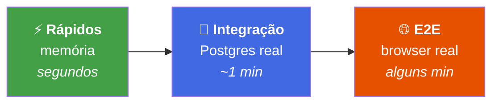
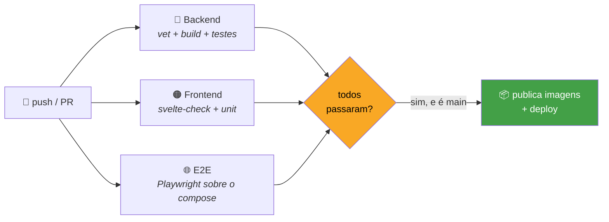

# 🧪 Guia de testes

> Os testes são separados em **camadas de custo crescente**. A ideia é simples:
> quanto mais rápido o teste, mais vezes você o roda.



| Camada | Precisa de | Quando roda |
|---|---|---|
| ⚡ **Rápidos** | nada | a cada mudança |
| 🐘 **Integração** | Docker (Testcontainers sobe o Postgres) | antes de commitar |
| 🌐 **E2E** | Docker + browser + app no ar | antes de subir para produção |

O "porquê" de cada ferramenta está em [tecnologias.md](tecnologias.md#6-testes).

---

## ⚡ Atalho rápido

Na raiz do repositório:

```bash
make test        # backend rápido + frontend unitário — sem Docker, sem browser
make test-all    # tudo: + integração (Postgres) + E2E (Playwright)
```

> [!TIP]
> Alvos individuais no `Makefile` da raiz: `test-backend`,
> `test-backend-integration`, `test-frontend`, `test-e2e`.

---

## 🔷 Backend (Go)

```bash
cd backend
make test        # rápidos + integração, saída legível (PASS/FAIL por caso)
make test-fast   # só os rápidos (sem Docker)
```

<details open>
<summary><b>Testes rápidos</b> — regras de negócio, usecases e contrato HTTP, em memória</summary>

<br>

```bash
go test ./...
```

</details>

<details>
<summary><b>Testes de integração</b> — repositório contra Postgres real</summary>

<br>

Banco efêmero via [Testcontainers](https://testcontainers.com/), criado, migrado e
destruído **pelo próprio teste** — não precisa do `docker compose` no ar:

```bash
go test -tags=integration ./...
```

> [!NOTE]
> A build tag `integration` é o que separa as duas camadas. Sem ela, esses
> arquivos nem entram na compilação — é por isso que os testes rápidos não
> precisam de Docker.

</details>

> [!TIP]
> Use `-v` para ver cada caso individualmente e `-count=1` para ignorar o cache
> do Go (que reaproveita resultados quando nada mudou).

**Onde cada coisa mora:**

```
backend/test/
├── 🧠 domain/       regras de negócio puras
├── 🔀 usecase/      fluxos de usecase (repositórios em memória)
├── 🌐 handler/      contrato HTTP via httptest
├── 🐘 repository/   integração real contra Postgres  ← build tag `integration`
├── 🔐 security/     hasher de senha (Argon2id)
├── 🎫 token/        geração/hash do token de sessão
└── ⚙️ config/       configuração (cookie seguro, swagger fora de produção, DSN)
```

---

## 🟠 Frontend (SvelteKit)

<details open>
<summary><b>Testes unitários</b> — cliente HTTP, login unificado e store de sessão</summary>

<br>

Rodam em Node, sem browser:

```bash
cd frontend
npm run test:unit        # ou: npm test
```

</details>

<details>
<summary><b>Testes E2E</b> — cadastro, login e sessão fim a fim</summary>

<br>

Via [Playwright](https://playwright.dev/). Exigem o app no ar (`docker compose up`
na raiz) e o browser instalado uma vez:

```bash
cd frontend
npx playwright install chromium   # só na primeira vez
npm run test:e2e
```

> [!WARNING]
> Se o `npm ci` falhar com `EACCES`, é o `node_modules` com dono `root` — o
> container de dev roda como root e monta a pasta. Veja o job `e2e` em
> `.github/workflows/ci.yml`, que resolve isso instalando as dependências
> **antes** de subir o compose.

</details>

**Onde cada coisa mora:**

```
frontend/
├── 📄 src/lib/api/*.test.ts       cliente HTTP e login unificado
├── 📄 src/lib/stores/*.test.ts    store de sessão
└── 🌐 e2e/                        specs Playwright (cadastro, login, sessão)
```

---

## 🤖 No CI

Todo push na `main` e todo pull request rodam as três camadas em paralelo
(`.github/workflows/ci.yml`):



> [!IMPORTANT]
> A publicação das imagens de produção **depende dos três jobs passarem**. Um
> teste vermelho não vira imagem, e imagem que não existe não chega na VPS.
