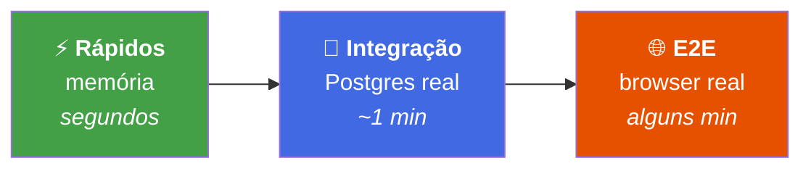
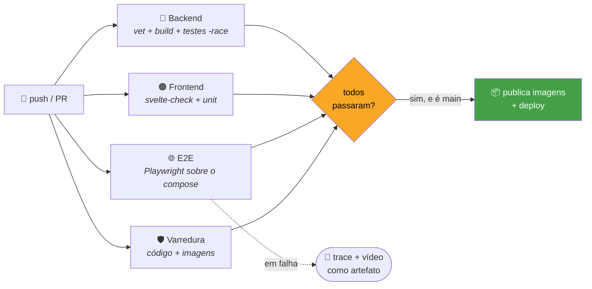

# 🧪 Guia de testes

> Os testes são separados em **camadas de custo crescente**. A ideia é simples:
> quanto mais rápido o teste, mais vezes você o roda.



| Camada | Precisa de | Quando roda |
|---|---|---|
| ⚡ **Rápidos** | nada | a cada mudança |
| 🐘 **Integração** | Docker (Testcontainers sobe o Postgres) | antes de commitar |
| 🌐 **E2E** | Docker + browser + app no ar | antes de subir para produção |

O "porquê" de cada ferramenta está em [tecnologias.md](tecnologias.md#6-testes).

---

## ⚡ Atalho rápido

Na raiz do repositório:

```bash
make test        # backend rápido + frontend unitário — sem Docker, sem browser
make test-all    # tudo: + integração (Postgres) + E2E (Playwright)
```

> [!TIP]
> Alvos individuais no `Makefile` da raiz: `test-backend`,
> `test-backend-integration`, `test-frontend`, `test-e2e`.

---

## 🔷 Backend (Go)

```bash
cd backend
make test        # rápidos + integração, saída legível (PASS/FAIL por caso)
make test-fast   # só os rápidos (sem Docker)
```

<details open>
<summary><b>Testes rápidos</b> — regras de negócio, usecases e contrato HTTP, em memória</summary>

<br>

```bash
go test ./...
```

</details>

<details>
<summary><b>Testes de integração</b> — repositório contra Postgres real</summary>

<br>

Banco efêmero via [Testcontainers](https://testcontainers.com/), criado, migrado e
destruído **pelo próprio teste** — não precisa do `docker compose` no ar:

```bash
go test -tags=integration ./...
```

> [!NOTE]
> A build tag `integration` é o que separa as duas camadas. Sem ela, esses
> arquivos nem entram na compilação — é por isso que os testes rápidos não
> precisam de Docker.

</details>

<details>
<summary><b>Detector de corrida</b> — <code>-race</code>, e por que ele está no <code>make test</code></summary>

<br>

```bash
go test -race -tags=integration ./...
```

A API serve requisições concorrentes, e o rate limiter e o worker de email
compartilham estado entre goroutines. Corrida de dados aí **não quebra o
teste**: o teste passa, e o defeito aparece em produção sob carga, como um
comportamento errado intermitente que não reproduz.

O `-race` instrumenta os acessos à memória e acusa o conflito na hora, com o
stack das duas goroutines envolvidas. Custa 2–3× no tempo de execução — por
isso está no `make test` (a suíte completa, igual ao CI) e **fora do
`make test-fast`**, que existe para o ciclo curto de edição.

</details>

> [!TIP]
> Use `-v` para ver cada caso individualmente e `-count=1` para ignorar o cache
> do Go (que reaproveita resultados quando nada mudou).

**Onde cada coisa mora:**

```
backend/test/
├── 🧠 domain/       regras de negócio puras
├── 🔀 usecase/      fluxos de usecase (repositórios em memória)
├── 🌐 handler/      contrato HTTP via httptest
├── 🐘 repository/   integração real contra Postgres  ← build tag `integration`
├── 🔐 security/     hasher de senha (Argon2id)
├── 🎫 token/        geração/hash do token de sessão
└── ⚙️ config/       configuração (cookie seguro, swagger fora de produção, DSN)
```

---

## 🟠 Frontend (SvelteKit)

<details open>
<summary><b>Testes unitários</b> — cliente HTTP, login unificado e store de sessão</summary>

<br>

Rodam em Node, sem browser:

```bash
cd frontend
npm run test:unit        # ou: npm test
```

</details>

<details>
<summary><b>Testes E2E</b> — cadastro, login e sessão fim a fim</summary>

<br>

Via [Playwright](https://playwright.dev/). Exigem o app no ar (`docker compose up`
na raiz) e o browser instalado uma vez:

```bash
cd frontend
npx playwright install chromium   # só na primeira vez
npm run test:e2e
```

> [!WARNING]
> Se o `npm ci` falhar com `EACCES`, é o `node_modules` com dono `root` — o
> container de dev roda como root e monta a pasta. Veja o job `e2e` em
> `.github/workflows/ci.yml`, que resolve isso instalando as dependências
> **antes** de subir o compose.

> [!IMPORTANT]
> **A suíte depende do Mailpit.** Nenhuma conta nasce sem confirmação por email
> — prestador e cliente —, então os helpers de `e2e/helpers.ts` leem o link
> direto da API do Mailpit (`localhost:8025`). Com o SMTP apontando para um
> provedor real, os testes travam esperando um email que nunca chega ali.

> [!TIP]
> **Desligue o rate limit ao rodar a suíte local** (`RATE_LIMIT_*=0` no `.env`):
> são centenas de requisições do mesmo IP em poucos minutos, e o teto por conta
> também alcança os testes que erram a senha de propósito.

**Quando falha só no CI.** É o cenário mais chato do E2E: verde na sua máquina,
vermelho no runner, e nada além de texto para investigar. A config
(`playwright.config.ts`) grava evidência para esse caso:

| Config | Valor | Por quê |
|---|---|---|
| `retries` | `2` só no CI | no runner a suíte disputa CPU com Postgres, API e Vite; parte da "falha" é lentidão. Local continua `0` — falhou, falhou |
| `trace` | `on-first-retry` | grava DOM, rede e screenshot de **cada passo**. Pesado demais para ligar sempre; na repetição, é exatamente quando se vai investigar |
| `screenshot` | `only-on-failure` | o estado da tela no momento da quebra |
| `video` | `retain-on-failure` | o caminho até ela |

O job `e2e` sobe tudo isso como artefato quando falha (`playwright-report`,
14 dias de retenção). Baixe, descompacte e abra:

```bash
npx playwright show-trace caminho/do/trace.zip
```

O trace viewer navega passo a passo, com o DOM de cada momento — é o que evita
ter que reproduzir o ambiente do CI na mão.

</details>

**Onde cada coisa mora:**

```
frontend/
├── 📄 src/lib/api/*.test.ts       cliente HTTP e login unificado
├── 📄 src/lib/stores/*.test.ts    store de sessão
└── 🌐 e2e/                        specs Playwright (cadastro, login, sessão)
```

---

## 🤖 No CI

Todo push na `main` e todo pull request rodam as três camadas em paralelo
(`.github/workflows/ci.yml`):



> [!IMPORTANT]
> A publicação das imagens de produção **depende de todos os jobs passarem**. Um
> teste vermelho não vira imagem, e imagem que não existe não chega na VPS.

Cada job tem `timeout-minutes` declarado: eles levam de 0,3 a 3,7 min, e sem
teto explícito o padrão do GitHub seria 360 min — um teste travado seguraria a
fila por seis horas antes de alguém notar.

> [!TIP]
> O que o CI faz além de rodar testes — varredura de vulnerabilidades,
> publicação das imagens e deploy — está em
> **[entrega-continua.md](entrega-continua.md)**.
